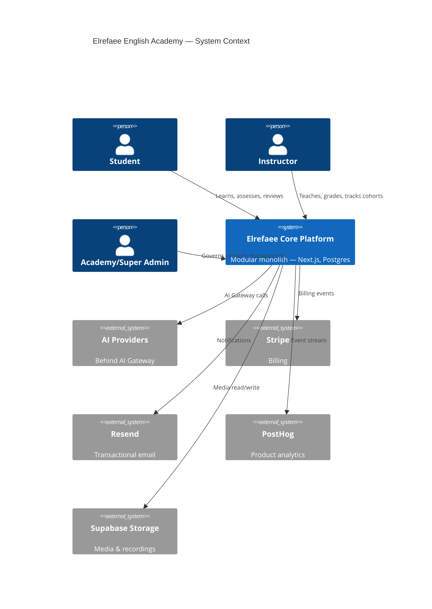
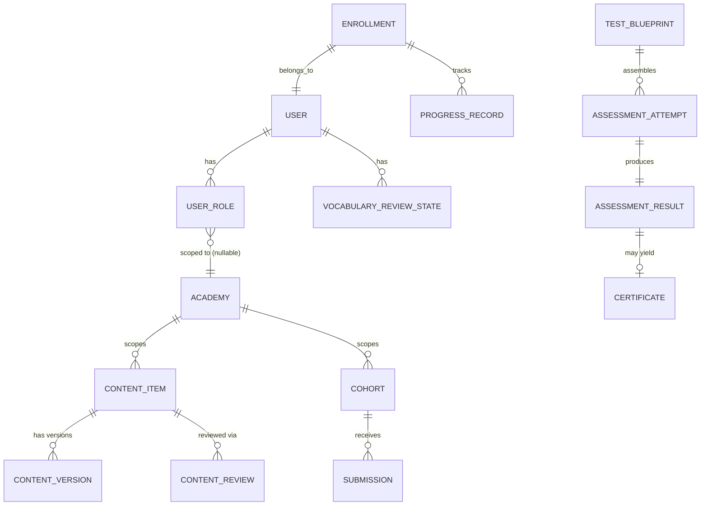
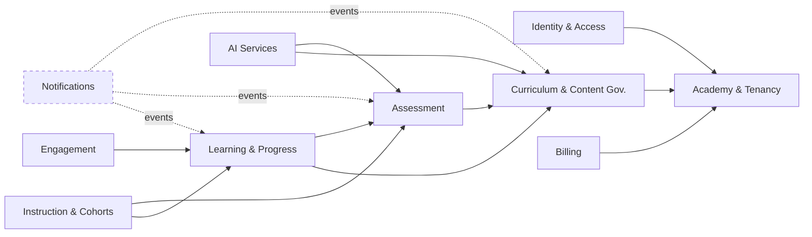
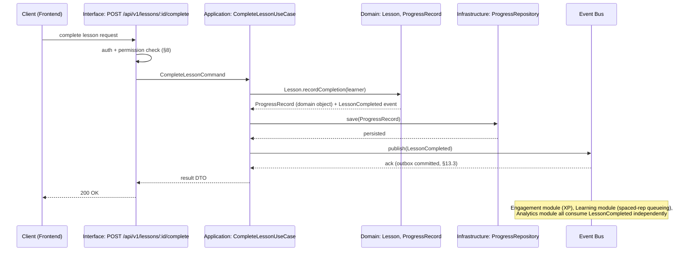
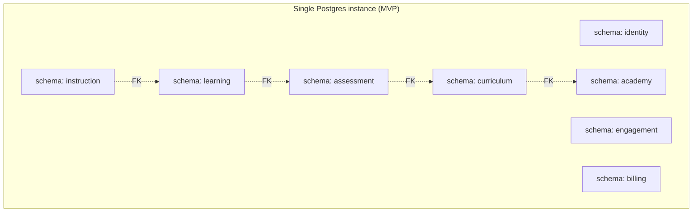
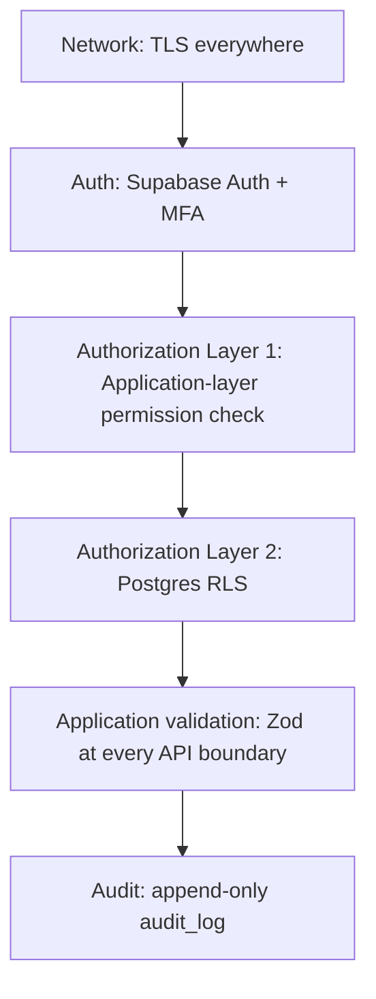
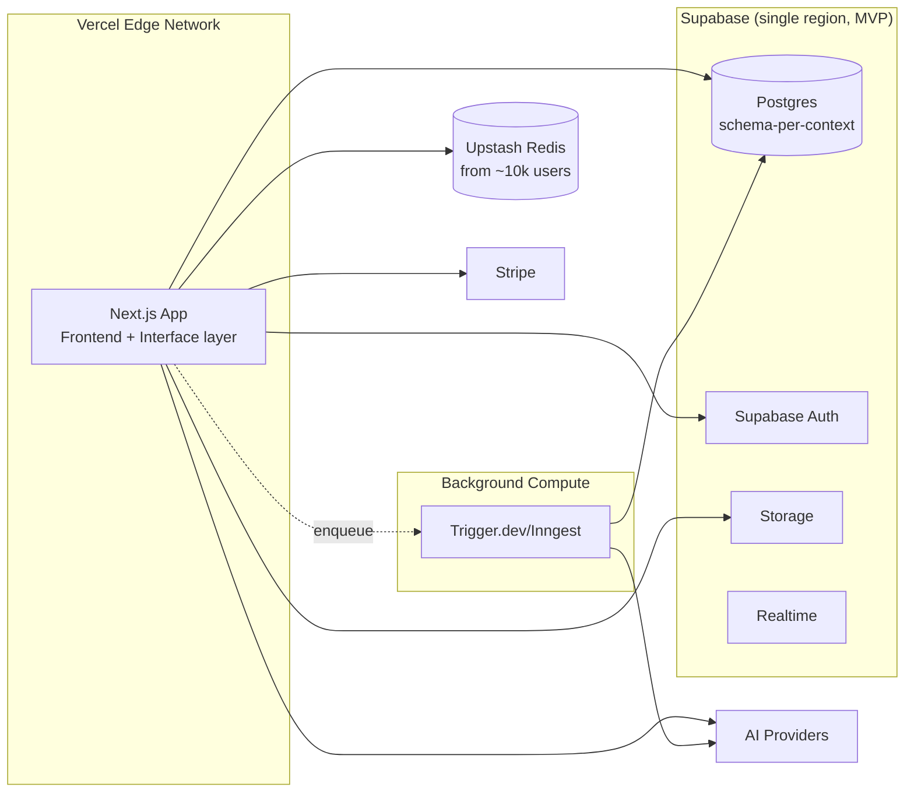

# Elrefaee English Academy — Enterprise System Architecture Document (SAD)

**Status:** Draft for review · **Date:** 2026-08-03 · **Builds on:** [00-master-blueprint.md](00-master-blueprint.md), [01-educational-design-document.md](01-educational-design-document.md), [02-product-requirements-document.md](02-product-requirements-document.md), [03-software-requirements-specification.md](03-software-requirements-specification.md)

**How this document differs from the SRS:** the SRS specifies *what the system must do* (behavior, flows, acceptance criteria). This SAD specifies *how the system is internally structured to do it* — the software-engineering shape: domain boundaries, layering, module contracts, data flow, and failure/scalability characteristics. Where the SRS already names a requirement precisely, this document does not restate it — it says how that requirement is architecturally satisfied.

**Scope-of-detail note, stated up front rather than left implicit:** the brief asks for nine fields (Responsibilities, Dependencies, Public Interfaces, Internal Components, Data Flow, Failure Scenarios, Security Considerations, Scalability Considerations, Future Extension Points) for "every module." Applied mechanically to all 28 requested sections, several of that template's fields don't fit (Disaster Recovery doesn't have a meaningful "Public Interface" in the same sense a service does). The full nine-field template is applied to **Sections 5–19** — the actual architectural modules. Sections 1–4 establish the DDD/Clean Architecture frame those modules sit inside; Sections 20–28 are cross-cutting system qualities, given the structure that actually fits them. This is a deliberate scoping call, not an omission — flagged the same way prior documents in this series have flagged their own scoping decisions.

**No implementation code appears below**, per your instruction — interfaces are described by name and contract shape, not syntax.

### Table of contents
1. Overall System Architecture
2. Domain Model
3. Bounded Contexts
4. Module Responsibilities
5. Frontend Architecture
6. Backend Architecture
7. AI Architecture
8. Authentication & Authorization
9. Database Architecture
10. File Storage Architecture
11. Search Architecture
12. Caching Strategy
13. Event System
14. Queue System
15. Notification Architecture
16. CMS Architecture
17. Assessment Architecture
18. Learning Engine Architecture
19. Analytics Architecture
20. Security Architecture
21. Logging & Monitoring
22. Error Handling
23. Deployment Architecture
24. Scalability Strategy
25. Disaster Recovery
26. High Availability
27. Performance Strategy
28. Future Migration to Microservices
29. Principal Engineering Review

---

## 1. Overall System Architecture

**Style: Modular Monolith, Clean Architecture internally, microservice-ready at every seam.**

A single deployable Next.js application (the "core platform") hosts ten independent **bounded-context modules** (Section 3). Each module is internally layered per Clean Architecture (Domain → Application → Infrastructure → Interface, Section 6.1) and exposes exactly one **public interface** to the rest of the system — no module reaches into another module's database tables, internal services, or types. Cross-module coordination happens through two channels only: **direct calls to a dependency's public interface** (synchronous, same-process) or **domain events on an in-process event bus** (asynchronous, decoupled, Section 13). This is the single architectural decision every other section in this document ultimately serves: it is what makes "modular monolith first, microservice-ready" true in practice rather than aspiration — extracting a module later means moving its already-isolated code across a process boundary, not rewriting it (Section 28).

**Why a modular monolith, not microservices, at this stage** (a deliberate call the brief asked to have architecturally reasoned, not assumed): at current and near-term scale (Blueprint §16's 100→10k stage), microservices would add network-call latency, distributed-transaction complexity, and multi-service deployment overhead without a corresponding benefit — nothing in the domain yet has an independent scaling profile, team-ownership boundary, or deploy-cadence need that justifies the cost (Section 28 states the concrete triggers that would change this call).

---

## 2. Domain Model

The domain model is expressed as **aggregates** (a cluster of entities/value objects with one root enforcing invariants) — this is intentionally not the physical database schema (Section 9 covers that); an aggregate boundary is a consistency boundary, not a table boundary.

| Aggregate root | Invariant it enforces | Bounded context |
|---|---|---|
| `User` | One identity, N role assignments, each role assignment scoped to at most one academy | Identity & Access |
| `ContentItem` | Cannot expose a `currentPublishedVersion` that isn't `Approved`; cannot transition status without a valid prior state (Section 16's FSM) | Curriculum & Content Governance |
| `TestBlueprint` / `AssessmentAttempt` | An `AssessmentResult` is immutable once created; an attempt cannot be scored against items outside its blueprint's declared skill/level constraints | Assessment |
| `Certificate` | Cannot exist without a passing `AssessmentResult` reference; disclaimer text is non-null, always rendered | Assessment |
| `Enrollment` | A learner has exactly one active placement per academy at a time | Learning & Progress |
| `VocabularyReviewState` | `dueAt` is only ever advanced by the FSRS domain service, never set directly | Learning & Progress |
| `Cohort` | An `Instructor` may only grade `Submissions` from learners enrolled in their own cohort | Instruction & Cohorts |
| `AIInteraction` | Every interaction is logged with cost/latency before its response is returned to the caller — logging is not best-effort | AI Services |
| `Subscription` | State transitions only via the `BillingProvider` port, never mutated directly by application code | Billing |
| `Academy` | Every tenant-scoped aggregate above carries a non-null `academyId` — no aggregate is "ownerless" | Academy & Tenancy |

---

## 3. Bounded Contexts

Each context is defined as much by what it **excludes** as what it owns — a context that "helpfully" reaches into a neighbor's data is the most common way modular monoliths decay into a distributed ball of mud.

| Context | Owns | Explicitly does not own |
|---|---|---|
| **Identity & Access** | Users, roles, permissions, sessions | Any domain-specific permission *logic* beyond role→permission mapping — e.g., "can this instructor grade this submission" is a Cohort-context rule, not an Identity rule |
| **Academy & Tenancy** | Academies, tenant-scoping metadata | Curriculum content itself |
| **Curriculum & Content Governance** | Content items, versions, reviews, units/lessons/courses, media metadata | Assessment items (owned by Assessment, even though pedagogically related) |
| **Assessment** | Item bank, blueprints, attempts, results, certificates | Lesson-embedded formative exercises (owned by Curriculum — a lesson's practice exercise is content, not a scored assessment instance) |
| **Learning & Progress** | Enrollments, progress, spaced-repetition state, recommendations, learning paths | Certificate issuance (consumes Assessment's events, doesn't own the aggregate) |
| **Instruction & Cohorts** | Cohorts, homework assignments, submissions, grading | Curriculum authoring (Instructors consume Published content, don't author it) |
| **Engagement & Gamification** | XP, streaks, badges | Certificates — deliberately excluded, restated for the fifth time across five documents, because it is the single easiest boundary for an engineer under deadline pressure to blur |
| **AI Services** | The AI Gateway, provider adapters, prompt templates, AI interaction logs | Curriculum publishing authority — AI-drafted content is a Draft `ContentItem` owned by Curriculum, not an AI Services aggregate |
| **Notifications** | Delivery, channel fan-out, preferences | The triggering business logic (a context emits an event; Notifications only reacts) |
| **Billing** | Subscriptions, plan entitlements | Payment credential handling (delegated entirely to Stripe via an anti-corruption layer) |

*(Solid arrows = synchronous public-interface dependency; dashed = event-driven only, no direct dependency — Notifications is intentionally coupled to nothing but the event bus.)*

---

## 4. Module Responsibilities

| Module (folder) | Owns aggregates | Public interface (summary) | Allowed dependencies |
|---|---|---|---|
| `modules/identity` | User, Role, Permission | `AuthService`, `RoleResolver` | none (foundational) |
| `modules/academy` | Academy | `AcademyRepository` (read-mostly) | `identity` |
| `modules/curriculum` | ContentItem, Version, Review, Unit, Lesson | `ContentGovernanceService`, `CurriculumQueryService` | `identity`, `academy` |
| `modules/assessment` | TestBlueprint, Attempt, Result, Certificate | `AssessmentService`, `CertificationService` | `identity`, `academy`, `curriculum` (item authorship only) |
| `modules/learning` | Enrollment, ProgressRecord, VocabularyReviewState | `ProgressService`, `ReviewSchedulerService`, `RecommendationService` | `identity`, `curriculum`, `assessment` |
| `modules/instruction` | Cohort, Assignment, Submission | `CohortService`, `GradingService` | `identity`, `learning`, `assessment` |
| `modules/engagement` | XP ledger, Streak, Badge | `GamificationService` | `identity`, event bus only (no direct dependency on `learning`) |
| `modules/ai` | AIInteraction | `AIGateway` | `identity` (for context), event bus |
| `modules/notifications` | NotificationRecord | `NotificationDispatcher` | `identity`; everything else via events only |
| `modules/billing` | Subscription | `BillingProvider` | `identity`, `academy` |

**Enforced rule:** the module dependency graph above must remain acyclic — a CI-level dependency-cruiser check (Section 6.5) fails the build if, e.g., `curriculum` ever imports from `learning`. This is the mechanical enforcement of Section 3's "excludes" column — without tooling enforcement, a boundary is a suggestion, not an architecture.

---

## 5. Frontend Architecture

**Responsibilities:** render role-scoped surfaces (Student/Instructor/Reviewer/Designer/Admin/SuperAdmin, per SRS §4); own client-side state that is genuinely client-local (form state, UI toggles); talk to the backend exclusively through the versioned REST contract (SRS §6), never direct database access from the client.
**Dependencies:** Backend Architecture (§6) as its sole data source; no frontend code imports from a backend module's internal layers.
**Public Interfaces:** none outward-facing — the frontend is a consumer, not a provider, of the system's public interfaces.
**Internal Components:** Next.js App Router route groups mirroring bounded contexts (`/app/(student)`, `/app/(instructor)`, `/app/(studio)` for Curriculum Studio, `/app/(admin)`); a shared design-system package (Tailwind/shadcn tokens, Blueprint §17) consumed by every route group so dark mode/high-contrast/dyslexia-font (Blueprint §11) are implemented once; TanStack Query for client-side server-state caching/revalidation; React Server Components by default, Client Components only where interactivity requires it (minimizes shipped JS, directly serves the p95 performance NFR, SRS §3).
**Data Flow:** Server Component fetches via the backend's Interface layer (§6) at render time → Client Components hydrate for interactivity → subsequent mutations go through TanStack Query mutations hitting the same REST contract → optimistic UI updates reconciled against the server response (critical for FR-05's exercise-resume and FR-18's idempotent-XP requirements — the frontend must tolerate a mutation's eventual-consistency window, not assume instant server truth).
**Failure Scenarios:** network drop mid-submission → local mutation queue with bounded retry (SRS FR-05 Exception Flow), visible "pending sync" state, never silent data loss; a role-gated route accessed without permission → server-side redirect/403 before any protected data is fetched, never a client-side-only guard (which would leak data in the initial payload).
**Security Considerations:** no business logic or authorization decision ever lives client-side as the sole gate (matches SRS §12.2's two-layer rule — the frontend's role-based rendering is a UX convenience, the API/RLS layers are the actual gate); no secrets or service-role keys ship to the client bundle.
**Scalability Considerations:** static/marketing pages pre-rendered (ISR) and CDN-cached (Vercel Edge, §12); authenticated dashboard routes are dynamically rendered per-request but keep payloads small via the CQRS read-model pattern (§19) rather than computing aggregates at request time.
**Future Extension Points:** the route-group-per-bounded-context structure means a future kids/teens UI (Blueprint §1) or a second academy vertical (Blueprint §18) adds a new route group and design-system theme variant, not a restructure; a native mobile app would consume the same REST contract the web client uses, since no logic is trapped in frontend-only code.

---

## 6. Backend Architecture

**Responsibilities:** implement every bounded context's business logic behind Clean Architecture layering; expose the SRS §6 REST contract; enforce authorization at the application layer (redundant with RLS, SRS §12.2).
**Dependencies:** Database Architecture (§9), AI Architecture (§7), Event System (§13), Queue System (§14) as its infrastructure-layer collaborators.
**Public Interfaces:** the versioned REST API (SRS §6) is the only interface the outside world (including the frontend) sees; internally, each module's Application layer exposes use-case-shaped services (e.g., `CompleteLessonUseCase`, `PublishContentUseCase`) as its public interface to other modules.

### 6.1 Clean Architecture layering (applied per module)
1. **Domain layer** — entities, value objects, domain events, domain services (e.g., the FSRS scheduler, §18). Zero framework/IO dependencies — this layer must be testable with no database, no network, no Next.js runtime (directly serves SRS §14.1's coverage target on exactly this logic).
2. **Application layer** — use cases orchestrating domain objects via repository *ports* (interfaces the domain/application layer defines, not implements — Dependency Inversion Principle). DTOs cross this boundary, never raw domain entities, so the interface layer can't reach into domain internals.
3. **Infrastructure layer** — repository *implementations* (Drizzle/Postgres), external adapters (AI provider adapters, `BillingProvider`, `PronunciationEngine` — all Strategy-pattern implementations of a port defined one layer up).
4. **Interface layer** — Next.js Route Handlers: parse request → call one Application use case → shape response (SRS §6.1's "thin transport" rule, restated here as the concrete Clean Architecture layer it corresponds to).

**Dependency Injection:** a composition root (a single service-wiring module, invoked once at application startup) constructs concrete Infrastructure implementations and injects them into Application use cases via their port interfaces. This is what makes a use case testable with an in-memory fake repository instead of a real database, and what makes swapping, e.g., the `PronunciationEngine` implementation (Blueprint §10) a composition-root change, not a scattered find-and-replace.

### 6.2 Worked example: "Complete Lesson" vertical slice

This single flow demonstrates every principle the brief named at once: **SRP** (each layer has one reason to change), **DIP** (Application depends on `ProgressRepository`'s interface, not Drizzle), **Repository Pattern** (§6.1.3), **Event-Driven decoupling** (Engagement and Analytics react without `CompleteLessonUseCase` knowing they exist), and **CQRS in miniature** (the write goes through the full stack above; a later read of "my progress" hits a precomputed view, §19, not this same path).

**Failure Scenarios:** the domain operation succeeds but the event publish fails → the Transactional Outbox Pattern (§13.3) guarantees the event is not lost, by writing it in the same database transaction as the `ProgressRecord` save, then relaying it asynchronously — this is the specific mechanism that prevents the classic "dual write" bug class.
**Security Considerations:** the Interface layer's auth/permission check (SRS §12.2) happens before any Application code runs — a use case never re-implements authorization itself, keeping that concern in exactly one place per request.
**Scalability Considerations:** because Application services depend only on port interfaces, a bottlenecked repository implementation (e.g., `ProgressRepository`) can be optimized or even backed by a different datastore without touching use-case logic.
**Future Extension Points:** any new module follows this exact four-layer shape — onboarding a new bounded context (e.g., a future kids/teens-specific module) means writing to a known pattern, not inventing structure.

---

## 7. AI Architecture

**Responsibilities:** provide every AI-touching capability (Tutor, Writing Coach, Conversation Partner, Pronunciation Coach, Placement, Study Plans, Question Generator, Content Assistant — SRS §7) behind one internal gateway, with zero direct vendor coupling elsewhere in the codebase.
**Dependencies:** Identity (for learner/lesson context), Event Bus (interaction logging, §13), Queue (async scoring jobs, §14).
**Public Interfaces:** `AIGateway.invoke(module, input, context)` — the single entry point every other module uses; per-module typed contracts (e.g., the Pronunciation Coach's contract accepts audio + target phrase, returns a score/feedback shape) defined at the Application layer, implemented by swappable Infrastructure-layer provider adapters (Strategy pattern — structurally identical to `BillingProvider` and `PronunciationEngine`, a deliberately repeated pattern, not three unrelated ones).
**Internal Components:** provider adapters (one per vendor per module); a prompt-template store (versioned data, SRS §7.3); a moderation/safety filter wrapping every call, input and output; a response cache keyed on prompt-template-version + input hash (§12); a cost/latency logger writing to `AIInteraction` (§2) synchronously before the response returns to the caller — never fire-and-forget logging, since cost tracking is a business requirement, not a nicety.
**Data Flow:** caller → `AIGateway.invoke` → resolve active adapter for (module, and canary-rollout weighting if a new adapter is being trialed, SRS §7.2) → moderate input → call provider adapter → moderate output → log interaction → return typed result; on any step failure, the fallback strategy (§7.6 below) engages before the caller ever sees an error.
**Failure Scenarios:** primary provider timeout → configured secondary adapter attempted (if one exists for that module) → if both fail, an explicit "unavailable" result type returned (never an unhandled exception surfacing to the Interface layer); moderation flags an output → the flagged interaction is logged and routed to a human-review queue, response either withheld or replaced with a safe fallback message depending on the module's configured severity policy (Conversation Partner and Tutor strictest, per Blueprint §9).
**Security Considerations:** input length caps (SRS FR-12) bound cost and prompt-injection surface; provider adapters never receive more learner PII than the specific call requires (context is a minimal DTO, not the full user record); AI-generated output can never itself trigger a Curriculum publish (§16) — it always lands as a Draft `ContentItem`, a hard architectural rule enforced by the fact that `AIGateway` has no dependency on `ContentGovernanceService`'s publish method, only its "propose draft" method.
**Scalability Considerations:** the response cache (§12) absorbs repeat low-variance queries; per-module rate/cost limiting (SRS §6.4b) is enforced at the Gateway boundary, independent of general API rate limiting, so AI cost cannot be exhausted via otherwise-normal traffic.
**Future Extension Points:** a new AI capability is a new module contract + at least one adapter — no change to the Gateway's core dispatch logic; a new provider for an existing capability is a new adapter + a composition-root config change (§6.1's DI pattern) plus the canary mechanism (§7.2/SRS §7.2) for safe rollout.

---

## 8. Authentication & Authorization

**Responsibilities:** verify identity, resolve role/permission scope, enforce access control on every request.
**Dependencies:** Supabase Auth (external identity provider), Database (RLS policies, §9).
**Public Interfaces:** `AuthService` (session issuance/validation), `RoleResolver` (resolves a user's effective permissions, optionally scoped to an academy).
**Internal Components:** JWT issuance/validation middleware; an MFA-enforcement gate applied to elevated roles at login (SRS FR-01); a permission-check decorator/wrapper applied at every Interface-layer route handler, sourcing from the `role_permissions` data (SRS §4) — never a hardcoded per-route conditional.
**Data Flow:** login → Supabase Auth validates credentials/OAuth/MFA → `AuthService` issues JWT + refresh token → every subsequent request's Interface layer resolves the JWT to a `RoleResolver` permission set → Application use case receives an already-authorized caller context, never raw credentials.
**Failure Scenarios:** expired JWT mid-request → silent refresh-token exchange (SRS FR-01), falling back to a re-auth prompt only if refresh also fails, preserving client-side in-progress state (§5's mutation-queue tolerance handles this gracefully); a compromised session → server-side refresh-token revocation immediately invalidates future access without waiting for JWT natural expiry (SRS §12.8).
**Security Considerations:** this is the one module where the "two-layer enforcement" rule (SRS §12.2) is most concretely realized — `RoleResolver`'s output gates the Application layer, and the identical role/academy scope is independently expressed as Postgres RLS predicates (§9), so a bug in one layer alone cannot cause a data leak.
**Scalability Considerations:** JWT validation is stateless (no database round-trip per request beyond initial issuance), so this module does not become a bottleneck as request volume grows; the refresh-token revocation list is the one piece of shared state, sized to active-session count, not total request volume.
**Future Extension Points:** a new role (Guardian/Parent, Billing Admin — Blueprint §13.3) is a data insert into `role_permissions`, requiring zero change to this module's code — the module was built to this extension point from day one, not retrofitted.

---

## 9. Database Architecture

**Responsibilities:** durable, consistent storage for every bounded context's aggregates; enforce data-level authorization via RLS as the second enforcement layer.
**Dependencies:** none (foundational infrastructure); every module depends on it via repository interfaces, never directly.
**Public Interfaces:** per-module repository interfaces (e.g., `ContentRepository`, `AssessmentRepository`) — application code never issues raw SQL outside the Infrastructure layer.
**Internal Components:** a single Supabase-managed Postgres instance at MVP, organized into **Postgres schemas per bounded context** (`identity`, `curriculum`, `assessment`, `learning`, `instruction`, `engagement`, `billing`, `academy`) — a deliberate physical-modeling choice that mirrors the DDD boundaries (§3) inside one physical database, so a future microservice extraction (§28) can move one schema to its own database with a well-understood, already-isolated surface, rather than untangling a single flat public schema; Drizzle ORM as the typed query layer; RLS policies per table, keyed on `auth.uid()` and resolved role/academy scope (§8); a migration pipeline (expand-contract pattern for breaking changes, SRS §13.5).
**Data Flow:** Infrastructure-layer repositories are the only code path that touches Postgres directly; every write to a governed aggregate (ContentItem, AssessmentResult, Certificate) that has audit obligations (SRS §5.6) writes to `audit_log` within the same transaction, never as a separate best-effort step.
**Failure Scenarios:** a migration that would break the currently-live application version is rejected by the expand-contract discipline (SRS §13.5) — schema changes ship in two steps (additive, then a later cleanup) so a mid-deploy window never sees an inconsistent shape; RLS-policy gaps are caught pre-merge by the CI check named in SRS §12.2 (a new table without a policy fails review).
**Security Considerations:** RLS is the non-bypassable floor even if application-layer authorization has a bug (SRS §12.2) — this is stated here again because the database is where that guarantee is actually enforced, not merely described.
**Scalability Considerations:** connection pooling (Supabase's pooler) from the pilot stage; read replicas for analytics/reporting queries introduced at the ~10k-user stage (Blueprint §16) so reporting load never competes with transactional writes; high-volume append-only tables (`learning_events`, `audit_log`) partitioned by time at the ~100k-user stage.

**Future Extension Points:** the schema-per-context layout (above) is the concrete seam Section 28's microservice-extraction strategy relies on — extracting, say, `assessment` means standing up a new database seeded from that schema, pointing `AssessmentRepository`'s implementation at it, with zero change to any other module's code, because no other module was ever permitted to query the `assessment` schema directly (§4's dependency rule, enforced at the ORM/connection layer, not just convention).

---

## 10. File Storage Architecture

**Responsibilities:** durable, access-controlled storage for lesson media, pronunciation recordings, certificates, and user-uploaded content.
**Dependencies:** Identity & Access (§8) for signed-URL authorization scoping.
**Public Interfaces:** `MediaRepository` (upload, retrieve-signed-URL, delete/archive).
**Internal Components:** Supabase Storage buckets, partitioned by content class (`lesson-media`, `pronunciation-recordings`, `certificates`, `submissions`) each with its own access policy — pronunciation recordings are private-by-default (owner + assigned Instructor only), lesson media is public-read once the parent `ContentItem` is Published (§16) and access-denied otherwise (Draft media must never be fetchable via a guessed URL).
**Data Flow:** client uploads directly to Storage via a short-lived signed upload URL issued by the Interface layer (never proxying large binary payloads through the application server) → a `MediaAsset` metadata record persisted in Postgres (§9), including the mandatory transcript/caption reference (Blueprint §11's accessibility gate) before the parent content can advance past Draft.
**Failure Scenarios:** upload interrupted mid-transfer → client retries against a fresh signed URL (the original is single-use/short-TTL, preventing replay); orphaned metadata (a `MediaAsset` row with no corresponding object) is caught by a periodic reconciliation job, not left to silently 404 for a learner.
**Security Considerations:** signed URLs are scoped (read-only vs. write, single-object, time-limited) and never long-lived or broadly-scoped; private buckets (recordings, submissions) are never made public even transiently.
**Scalability Considerations:** CDN-fronted delivery for public lesson media (Vercel Edge/Supabase CDN, §12); a lifecycle policy (introduced once volume justifies it, ~10k-user stage) moves old pronunciation-attempt audio to cheaper cold storage rather than indefinite hot-tier retention.
**Future Extension Points:** the bucket-per-content-class layout allows adding a new content class (e.g., video for a future capstone-project submission type, Blueprint §2) as a new bucket + policy, not a redesign.

---

## 11. Search Architecture

**Responsibilities:** role-scoped content discovery (SRS FR-19).
**Dependencies:** Curriculum & Content Governance (§16, indexed content source).
**Public Interfaces:** `SearchService.query(term, callerScope)`.
**Internal Components (MVP):** Postgres full-text search (`tsvector` + GIN index) over Published content — deliberately **not** a dedicated search engine at MVP; content volume at the Pre-A1→B1 MVP scope (PRD §12) doesn't yet justify the operational cost of a separate service, and Postgres FTS is sufficient for the query patterns FR-19 actually needs (title/body term matching, not fuzzy semantic search).
**Data Flow:** content publish event (§13) triggers a search-index update (a materialized `tsvector` column, refreshed synchronously within the same publish transaction — not a separately-scheduled reindex, so there is no window where a just-published lesson is unfindable).
**Failure Scenarios:** index staleness beyond the defined freshness SLA (SRS FR-19, ≤5 minutes) is monitored and alarms if a publish event's index update fails — treated as a governance-integrity bug (a Draft leaking into search results, or a Published item missing from them), not a cosmetic issue.
**Security Considerations:** the query itself is scoped by `callerScope` (SRS FR-19's hard rule — Draft/In-Review content is never returned to a Student searcher) at the query-construction layer, not filtered post-hoc from a broader result set, which would risk an information leak via response timing or partial caching.
**Scalability Considerations:** the concrete upgrade trigger is stated explicitly rather than left vague: **when Postgres FTS query latency exceeds the p95 API target (SRS §3) under realistic content volume, or when semantic (not just lexical) search becomes a product requirement**, migrate to a dedicated engine (Meilisearch/Typesense) — because `SearchService` is a port with one Infrastructure implementation, this is an adapter swap, not a rewrite of every caller.
**Future Extension Points:** semantic/AI-assisted search (e.g., "find lessons about ordering food" without exact keyword match) is a natural future `AIGateway` module (§7) composed with `SearchService`, not a replacement for it.

---

## 12. Caching Strategy

**Responsibilities:** reduce latency and database/AI-provider load for repeat reads.
**Dependencies:** every module that has a hot read path (Learning's review queue, Engagement's leaderboards, AI's response cache).
**Public Interfaces:** a thin `CacheProvider` port (get/set/invalidate) — application code never calls a caching backend's SDK directly, mirroring the Repository Pattern's rationale.
**Internal Components:** three layers, each with a distinct purpose: **(1) CDN** (Vercel Edge) for public, static, or ISR-rendered pages; **(2) Redis (Upstash)**, introduced at the ~10k-user stage (Blueprint §16), for hot application-level reads — vocabulary review queue, leaderboards, session state; **(3) AI response cache** (§7), keyed on prompt-template-version + input hash, logically part of the AI module but implemented via the same `CacheProvider` port.
**Data Flow:** a cache-aside pattern throughout — read checks cache first, falls back to the repository on miss, populates cache on the way back; writes to the underlying aggregate invalidate the relevant cache key(s) synchronously (e.g., a content-publish event, §13, triggers cache invalidation for that `ContentItem`'s cached read view — this is the same event that triggers the search-index update in §11, one event, multiple consumers).
**Failure Scenarios:** cache backend unavailable → `CacheProvider` degrades to a pass-through (every read hits the repository directly) rather than failing the request — caching is a performance optimization, never a correctness dependency, a rule enforced by construction (no code path assumes the cache is authoritative).
**Security Considerations:** cache keys never include unscoped user-provided input verbatim (avoids cache-poisoning/key-collision risk); role/academy scope is always part of the key for any cached data that isn't uniformly public.
**Scalability Considerations:** introduced precisely at the Blueprint §16 trigger (~10k users), not earlier — premature caching infrastructure was explicitly named as a thing *not* to build in the Blueprint's scalability table, and this section holds that line.
**Future Extension Points:** the `CacheProvider` port means a future move from Upstash to a self-hosted Redis cluster (at very large scale) is a composition-root change, not an application-code change.

---

## 13. Event System

**Responsibilities:** decouple bounded contexts that need to react to something happening elsewhere without a direct dependency (§3's dashed-line relationships).
**Dependencies:** Database (for the transactional outbox, below), Queue System (§14, for async relay).
**Public Interfaces:** `EventBus.publish(event)`, `EventBus.subscribe(eventType, handler)` — every domain event is a typed, versioned payload (schema-versioned, matching SRS §11.1's event-schema-validation NFR).
**Internal Components:** at MVP, an **in-process pub/sub bus** backed by the **Transactional Outbox Pattern** — a domain event is written to an `outbox` table in the *same database transaction* as the aggregate change that caused it (§6.2's worked example), then a relay process reads the outbox and dispatches to in-process subscribers (and, later, to a real broker, §13.4). This solves the classic dual-write problem (DB commit succeeds, event publish fails, system state and event stream diverge) without needing a distributed transaction.
**Event catalog (representative):** `LessonCompleted`, `ContentPublished`, `ContentArchived`, `AssessmentResultRecorded`, `CertificateIssued`, `VocabularyReviewed`, `SubmissionGraded`, `AIInteractionFlagged`, `SubscriptionStateChanged`.
**Data Flow:** aggregate change → domain event raised (in-memory) → Application layer persists both the aggregate and the outbox row atomically → relay dispatches to subscribed handlers in other modules (Engagement awards XP on `LessonCompleted`; Learning queues spaced-repetition items on the same event; Analytics consumes every event type; Notifications reacts to `CertificateIssued`, etc.) — each subscriber processes independently; one subscriber's failure does not roll back the publisher's transaction (already committed) or block other subscribers.
**Failure Scenarios:** a subscriber handler throws → retried per a bounded backoff (via the Queue System, §14) → persistent failure moves the event to a dead-letter queue for manual inspection, never silently dropped; this is specifically what prevents, e.g., a transient Engagement-module bug from ever causing a lost `LessonCompleted` event that should have advanced the Learning module's spaced-repetition queue.
**Security Considerations:** event payloads carry only the minimum data subscribers need (not full aggregate snapshots) to limit cross-module data exposure; a module may only subscribe to event types, never query another module's outbox/table directly.
**Scalability Considerations:** the in-process bus is sufficient while all modules share one process (the modular monolith); the outbox-relay pattern is deliberately chosen because it is the same pattern that scales cleanly to a real message broker (SQS, Kafka) later — the relay's destination changes, the publish/subscribe contract at the application layer does not.
**Future Extension Points:** this is the primary seam Section 28 extracts along — moving a module to its own service means its event subscriptions move from in-process handlers to a real broker's consumer group, with no change to the events themselves.

---

## 14. Queue System

**Responsibilities:** execute work that must not block a request/response cycle (SRS §16 scaling trigger: introduced at the ~1,000-user stage).
**Dependencies:** AI Architecture (§7, async scoring), CMS (§16, scheduled publishing), Analytics (§19, nightly aggregation), Event System (§13, retry/dead-letter relay).
**Public Interfaces:** `JobScheduler.enqueue(jobType, payload, options)`.
**Internal Components:** Trigger.dev or Inngest (evaluated at Phase 3, Blueprint §19) as the orchestration layer; job types: AI-heavy scoring (writing/speaking feedback), scheduled content publishing (§16), nightly analytics aggregation (§19), email dispatch (§15), event-relay retries (§13).
**Data Flow:** a use case enqueues a job (e.g., "score this writing submission") rather than calling the AI Gateway synchronously when the SRS-specified latency budget (§3) would be exceeded → the job runner picks it up, executes, and on completion triggers a follow-up event (`SubmissionGraded`) that the originating module (and Notifications) can react to.
**Failure Scenarios:** job failure → retried with exponential backoff up to a defined limit → persistent failure → dead-lettered with alerting, never silently disappearing (a "we scored your essay" promise that never resolves is a trust failure, not just a technical one, given the product's credibility positioning, PRD §4).
**Security Considerations:** job payloads containing learner data are scoped minimally, same principle as event payloads (§13); job execution runs with least-privilege service credentials, not a broad service-role key.
**Scalability Considerations:** job types are independently scalable — a burst of certification-exam grading at a cohort's level-end doesn't starve scheduled-publishing jobs, because they're distinct queues/job types, not one undifferentiated work list.
**Future Extension Points:** a new async workload (e.g., a future bulk-import tool for institutional onboarding) is a new job type on the existing infrastructure, not a new system.

---

## 15. Notification Architecture

**Responsibilities:** multi-channel delivery of re-engagement and time-sensitive alerts (SRS FR-17), respecting user preferences.
**Dependencies:** Event Bus (§13, the only way this module learns anything happened), Queue (§14, email dispatch).
**Public Interfaces:** `NotificationDispatcher` — has no inbound API from other modules beyond event subscription; this is deliberate (§3's bounded-context table: Notifications is coupled to nothing but the event bus).
**Internal Components:** a preference-check gate (SRS FR-17/FR-20) evaluated before any dispatch; channel adapters (in-app, email via Resend, push — future); a templating system (versioned templates, i18n-ready per Blueprint §12, not hardcoded strings per call site).
**Data Flow:** domain event (`CertificateIssued`, `VocabularyReviewed` reaching a due threshold, `SubmissionGraded`, etc.) → preference check → template resolution → channel adapter dispatch → delivery status logged.
**Failure Scenarios:** email delivery failure (Resend bounce) → bounded retry via the Queue (§14) → persistent failure surfaces in-app only, never silently vanishing (SRS FR-17).
**Security Considerations:** notification content never includes sensitive data beyond what the channel's security model supports (e.g., no assessment answer content in an email body).
**Scalability Considerations:** dispatch is fully asynchronous via the Queue (§14), so a burst of simultaneous triggering events (e.g., end of a cohort's term) doesn't block the modules that raised those events.
**Future Extension Points:** push notifications and SMS are new channel adapters behind the same `NotificationDispatcher` interface — no change to the ~10 other modules that raise the events triggering them.

---

## 16. CMS Architecture

**Responsibilities:** the Curriculum & Content Governance context's full implementation — the lifecycle state machine (SRS §8.1), versioning, review, publishing, scheduling.
**Dependencies:** Identity & Access (§8, role checks), Storage (§10, media), Event Bus (§13, publish notifications).
**Public Interfaces:** `ContentGovernanceService` (submitForReview, requestChanges, approve, publish, schedule, rollback), `CurriculumQueryService` (read-only, Published-content queries — a CQRS read side, see below).
**Internal Components:** the lifecycle **finite-state machine** (Draft→In Review→Approved→Scheduled→Published→Deprecated→Archived, SRS §4.1/§8.1), guarded per-transition by role permission (§4); the **optimistic-locking mechanism** for concurrent Draft edits (SRS FR-15's conflict resolution — every `ContentVersion` carries the version number it was branched from; a save whose base version no longer matches the current head is rejected with a diff, never silently overwritten); the scheduled-publish poller (via the Queue, §14).
**Data Flow:** matches SRS §8.3 exactly — publish is one atomic transaction (pointer update + audit write + cache/search invalidation event); this is a **CQRS split**: the write side is the full versioned `ContentItem`/`ContentVersion` model (§9), the read side (`CurriculumQueryService`) serves only the current-published-version projection, denormalized for fast learner-facing reads — a genuine divergence in read/write shape that justifies CQRS here (unlike, say, the Notifications module, which has no meaningful read side at all).
**Failure Scenarios:** concurrent edit conflict → optimistic-lock rejection with a diff view (above); publish transaction partial failure → the whole transaction rolls back (pointer, audit, and invalidation-event-emission are one atomic unit, per §6.2's outbox pattern) — never a state where content is "published" in the pointer but the search index or cache wasn't told.
**Security Considerations:** every transition writes to the shared `audit_log` (SRS §5.6) atomically with the state change; media cannot be attached to an Approved-eligible item without transcript/captions metadata present (Blueprint §11's hard gate, enforced here as a state-transition guard, not a UI-only validation).
**Scalability Considerations:** the CQRS read side means learner-facing content reads never touch the more complex versioned write-side tables at read time — this is what keeps Course/Lesson reads (FR-04/FR-05) fast independent of how much version/review history a piece of content has accumulated.
**Future Extension Points:** a second academy vertical (Blueprint §18) or a future accredited-partner content feed (Blueprint §8) both enter through the same `ContentGovernanceService` — the lifecycle doesn't care what subject the content teaches.

---

## 17. Assessment Architecture

**Responsibilities:** the Assessment context's full implementation — item bank, blueprint-based test assembly, scoring, certification (SRS §9).
**Dependencies:** Curriculum (item authorship flows through the same governance lifecycle, §16), Identity (§8), AI Services (§7, for AI-assisted writing/speaking scoring).
**Public Interfaces:** `AssessmentService` (assembleAttempt, submitResponse, scoreAttempt), `CertificationService` (issueCertificate, verifyCertificate).
**Internal Components:** a **scoring-strategy registry** — one strategy implementation per item type (exact/fuzzy-match auto-grading, AI-assisted categorized writing scoring, AI-assisted + mandatory-human-override speaking/certification scoring, SRS §9.2) — structurally the same Strategy pattern as the AI provider adapters (§7) and `PronunciationEngine`, a deliberately consistent pattern across the whole system rather than three unrelated ad hoc designs; the randomized item-selection engine, constrained by a blueprint's declared skill/level/difficulty rules (SRS §9.5).
**Data Flow:** **CQRS split**, justified concretely here: the *write side* is item authorship (through Curriculum's governance lifecycle, §16) and attempt/result recording (append-only, immutable per §2's aggregate invariant); the *read side* is test-assembly — a read-optimized query against the `item_bank`'s indexed skill/level/difficulty columns (SRS §5.4) that has no reason to touch the write-side content-versioning machinery at all.
**Failure Scenarios:** scoring-service (AI-assisted) unavailable mid-attempt → the attempt is preserved (not lost) and scoring is retried asynchronously via the Queue (§14), with the learner notified on completion rather than blocked waiting; an item-bank query returns an insufficient pool for a blueprint's constraints (e.g., not enough B1 grammar items) → this is treated as a **release-blocking content-inventory gap**, surfaced to Academy Admin, not silently served with a smaller/weaker test.
**Security Considerations:** `AssessmentResult` immutability (SRS §5.3, RLS-enforced) means a disputed certificate is always traceable to an unaltered record; randomized item selection specifically reduces answer-sharing risk on certification exams (SRS §9.5).
**Scalability Considerations:** the read-side item-bank query is the one under real load (every practice quiz and certification attempt hits it) — indexed and read-replica-eligible (§9) independent of the much-lower-volume write-side authoring traffic.
**Future Extension Points:** true IRT-based adaptive calibration (deferred per Blueprint §6/§19 pending real attempt-volume data) is a new scoring/routing strategy registered in the same registry — it does not require restructuring the attempt/result data model, because that model was built item-type-and-strategy-agnostic from the start.

---

## 18. Learning Engine Architecture

**Responsibilities:** the Learning & Progress context — enrollment, progress tracking, spaced repetition, recommendations, learning paths (SRS §10).
**Dependencies:** Curriculum (§16, content structure), Assessment (§17, mastery-gate results).
**Public Interfaces:** `ProgressService`, `ReviewSchedulerService` (the FSRS engine), `RecommendationService`.
**Internal Components:** the **FSRS scheduler is a pure domain service** — takes a review response and prior state, returns new state (stability/difficulty/`dueAt`); zero I/O, zero framework dependency, directly serving the SRS §14.1 testability target with real unit-test rigor, not just aspiration; the recommendation engine composes three signals (mastery gaps from Analytics §19, due-review items from the scheduler, curriculum sequence position) into one ranked "next best action."
**Data Flow:** a `VocabularyReviewed` event (raised by the scheduler after each response) is both persisted (write side) and separately feeds a due-today count the Dashboard reads (a lightweight, non-CQRS-formal but still read/write-separated pattern — this one doesn't need full CQRS machinery, just an indexed `dueAt` query, SRS §5.4).
**Failure Scenarios:** a learner's review history is incomplete/corrupted for one item (e.g., a client-side double-submit) → the scheduler is idempotent per review-event-id (mirrors FR-18's idempotency requirement for XP) — a duplicate response does not double-advance `dueAt`.
**Security Considerations:** review/progress data is strictly per-learner (§2 aggregate invariant); an Instructor's cohort view (§instruction) reads *aggregated* progress, never raw per-item review history, unless a learner has explicitly shared it (privacy default already stated in SRS §10.6 for notes, applied consistently here).
**Scalability Considerations:** the due-review query (`vocabulary_reviews(user_id, due_at)`, SRS §5.4) is the hottest read path in this module and is indexed accordingly from MVP, not deferred.
**Future Extension Points:** the `RecommendationService`'s three-signal composition is deliberately extensible — a future fourth signal (e.g., an AI-generated Personalized Study Plan, SRS §7's Should/Could-Have module) plugs in as an additional weighted input, not a redesign of the recommendation logic.

---

## 19. Analytics Architecture

**Responsibilities:** the Analytics context — event ingestion, computed metrics, role-scoped dashboards (SRS §11).
**Dependencies:** Event Bus (§13, its entire data source — Analytics subscribes to every event type, uniquely among modules).
**Public Interfaces:** `AnalyticsQueryService` (dashboard reads only — this module has almost no write-side public interface, since ingestion is purely event-driven, not command-driven).
**Internal Components:** two parallel consumers of the same event stream (SRS §7/§11): PostHog (generic product analytics) and our own nightly aggregation jobs (education-specific computed metrics — mastery-per-skill, CEFR-progress composite, retention curves, bottleneck funnels) writing to precomputed aggregate tables.
**Data Flow:** this is the system's clearest **CQRS example**: the write side is the append-only `learning_events` stream (effectively an event-sourced log, SRS §11.1); the read side is entirely separate precomputed aggregate tables that dashboards (§5) query — a dashboard request never triggers a live aggregation over raw events, which is precisely the design point flagged in SRS §11.3 as needing to exist no later than the ~10k-user stage (this document specifies it as the architecture from the start, since retrofitting CQRS onto a live-query dashboard later is exactly the kind of costly-to-defer decision the Blueprint's "cheap now, expensive later" principle (Blueprint §12) warns against).
**Failure Scenarios:** an event fails schema validation → dead-lettered for inspection (SRS §11.1), never silently dropped or crashing ingestion; an aggregation job failure → the prior night's aggregate remains served (stale-but-correct) rather than a broken/partial dashboard, with the failure alarmed (§21).
**Security Considerations:** role-scoped reads (a teacher never sees another teacher's cohort, SRS §11.4) enforced identically to every other module — RLS + application-layer, no exception for "it's just analytics."
**Scalability Considerations:** this module is the most likely single first candidate for genuine independent scaling (its read/write ratio and query shape are unlike any other module's) — flagged explicitly here and carried into Section 28's extraction-candidate list.
**Future Extension Points:** a genuine event-sourcing upgrade (replaying the full event log to rebuild aggregates, rather than only appending to them) is architecturally available without a redesign, since `learning_events` is already append-only and schema-versioned.

---

## 20. Security Architecture

Software-architecture view of SRS §12 (which remains the requirements source of truth; this section states how those requirements are structurally realized).

**Defense-in-depth layering:**

Each layer assumes the one above it can fail — RLS (D) is not "defense we hope not to need," it is independently sufficient to block unauthorized data access even if C has a bug, which is the entire justification for paying the cost of implementing both.

**Secure-SDLC practices:** dependency scanning and secret-scanning in CI (SRS §12.4/§12.6); a CI gate requiring an RLS policy for any new table (§9); the module dependency-graph check (§4) is itself a security control, not just a cleanliness one — an unauthorized cross-module data reach is exactly the kind of bug class that produces access-control failures, so architectural boundary enforcement and security enforcement are the same mechanism here, not two separate concerns.

**Threat model summary (representative, not exhaustive):** credential stuffing → rate-limited login + MFA for elevated roles (§8); prompt injection against the AI Gateway → input moderation + capped input length + minimal-PII context (§7); content-governance bypass (a Draft reaching learners) → the search (§11), cache (§12), and CQRS read-side (§16/§19) architectures all independently filter by `Published` status, so no single component's bug alone leaks unpublished content; insider risk (a Reviewer publishing without genuine review) → mitigated by process (EDD §19 checklist) and made forensically traceable (audit log), not something software alone can fully prevent — stated honestly rather than oversold.

---

## 21. Logging & Monitoring

**Structured logging:** every request and background job carries a correlation ID (SRS §3), propagated across module boundaries **and across the event bus** (§13) — this second half is the harder, easily-skipped part: a `LessonCompleted` event's handlers in Engagement/Learning/Analytics all log with the correlation ID of the request that originally raised it, so a single trace can be reconstructed end-to-end even though the actual work happened asynchronously in three different modules.

**Observability stack:** Sentry (errors, all layers), Vercel/Supabase built-in metrics (latency/throughput), PostHog (product + learning events, §19). Alerting thresholds (error rate, p95 latency breach, dead-letter-queue depth from §13/§14) are defined and tested pre-launch (SRS §13.6) — an alert with no owner is not monitoring, restated here as an architecture-level requirement: every alert configuration must name an on-call owner at creation time, or it is not permitted to ship.

**Distributed tracing priority:** the hardest-to-trace paths in this architecture are exactly the asynchronous ones (event bus, queue) — tracing instrumentation is prioritized there first, not just on synchronous API request/response, which is comparatively easy to observe by default.

---

## 22. Error Handling

**Layered error taxonomy**, each layer translating errors at its boundary rather than leaking a lower layer's error type upward:
- **Domain errors** — typed, meaningful (e.g., an `InvalidTransitionError` when a Content Item's lifecycle transition is illegal, §16) — raised by domain entities/services, never a generic exception.
- **Application errors** — a use case catches domain errors and repository/infrastructure failures, translates them into a use-case-level result type (success/typed-failure), never lets a raw database exception escape the Application layer.
- **Infrastructure errors** — a repository implementation translates a Drizzle/Postgres error (e.g., a unique-constraint violation) into a domain-meaningful error the Application layer already knows how to handle (e.g., "email already registered"), not a raw SQL error code.
- **Interface-layer translation** — the Route Handler maps the Application layer's typed result into the SRS §6.5 API error envelope (`{error: {code, message, details}}`), with a stable, documented `code` enum — the client branches on `code`, never on `message` text (restated from SRS §6.5 because this is the architectural mechanism that makes that requirement possible: it only holds if every lower layer's error was translated, not passed through raw).

**AI-specific exception:** AI Gateway failures (§7) are modeled as a typed result (`success | unavailable | flagged`), never a thrown exception the caller must remember to catch — because every caller of `AIGateway.invoke` must handle unavailability gracefully (SRS's "never a silent hang" NFR), making it a return-type-level guarantee rather than a documentation-level convention closes that gap architecturally.

---

## 23. Deployment Architecture

**Environment promotion:** local/dev → staging → production, each its own Supabase project (SRS §13.1); Vercel preview deploys per PR support this project's established phase-gated human-review pattern directly — every reviewable increment gets a real, isolated URL. **Deployment safety:** expand-contract migrations (§9) run as a distinct, ordered pre-traffic-cutover step (SRS §13.5); Vercel's atomic deploys mean a deploy is never observed half-applied by end users.

---

## 24. Scalability Strategy

Restates Blueprint §16's staged roadmap in architectural terms — **which layer absorbs load at which stage**, and specifically how the modular-monolith structure enables each step without a rewrite:

| Stage | What scales | Architectural mechanism already in place |
|---|---|---|
| ~1,000 | Async AI/scoring load | Queue System (§14) — already specified, not retrofitted |
| ~10,000 | Read contention, hot-path latency | Redis (§12), read replicas (§9), CQRS read sides (§16/§17/§19) already structurally present, just not yet load-bearing |
| ~100,000 | Single-instance DB ceiling, reporting cost | Table partitioning (§9), dedicated analytics store fed from the same event stream (§19) |
| 1,000,000+ | Tenant isolation at scale, module-specific bottlenecks | Schema-per-context (§9) becomes database-per-context; highest-load module(s) extracted to independent services (§28) — the *only* stage that requires the microservices step, and only for the specific module(s) that need it |

**The core scalability claim this architecture makes, stated plainly:** nothing above requires re-architecting a module's internal logic — every scaling step is either (a) swapping an Infrastructure-layer implementation behind an existing port, or (b) moving an already-isolated module across a process boundary. The Clean Architecture + bounded-context discipline (§§1–6) is what makes that claim true rather than a slogan.

---

## 25. Disaster Recovery

Architectural realization of SRS §3/§13.7's RPO ≤24h / RTO ≤4h targets: automated daily Postgres backups with point-in-time recovery (Supabase-managed); the schema-per-context layout (§9) means a restore can, if ever needed, be scoped to a single context's data rather than always requiring a full-instance restore — a practical benefit of the physical modeling choice beyond its microservices-readiness rationale. Restore procedure tested on a defined cadence (DevOps-owned, SRS §13.7), with the test result itself logged — an untested backup is treated as an unverified claim, not a safeguard.

---

## 26. High Availability

**Stated honestly:** at MVP, single-region Postgres is a real single point of failure, mitigated by backup/restore RTO (§25) rather than active-active multi-region HA — a deliberate, stated trade-off given current scale (Blueprint §16 doesn't call for multi-region until a specific market need arises), not an oversight. Vercel's edge network provides frontend/Interface-layer redundancy without additional work (multiple edge regions serve the stateless Next.js layer by default). The Queue System (§14) and Event System's outbox (§13.3) provide resilience against transient failures in downstream consumers without requiring the core database itself to be multi-region.

---

## 27. Performance Strategy

Synthesizes §§5, 9, 12, 16, 19 into one coherent statement against the SRS §3 targets: **caching** (§12) absorbs repeat reads; **CQRS read models** (§16/§17/§19) mean dashboard and content reads never pay the cost of the full write-side complexity; **database indexing** (§9.4/SRS §5.4) targets the specific hot paths named throughout this document (review-due queries, content status/level lookups, audit/event queries); **React Server Components** (§5) minimize shipped client JS; the **repository pattern's batch-loading convention** (a repository interface exposes bulk-fetch methods, e.g., `findManyByIds`, not just single-record lookups) is the architectural rule that prevents N+1 query patterns from ever being the *only* option a use case has available.

---

## 28. Future Migration to Microservices

**Extraction criteria (concrete triggers, not vibes):** a module becomes an extraction candidate when it has **(a)** a demonstrably different scaling profile than the rest of the monolith (e.g., Analytics's read/write ratio, §19), **(b)** a distinct compliance/audit boundary (e.g., Assessment's certification-integrity requirements, §17), **(c)** a materially different cost model (e.g., AI Services' provider-cost-driven scaling, §7), or **(d)** an independent team-ownership need once the organization is large enough for that to matter. None of these triggers are met at MVP or Version 1–2 scale (PRD §13) — this section exists so the *option* is real when one of them is met, not to schedule the work prematurely.

**Mechanical extraction steps**, for any module meeting a trigger above:
1. The module's Postgres schema (§9) becomes its own database — a data-migration, not a data-*model*-migration, since the schema boundary already matches the intended service boundary.
2. The module's event-bus subscriptions (§13) move from in-process handlers to a real message broker's consumer group — the event contracts themselves are unchanged, since they were already versioned, typed payloads, not in-process objects.
3. The module's public interface (§4) becomes a network API (REST or gRPC) instead of an in-process function call — because every other module already only called that interface, never the module's internals, the call sites elsewhere in the codebase change their transport, not their logic.
4. The module deploys and scales independently.

**Most likely first candidates, with rationale:**
- **AI Services (§7)** — different scaling/cost profile than the rest of the platform; provider-outage isolation (an AI-provider incident shouldn't risk the core learning-loop's availability); already has the cleanest interface boundary of any module (`AIGateway.invoke`).
- **Assessment (§17)** — distinct audit/compliance posture (certification integrity) that could benefit from isolated deployment/compliance review cycles independent of the rest of the platform's release cadence.
- **Analytics (§19)** — fundamentally different read/write shape (event-sourced ingestion + heavy aggregation) than the transactional core; the one module already explicitly flagged in §19 as the architecture's own prediction for "most likely to need this first."

**What this section is not:** a commitment to build microservices. It is the concrete, load-bearing evidence that the modular-monolith choice (§1) is a genuine architectural decision with a real exit path, not deferred complexity — consistent with the "architect for it, don't build it yet" discipline this project has applied consistently since the Blueprint (kids/teens track, multi-academy expansion, and now microservices all follow the same pattern).

---

## 29. Principal Engineering Review

Reviewed against the standard the brief named — the bar a senior engineer at Google, Microsoft, Amazon, or Stripe would apply. Issues found were resolved directly in the sections above; each item states what was found and where the fix now lives, so the review is verifiable rather than asserted.

1. **(Principal Architect) Initial draft risked applying CQRS uniformly as a buzzword rather than where read/write shape genuinely diverges.** Corrected: §16, §17, and §19 each state the *specific* divergence justifying CQRS there; §18 explicitly notes its due-query pattern does *not* need full CQRS machinery, just an index — stated as a deliberate non-application, matching this project's standing discipline against unjustified complexity.
2. **(Principal Backend Engineer) The Transactional Outbox Pattern was initially implied but not named or mechanically specified**, leaving the dual-write problem (DB commit succeeds, event publish fails) unresolved on paper. Fixed: §13.3 and §6.2's worked example both now state the pattern explicitly as the mechanism, not just "publish an event" hand-waved.
3. **(Principal Cloud Architect) Database physical modeling (§9) initially risked being a single flat schema**, which would make the microservices story in §28 aspirational rather than mechanical. Fixed: schema-per-bounded-context (§9's diagram) specified from the start, explicitly as the seam §28 later cuts along — this is the single change that makes "microservice-ready" a structural fact rather than a claim.
4. **(DevOps Architect) Alerting was at risk of being specified as a configuration detail with no ownership model.** Fixed: §21 now states an alert without a named on-call owner may not ship — an explicit process rule, not just a tooling list.
5. **(Security Architect) The defense-in-depth diagram initially read as a list rather than a genuine independent-failure argument.** Fixed: §20 restates explicitly that each layer must independently withstand the layer above it failing — RLS is not "backup," it's independently sufficient.
6. **(Principal AI Engineer) AI Gateway failure handling initially left "what does the caller receive on failure" ambiguous**, risking every call site independently reinventing error handling. Fixed: §22 specifies a typed result (`success | unavailable | flagged`) as a return-type-level contract, not a documentation convention.
7. **(Principal Frontend Engineer) No section addressed how the frontend should reconcile optimistic UI updates against the event-driven backend's eventual-consistency window** (e.g., XP awarded asynchronously after `LessonCompleted`). Fixed: §5's Data Flow now states this explicitly as a frontend architectural requirement, not an implicit assumption.

**Deliberately not resolved here (correctly out of this document's scope):** the exact criteria thresholds for microservice extraction (§28) are qualitative by design — quantifying them (e.g., "extract Analytics at exactly 45,000 req/s") would be manufactured precision this system has no data to support yet; the four SRS §15 open product-policy decisions remain product-workstream items with no architectural blocker, as already stated in SRS §16.

**Net assessment:** this architecture is internally consistent with the Blueprint, EDD, PRD, and SRS — cross-checked explicitly, no contradictions found — and satisfies DDD, Clean Architecture, SOLID, selectively-applied CQRS, the Repository Pattern, Dependency Injection, API-first design, and event-driven decoupling as genuine structural properties rather than section headings. No implementation code was written, per instruction. Ready for your review.
