# Elrefaee English Academy — Database Design Document (DDD)

**Status:** Draft for review · **Date:** 2026-08-03 · **Builds on:** [04-system-architecture-document.md](04-system-architecture-document.md) §9 (Database Architecture, which established schema-per-bounded-context and the high-level entity list this document now makes complete and exact)

**Scope note:** this is a schema *design* document — every table, column, type, and constraint is specified precisely enough to generate DDL from, but **no SQL appears below**, per your instruction. Postgres-specific concepts (enums, partial indexes, declarative partitioning, `jsonb`, generated identity columns) are named because the target is concretely Postgres via Supabase (Blueprint §17), not a generic RDBMS.

### Table of contents
1. Design Principles
2. Complete ER Diagram
3. Table Catalog — by Schema
4. Indexing Strategy
5. Full-Text Search Strategy
6. Soft Deletes & Data Lifecycle
7. Audit Logging
8. Versioning
9. Optimistic Locking
10. Data Retention & Archiving
11. Partitioning Strategy
12. Backup Strategy
13. Restore Strategy
14. Principal Database Architect Review

---

## 1. Design Principles

Stated once here rather than repeated per table:

1. **Schema-per-bounded-context** (SAD §9): `identity`, `academy`, `curriculum`, `assessment`, `learning`, `instruction`, `engagement`, `ai`, `notifications`, `billing`, `shared`. A table's schema is its bounded-context ownership made physical.
2. **Primary key type is chosen deliberately, not uniformly.** Entity/aggregate-root tables (users, content items, certificates, etc.) use `uuid` (Postgres `gen_random_uuid()`) — safe for client-generated IDs, no coordination needed across the modular monolith's modules. **High-volume, append-only, insert-heavy log tables** (`learning_events`, `audit_log`, `ai.interactions`, `xp_transactions`, `notifications.notifications`, `billing.billing_events`) use `bigint generated always as identity` instead — sequential integers keep B-tree index pages insert-local and avoid the write-amplification and index bloat random UUIDs cause at high insert rates. This distinction is a deliberate senior-level call, not an inconsistency.
3. **Shared domain types are enums, defined once, reused everywhere:** `cefr_level` (`pre_a1, a1, a2, b1, b2, c1`), `content_status` (`draft, in_review, changes_requested, approved, scheduled, published, deprecated, archived`), `content_type`, `skill_type` (`listening, reading, writing, speaking, grammar, vocabulary`), `test_blueprint_type`. A `cefr_level` typo is a compile-time-equivalent error, not a runtime data-quality bug.
4. **Every table has `created_at timestamptz`; mutable tables also have `updated_at timestamptz`.** Immutable-by-design tables (`assessment.results`, `shared.audit_log`, `content_versions`) deliberately omit `updated_at` — its absence is itself a constraint statement (SAD §2's aggregate invariant, made physical).
5. **`jsonb` is used only for genuinely variable, type-specific, or append-only payloads** (a lesson's authored block structure, an event payload) — **never** for a field that is filtered, joined, or indexed on in a hot query path; those fields are always real, typed, indexed columns, even when it means denormalizing a value out of a `jsonb` blob (Principle 8).
6. **Soft-delete is not one universal pattern** — it is decided per table category in Section 6, because "just add `deleted_at` everywhere" is a common source of accidental complexity this project's standing discipline (Blueprint's anti-overengineering pattern, restated in SAD §16 as a review finding) has consistently rejected.
7. **RLS policy exists for every table before merge** (SRS §12.2's CI-enforced rule) — this document specifies each table's row-ownership/tenancy column so that rule is mechanically checkable, not just stated.
8. **Deliberate, justified denormalization**: a small number of tables carry a denormalized `academy_id` even though it's derivable via a join (e.g., `assessment.item_bank.academy_id` via `content_items`) — stated explicitly per table, always for one reason: avoiding a join on a query that is on a hot read path (Section 4's indexing strategy depends on these columns existing directly).

---

## 2. Complete ER Diagram

Full entity set and relationships. Attributes shown are primary/foreign keys only — full column definitions are in Section 3's per-table catalog; a diagram carrying every business column for 45 tables would stop being legible, which would defeat the diagram's purpose.

```mermaid
erDiagram
  %% ===== identity =====
  USER_PROFILES ||--o{ USER_ROLES : has
  ROLES ||--o{ USER_ROLES : assigned_as
  ROLES ||--o{ ROLE_PERMISSIONS : grants
  PERMISSIONS ||--o{ ROLE_PERMISSIONS : granted_by
  USER_PROFILES ||--o{ REFRESH_TOKEN_REGISTRY : owns

  %% ===== academy =====
  ACADEMIES ||--o{ USER_ROLES : scopes
  ACADEMIES ||--o{ CONTENT_ITEMS : scopes
  ACADEMIES ||--o{ COURSES : scopes
  ACADEMIES ||--o{ COHORTS : scopes

  %% ===== curriculum =====
  CONTENT_ITEMS ||--o{ CONTENT_VERSIONS : has
  CONTENT_ITEMS ||--o{ CONTENT_REVIEWS : reviewed_via
  CONTENT_VERSIONS ||--o{ CONTENT_REVIEWS : reviewed_at_version
  COURSES ||--o{ UNITS : contains
  UNITS ||--o{ LESSONS : contains
  UNITS }o--|| CONTENT_ITEMS : authored_by
  LESSONS }o--|| CONTENT_ITEMS : authored_by
  CONTENT_ITEMS ||--o{ VOCABULARY_ENTRIES : "authors (type=vocabulary_entry)"
  CONTENT_ITEMS ||--o{ MEDIA_ASSETS : attaches

  %% ===== assessment =====
  CONTENT_ITEMS ||--o| ITEM_BANK : "authors (type=assessment_item)"
  TEST_BLUEPRINTS ||--o{ ASSESSMENT_ATTEMPTS : assembles
  ASSESSMENT_ATTEMPTS ||--o{ ASSESSMENT_RESPONSES : contains
  ITEM_BANK ||--o{ ASSESSMENT_RESPONSES : answered_in
  ASSESSMENT_ATTEMPTS ||--|| ASSESSMENT_RESULTS : produces
  ASSESSMENT_RESULTS ||--o| CERTIFICATES : "may yield"
  RUBRICS ||--o{ ITEM_BANK : scores

  %% ===== learning =====
  USER_PROFILES ||--o{ ENROLLMENTS : has
  COURSES ||--o{ ENROLLMENTS : "placed into"
  USER_PROFILES ||--o{ PROGRESS_RECORDS : tracks
  LESSONS ||--o{ PROGRESS_RECORDS : tracked_by
  USER_PROFILES ||--o{ VOCABULARY_REVIEW_STATE : schedules
  VOCABULARY_ENTRIES ||--o{ VOCABULARY_REVIEW_STATE : scheduled_as
  USER_PROFILES ||--o{ BOOKMARKS : saves
  USER_PROFILES ||--o{ LEARNER_NOTES : writes
  USER_PROFILES ||--o{ LEARNING_EVENTS : emits

  %% ===== instruction =====
  USER_PROFILES ||--o{ COHORTS : instructs
  COHORTS ||--o{ COHORT_ENROLLMENTS : has
  USER_PROFILES ||--o{ COHORT_ENROLLMENTS : joins
  COHORTS ||--o{ HOMEWORK_ASSIGNMENTS : assigns
  CONTENT_ITEMS ||--o{ HOMEWORK_ASSIGNMENTS : "assigned content"
  USER_PROFILES ||--o{ SUBMISSIONS : submits
  HOMEWORK_ASSIGNMENTS ||--o{ SUBMISSIONS : fulfilled_by

  %% ===== engagement =====
  USER_PROFILES ||--o{ XP_TRANSACTIONS : earns
  USER_PROFILES ||--|| STREAKS : has
  USER_PROFILES ||--o{ USER_BADGES : earns
  BADGES ||--o{ USER_BADGES : awarded_as

  %% ===== ai =====
  USER_PROFILES ||--o{ AI_INTERACTIONS : triggers
  PROMPT_TEMPLATES ||--o{ AI_INTERACTIONS : used_in

  %% ===== notifications =====
  USER_PROFILES ||--|| NOTIFICATION_PREFERENCES : configures
  USER_PROFILES ||--o{ NOTIFICATIONS : receives

  %% ===== billing =====
  USER_PROFILES ||--o{ SUBSCRIPTIONS : holds
  ACADEMIES ||--o{ SUBSCRIPTIONS : holds
  PLANS ||--o{ SUBSCRIPTIONS : defines

  %% ===== shared =====
  USER_PROFILES ||--o{ AUDIT_LOG : "acted as"
```

---

## 3. Table Catalog — by Schema

### 3.1 `identity` schema

#### `identity.user_profiles`
**Purpose:** app-specific profile data extending Supabase-managed `auth.users` (which we do not own or redesign) 1:1.
| Column | Type | Constraints | Description |
|---|---|---|---|
| id | uuid | PK, FK → `auth.users.id` | Shared identity with Supabase Auth |
| display_name | varchar(60) | NOT NULL | |
| native_language | varchar(10) | NULL | ISO 639-1, reserved for future L1 glossing (Blueprint §12) |
| current_level | cefr_level | NULL | Self-reported/placed level |
| accessibility_prefs | jsonb | NOT NULL, default `{}` | Font scale, contrast, dyslexia-font toggle |
| anonymized_at | timestamptz | NULL | GDPR anonymization marker (Section 6.2) |
| created_at, updated_at | timestamptz | NOT NULL | |
**Relationships:** referenced by nearly every other schema's `user_id` FK.
**Expected growth:** 1 row per registered user — the platform's primary growth-driving table (100 → 1M+, Blueprint §16).
**Performance considerations:** read on every authenticated request (profile context); kept narrow — heavy/rarely-read fields (accessibility_prefs) stay `jsonb` since they're never filtered on, only fetched whole.

#### `identity.roles`, `identity.permissions`, `identity.role_permissions`
**Purpose:** the RBAC data model (SAD §8) — roles and permissions are data, never hardcoded (Blueprint §13).
| Table | Key columns |
|---|---|
| `roles` | id (uuid PK), key (varchar(40), UNIQUE — e.g. `instructor`), description |
| `permissions` | id (uuid PK), key (varchar(60), UNIQUE — e.g. `content.publish`), description |
| `role_permissions` | role_id (FK), permission_id (FK), PK(role_id, permission_id) |
**Relationships:** `role_permissions` is the many-to-many join realizing SRS §4's permission matrix as literal seed data.
**Expected growth:** near-static — tens of rows, not user-scaled.
**Performance considerations:** read-heavy but tiny and cacheable (a role's permission set changes rarely; safe to cache aggressively at the application layer, §12 of the SAD).

#### `identity.user_roles`
**Purpose:** assigns a role to a user, optionally scoped to one academy.
| Column | Type | Constraints | Description |
|---|---|---|---|
| id | uuid | PK | |
| user_id | uuid | FK → `user_profiles.id`, NOT NULL | |
| role_id | uuid | FK → `roles.id`, NOT NULL | |
| academy_id | uuid | FK → `academy.academies.id`, NULL | NULL = platform-wide (Super Admin) |
| granted_by | uuid | FK → `user_profiles.id` | Audit trail of who granted the role |
| granted_at | timestamptz | NOT NULL | |
**Constraints (Postgres-specific, flagged deliberately):** a naive `UNIQUE(user_id, role_id, academy_id)` **does not** prevent duplicate platform-wide role grants, because Postgres treats `NULL` values as distinct in a unique constraint. Fixed with **two partial unique indexes**: `UNIQUE(user_id, role_id) WHERE academy_id IS NULL` and `UNIQUE(user_id, role_id, academy_id) WHERE academy_id IS NOT NULL`. This exact gap is called out again in Section 14's review as a real, easy-to-miss correctness bug this design closes proactively.
**Relationships:** the row this table's presence/absence drives RLS policy evaluation across every other schema.
**Expected growth:** a few rows per user (most learners: exactly one, Student in their academy).
**Performance considerations:** looked up on every authenticated request (permission resolution) — indexed on `(user_id)` at minimum, cached at the application layer per role-change event (an `outbox` event, Section 7).

#### `identity.refresh_token_registry`
**Purpose:** enables server-side session revocation (SRS §12.8).
| Column | Type | Constraints |
|---|---|---|
| id | uuid | PK |
| user_id | uuid | FK, NOT NULL |
| token_hash | varchar(128) | UNIQUE, NOT NULL — never store the raw token |
| issued_at, expires_at | timestamptz | NOT NULL |
| revoked_at | timestamptz | NULL |
**Relationships:** `user_id` → `user_profiles`.
**Expected growth:** bounded by active-session count (old rows purged past `expires_at`, Section 10).
**Performance considerations:** indexed on `token_hash` for the revocation check on every refresh; a lightweight table by design, since JWT validation itself is stateless (SAD §8).

---

### 3.2 `academy` schema

#### `academy.academies`
**Purpose:** tenant/subject-vertical container (Blueprint §18) — "English Academy" is the one seeded row, not a special case.
| Column | Type | Constraints |
|---|---|---|
| id | uuid | PK |
| slug | varchar(60) | UNIQUE, NOT NULL |
| name | varchar(120) | NOT NULL |
| vertical | varchar(40) | NOT NULL, e.g. `english` |
| settings | jsonb | NOT NULL, default `{}` |
| created_at | timestamptz | NOT NULL |
**Relationships:** referenced by almost every tenant-scoped table via `academy_id`.
**Expected growth:** near-static at MVP (one row); this is the seam Blueprint §18 and SAD §28 both rely on — its low row count today doesn't reflect its architectural importance.
**Performance considerations:** trivial — read-cached at the application layer given its near-static nature.

---

### 3.3 `curriculum` schema

#### `curriculum.content_items`
**Purpose:** the shared governance envelope for every content type (Blueprint §4) — the single most structurally important table in the schema.
| Column | Type | Constraints | Description |
|---|---|---|---|
| id | uuid | PK | |
| type | content_type | NOT NULL | `lesson, exercise, quiz_item, vocabulary_entry, grammar_explanation, reading_passage, listening_script, pronunciation_activity, teacher_note, dialogue, assessment_item` |
| academy_id | uuid | FK, NOT NULL | |
| cefr_level | cefr_level | NOT NULL | |
| status | content_status | NOT NULL, default `draft` | |
| current_published_version_id | uuid | FK → `content_versions.id`, NULL | Nullable until first publish |
| created_by | uuid | FK → `user_profiles.id`, NOT NULL | |
| created_at, updated_at | timestamptz | NOT NULL | |
**Constraints:** CHECK that `current_published_version_id`, when set, references a `content_versions` row with matching `content_item_id` — expressed at the application layer (SAD §9's Infrastructure repository), since a native FK can't cross-validate a second column's equality; flagged explicitly rather than silently assumed enforced.
**Relationships:** parent of `content_versions`, `content_reviews`, `media_assets`; referenced by `units`, `lessons`, `vocabulary_entries`, `item_bank` (1:1, for those types).
**Expected growth:** thousands at MVP (Pre-A1→B1), tens of thousands at full ladder + multi-academy — small relative to user-scaled tables.
**Performance considerations:** the hottest read filter in the whole schema is `(status='published', academy_id, cefr_level)` — a composite index on exactly those three columns (Section 4) is load-bearing for course/lesson browsing performance at any scale.

#### `curriculum.content_versions`
**Purpose:** immutable, append-only version history (Blueprint §4.2) — publish is a pointer, never an in-place edit.
| Column | Type | Constraints | Description |
|---|---|---|---|
| id | uuid | PK | |
| content_item_id | uuid | FK, NOT NULL | |
| version_number | int | NOT NULL | |
| payload | jsonb | NOT NULL | Type-specific authored content (blocks, text, media refs) |
| base_version_id | uuid | FK → self, NULL | The version this edit branched from — the optimistic-lock field (Section 9) |
| created_by | uuid | FK, NOT NULL | |
| created_at | timestamptz | NOT NULL | |
**Constraints:** UNIQUE(content_item_id, version_number); no `updated_at` — rows are never updated, only inserted (Principle 4).
**Relationships:** many per `content_item_id`; referenced by `content_reviews.version_id` and `content_items.current_published_version_id`.
**Expected growth:** the fastest-growing table in `curriculum` (many drafts per published lesson over its lifetime) — still small relative to user-activity tables.
**Performance considerations:** `payload` is `jsonb` and can be large (TOASTed automatically by Postgres past ~2KB) — never queried/filtered on its internal structure at the database layer; the read-side `CurriculumQueryService` (SAD §16) reads only the *current published version*, so this table's growth doesn't degrade learner-facing read performance.

#### `curriculum.content_reviews`
**Purpose:** review decisions (Blueprint §4.1's "Changes Requested" loop).
| Column | Type | Constraints |
|---|---|---|
| id | uuid | PK |
| content_item_id | uuid | FK, NOT NULL |
| version_id | uuid | FK, NOT NULL |
| reviewer_id | uuid | FK, NOT NULL |
| decision | varchar(20) | NOT NULL, CHECK IN (`approved`, `changes_requested`) |
| comments | text | NOT NULL when decision = `changes_requested` (application-enforced) |
| checklist_snapshot | jsonb | NOT NULL | EDD §19 checklist state at review time — an audit artifact of *why* it passed |
| created_at | timestamptz | NOT NULL |
**Relationships:** many per `content_item_id`.
**Expected growth:** roughly 1–3 rows per content item (review cycles).
**Performance considerations:** low-volume, indexed on `content_item_id` for the Reviewer's diff-history view.

#### `curriculum.courses`, `curriculum.units`, `curriculum.lessons`
**Purpose:** curriculum structure — lightweight, indexed navigation tables that reference `content_items` for their authored payload rather than duplicating it (Blueprint §3.1/§5).
| Table | Key columns | Constraints |
|---|---|---|
| `courses` | id (uuid PK), academy_id (FK), cefr_level (cefr_level), content_item_id (FK, NULL) | UNIQUE(academy_id, cefr_level) — one course per level per academy |
| `units` | id (uuid PK), course_id (FK), content_item_id (FK), order_index (int) | UNIQUE(course_id, order_index) |
| `lessons` | id (uuid PK), unit_id (FK), content_item_id (FK), order_index (int) | UNIQUE(unit_id, order_index) |
**Relationships:** `courses → units → lessons`, each level also FK'd to its own `content_items` row for the authored description/metadata.
**Expected growth:** hundreds at MVP scope, low thousands at full ladder — static relative to user growth.
**Performance considerations:** `order_index` uniqueness per parent is what makes "next lesson in sequence" a cheap indexed lookup rather than a payload-parsing operation.

#### `curriculum.vocabulary_entries`
**Purpose:** the vocabulary spine (EDD §7) — sense-specific entries, not one row per headword.
| Column | Type | Constraints | Description |
|---|---|---|---|
| id | uuid | PK | |
| content_item_id | uuid | FK, NOT NULL | |
| academy_id | uuid | FK, NOT NULL | **Denormalized** from `content_items` — justified per Principle 8: vocabulary-notebook and review-queue queries filter on this directly and cannot afford a join through `content_items` at review-queue read volume |
| headword | varchar(100) | NOT NULL | |
| sense_number | smallint | NOT NULL, default 1 | |
| ipa_transcription | varchar(150) | NOT NULL | GenAm, Wells LPD convention (EDD §4) |
| part_of_speech | varchar(30) | NOT NULL | |
| cefr_level | cefr_level | NOT NULL | |
| tier | varchar(10) | NOT NULL, CHECK IN (`active`, `receptive`) | EDD §7 |
| collocations | text[] | NOT NULL, default `{}` | |
| synonyms | text[] | NOT NULL, default `{}` | |
| example_sentences | jsonb | NOT NULL | |
**Constraints:** UNIQUE(academy_id, headword, sense_number).
**Relationships:** referenced by `learning.vocabulary_review_state`.
**Expected growth:** low thousands at full ladder — static relative to user growth, but its **child** table (`vocabulary_review_state`) grows with every learner × every word they've studied, which is the real scale driver.
**Performance considerations:** indexed on `(academy_id, cefr_level, tier)` for notebook/browse views.

#### `curriculum.media_assets`
**Purpose:** audio/video/image attachments with the mandatory accessibility metadata gate (Blueprint §11).
| Column | Type | Constraints |
|---|---|---|
| id | uuid | PK |
| content_item_id | uuid | FK, NOT NULL |
| type | varchar(10) | NOT NULL, CHECK IN (`audio`,`video`,`image`) |
| storage_path | text | NOT NULL |
| transcript_ref | text | NULL |
| captions_ref | text | NULL |
| uploaded_by | uuid | FK, NOT NULL |
| created_at | timestamptz | NOT NULL |
**Constraints:** the rule "`transcript_ref`/`captions_ref` required before the parent `content_item` may reach `approved`" is a **cross-table** business rule — cannot be a plain `CHECK` constraint (which can't reference another table); enforced via an application-layer guard in the CMS's state-transition service (SAD §16) and, as defense-in-depth, a database trigger on `content_items` status transitions that raises an exception if type ∈ {audio, video} and no linked `media_assets` row has both refs populated.
**Relationships:** many per `content_item_id`.
**Expected growth:** roughly one per lesson with audio/video — low thousands at scale.
**Performance considerations:** `storage_path` points to Supabase Storage (SAD §10), not a blob stored in Postgres — this table is metadata-only, deliberately.

---

### 3.4 `assessment` schema

#### `assessment.item_bank`
**Purpose:** reusable, independently-tagged test items (Blueprint §6) — one item can serve a diagnostic, a practice quiz, and a certification exam.
| Column | Type | Constraints | Description |
|---|---|---|---|
| id | uuid | PK | |
| content_item_id | uuid | FK, UNIQUE, NOT NULL | 1:1 governance envelope — an item is authored, reviewed, and published exactly like any other content |
| academy_id | uuid | FK, NOT NULL | Denormalized (Principle 8) — test-assembly queries (Section 3's CQRS read side, SAD §17) filter on this at high frequency |
| skill | skill_type | NOT NULL | |
| cefr_level | cefr_level | NOT NULL | |
| difficulty | numeric(4,2) | NOT NULL | Simple 1–5 scale at MVP; reserved range for future IRT-calibrated difficulty (Blueprint §6/§19) |
| item_type | varchar(20) | NOT NULL, CHECK IN (`multiple_choice`,`fill_in_blank`,`free_text`,`audio_response`,`essay`) | |
| scoring_key | jsonb | NOT NULL | Correct answer(s) or a `rubric_id` reference for AI/human-scored types |
**Relationships:** `rubric_id` (nullable FK to `rubrics`) for writing/speaking items; referenced by `assessment_responses`.
**Expected growth:** grows with content production — low thousands at full ladder.
**Performance considerations:** the hottest query here is test assembly — `(academy_id, skill, cefr_level, difficulty)` composite index (Section 4) is what makes randomized blueprint-constrained item selection (SRS §9.5) fast.

#### `assessment.rubrics`
**Purpose:** structured, reusable scoring criteria (SRS §9.3) — never embedded per-exercise.
| Column | Type | Constraints |
|---|---|---|
| id | uuid | PK |
| name | varchar(100) | NOT NULL |
| skill | skill_type | NOT NULL |
| criteria | jsonb | NOT NULL — `[{criterion, weight, band_descriptors}]` |
| created_by, created_at | uuid, timestamptz | NOT NULL |
**Expected growth:** near-static — tens of rows (one rubric family reused across many items).

#### `assessment.test_blueprints`
**Purpose:** defines how items assemble into a specific test type (Blueprint §6).
| Column | Type | Constraints |
|---|---|---|
| id | uuid | PK |
| academy_id | uuid | FK, NOT NULL |
| type | test_blueprint_type | NOT NULL — `placement, diagnostic, adaptive_practice, practice_quiz, mock_exam, mid_level_exam, final_exam, speaking_exam, certification_exam` |
| cefr_level | cefr_level | NOT NULL |
| rules | jsonb | NOT NULL — item count, skill weights, time limit, pass threshold, randomization constraints |
| created_at | timestamptz | NOT NULL |
**Expected growth:** near-static — one blueprint per (academy, level, type) combination, tens of rows.

#### `assessment.attempts`
**Purpose:** one row per learner's attempt at a blueprint instance.
| Column | Type | Constraints | Description |
|---|---|---|---|
| id | uuid | PK | |
| user_id | uuid | FK, NOT NULL | |
| blueprint_id | uuid | FK, NOT NULL | |
| status | varchar(15) | NOT NULL, CHECK IN (`in_progress`,`submitted`,`expired`,`abandoned`) | |
| assembled_items | uuid[] | NOT NULL | Snapshot of the exact items served — immutable record of what was actually tested, independent of later item-bank edits |
| started_at | timestamptz | NOT NULL | |
| completed_at | timestamptz | NULL | |
**Relationships:** parent of `assessment_responses`; 1:1 with `assessment_results` on completion.
**Expected growth:** a major user-scaled table — every practice quiz and exam attempt, every learner. Millions of rows at scale.
**Performance considerations:** indexed on `(user_id, blueprint_id, started_at)` (Section 4); a partitioning candidate at the 100k-user stage (Section 11), alongside `learning_events`.

#### `assessment.responses`
**Purpose:** per-item response within an attempt.
| Column | Type | Constraints |
|---|---|---|
| id | uuid | PK |
| attempt_id | uuid | FK, NOT NULL |
| item_id | uuid | FK, NOT NULL |
| response_payload | jsonb | NOT NULL |
| is_correct | boolean | NULL until scored |
| score | numeric(5,2) | NULL until scored |
| scored_by | varchar(10) | NULL, CHECK IN (`auto`,`ai`,`human`) |
| created_at | timestamptz | NOT NULL |
**Relationships:** many per `attempt_id`.
**Expected growth:** the single largest table in this schema by row count (item-count × attempt-count) — a **second** partitioning candidate flagged explicitly in Section 14's review, not just an afterthought.
**Performance considerations:** indexed on `attempt_id` for result-compilation reads.

#### `assessment.results`
**Purpose:** the immutable, per-skill scored outcome of a completed attempt (Blueprint §6/§8's auditability requirement).
| Column | Type | Constraints |
|---|---|---|
| id | uuid | PK |
| attempt_id | uuid | FK, UNIQUE, NOT NULL |
| skill_scores | jsonb | NOT NULL — `{listening: 82, reading: 90, ...}` |
| overall_score | numeric(5,2) | NOT NULL |
| passed | boolean | NOT NULL |
| created_at | timestamptz | NOT NULL |
**Constraints:** **immutable after insert** — no `UPDATE` grant at the RLS/policy level (SAD §17's aggregate invariant made physical); a correction is a new `attempts` row, never an edit here.
**Relationships:** referenced by `certificates.result_id`.
**Expected growth:** 1:1 with completed attempts — large, but smaller than `responses`.
**Performance considerations:** indexed on `attempt_id`; rarely queried in bulk (mostly single-row lookups by certificate/dispute resolution).

#### `assessment.certificates`
**Purpose:** the credentialing artifact (Blueprint §8).
| Column | Type | Constraints | Description |
|---|---|---|---|
| id | uuid | PK | |
| user_id | uuid | FK, NOT NULL | |
| academy_id | uuid | FK, NOT NULL | |
| cefr_level | cefr_level | NOT NULL | |
| result_id | uuid | FK, UNIQUE, NOT NULL | |
| issuer | varchar(120) | NOT NULL, default `'Elrefaee English Academy'` | Not hardcoded — future accredited-partner issuers (Blueprint §8) |
| verification_code | varchar(20) | UNIQUE, NOT NULL | Non-guessable random string, not sequential |
| disclaimer_text | text | NOT NULL | |
| status | varchar(10) | NOT NULL, CHECK IN (`active`,`revoked`) | |
| issued_at | timestamptz | NOT NULL | |
**Relationships:** `result_id` → `assessment.results` (traceability for disputes, Blueprint §8).
**Expected growth:** grows with certifications earned — much smaller than `attempts`/`responses` (most attempts don't culminate in a passing certification exam).
**Performance considerations:** `verification_code` is looked up by an **unauthenticated public endpoint** (SRS FR-11) — indexed, and the endpoint itself is rate-limited (SRS §6.4) since it has no auth gate to lean on.

---

### 3.5 `learning` schema

#### `learning.enrollments`
**Purpose:** a learner's active placement in one academy.
| Column | Type | Constraints |
|---|---|---|
| id | uuid | PK |
| user_id | uuid | FK, NOT NULL |
| academy_id | uuid | FK, NOT NULL |
| current_course_id | uuid | FK, NOT NULL |
| current_unit_id | uuid | FK, NULL |
| placement_method | varchar(20) | NOT NULL, CHECK IN (`self_assessment`,`adaptive_test`,`manual`) |
| placed_at | timestamptz | NOT NULL |
**Constraints:** UNIQUE(user_id, academy_id) — SAD §2's "one active placement per academy" invariant, physically enforced.
**Expected growth:** 1:1 with active learners per academy.

#### `learning.progress_records`
**Purpose:** per-lesson completion + resume state (FR-05).
| Column | Type | Constraints |
|---|---|---|
| id | uuid | PK |
| user_id | uuid | FK, NOT NULL |
| lesson_id | uuid | FK, NOT NULL |
| status | varchar(15) | NOT NULL, CHECK IN (`not_started`,`in_progress`,`completed`) |
| last_position | jsonb | NOT NULL, default `{}` |
| completed_at | timestamptz | NULL |
**Constraints:** UNIQUE(user_id, lesson_id).
**Expected growth:** user-count × lessons-attempted — a genuinely large table at scale, though smaller than event/response tables since it's one row per lesson, not per interaction.
**Performance considerations:** indexed on `(user_id, status)` for dashboard "in progress" queries.

#### `learning.vocabulary_review_state`
**Purpose:** per-learner, per-vocabulary-item FSRS scheduler state (EDD §15) — the review-queue hot path.
| Column | Type | Constraints |
|---|---|---|
| id | uuid | PK |
| user_id | uuid | FK, NOT NULL |
| vocabulary_entry_id | uuid | FK, NOT NULL |
| stability | numeric(8,4) | NOT NULL |
| difficulty | numeric(8,4) | NOT NULL |
| due_at | timestamptz | NOT NULL |
| last_reviewed_at | timestamptz | NULL |
| review_count | int | NOT NULL, default 0 |
**Constraints:** UNIQUE(user_id, vocabulary_entry_id) — sense-specific entries reviewed independently (EDD §7), enforced because `vocabulary_entry_id` already identifies a specific sense, not just a headword.
**Expected growth:** the single largest table in `learning` by row count — every learner × every word they've ever studied. At 1M learners × a few hundred words each, this is a genuinely large (hundreds-of-millions-of-rows) table.
**Performance considerations:** `(user_id, due_at)` composite index (Section 4) is the single most performance-critical index in this schema — it's read on every dashboard load.

#### `learning.bookmarks`, `learning.learner_notes`
**Purpose:** low-stakes, personal, non-audited learner data.
| Table | Key columns | Constraints |
|---|---|---|
| `bookmarks` | id (uuid PK), user_id (FK), content_item_id (FK), created_at | UNIQUE(user_id, content_item_id) |
| `learner_notes` | id (uuid PK), user_id (FK), content_item_id (FK), body (text), shared_with_instructor (boolean, default false), created_at, updated_at | |
**Relationships:** both scoped to `user_id`; `learner_notes.shared_with_instructor` defaults **false** — a deliberate privacy default (SAD §18), never visible to an Instructor unless explicitly toggled.
**Expected growth:** modest, user-driven, opt-in.
**Performance considerations:** neither needs soft-delete or audit history (Section 6) — genuinely low-stakes, hard-deleted on user removal.

#### `learning.learning_events`
**Purpose:** the append-only analytics event stream (SAD §19's CQRS write side) — the source of truth every computed metric derives from.
| Column | Type | Constraints |
|---|---|---|
| id | bigint | PK, GENERATED ALWAYS AS IDENTITY |
| user_id | uuid | FK, NOT NULL |
| event_type | varchar(60) | NOT NULL |
| payload | jsonb | NOT NULL |
| schema_version | smallint | NOT NULL |
| created_at | timestamptz | NOT NULL — **partition key** (Section 11) |
**Expected growth:** the highest-volume table in the entire database — every learner interaction emits at least one row. Billions of rows at 1M+ users.
**Performance considerations:** never queried directly by a dashboard (SAD §19's CQRS rule — dashboards read precomputed aggregates); write-optimized (bigint identity PK, monthly partitioning, minimal indexing beyond `(user_id, created_at)`).

---

### 3.6 `instruction` schema

#### `instruction.cohorts`, `instruction.cohort_enrollments`, `instruction.homework_assignments`, `instruction.submissions`
| Table | Key columns | Constraints |
|---|---|---|
| `cohorts` | id (uuid PK), academy_id (FK), instructor_id (FK), name, created_at | |
| `cohort_enrollments` | cohort_id (FK), user_id (FK), joined_at | PK(cohort_id, user_id) |
| `homework_assignments` | id (uuid PK), cohort_id (FK), content_item_id (FK), assigned_by (FK), due_at, created_at | |
| `submissions` | id (uuid PK), user_id (FK), assignment_id (FK, NULL), type (`writing`/`speaking`), content_ref (text), ai_feedback (jsonb, NULL), instructor_score (jsonb, NULL), instructor_feedback (text, NULL), status (`submitted`/`ai_scored`/`instructor_reviewed`/`finalized`), created_at, graded_at (NULL) | `assignment_id` nullable — a submission can be unassigned practice |
**Purpose:** the Instruction & Cohorts bounded context (SAD §3) — cohort management, homework, grading.
**Relationships:** `submissions.instructor_score` is only ever set after the AI-suggested score (SRS FR-13's hard rule) — this is an application-layer sequencing rule, not a database constraint, flagged here so it isn't mistaken for one.
**Expected growth:** `cohorts`/`cohort_enrollments`/`homework_assignments` are small (B2B-scale, not learner-count-scale); `submissions` scales with homework volume — moderate, well below `learning_events`.
**Performance considerations:** `submissions` indexed on `(assignment_id, status)` for the Instructor grading-queue view (SRS US-I2).

---

### 3.7 `engagement` schema

#### `engagement.xp_transactions`
**Purpose:** an append-only XP ledger, not a mutable counter — chosen specifically for idempotency and auditability (SRS FR-18).
| Column | Type | Constraints | Description |
|---|---|---|---|
| id | bigint | PK, GENERATED ALWAYS AS IDENTITY | |
| user_id | uuid | FK, NOT NULL | |
| amount | int | NOT NULL | |
| source_event_id | uuid | UNIQUE, NULL | The triggering domain event's id — the idempotency key that guarantees "duplicate event delivery ⇒ XP awarded once" (FR-18's acceptance criterion, physically enforced) |
| reason | varchar(60) | NOT NULL | |
| created_at | timestamptz | NOT NULL | |
**Expected growth:** large, user-activity-scaled (every XP-earning action).
**Performance considerations:** **flagged in Section 14's review** — computing "current total XP" as `SUM(amount)` over this ledger doesn't scale to a dashboard-load-time query at high row counts; resolved by adding a denormalized `engagement.xp_balances(user_id PK, total_xp, updated_at)` table, updated transactionally in the same write as each ledger insert. The ledger remains the source of truth (audit/idempotency); the balance table is a maintained read-optimization, not a second source of truth.

#### `engagement.streaks`
| Column | Type | Constraints |
|---|---|---|
| user_id | uuid | PK, FK |
| current_streak_days | int | NOT NULL, default 0 |
| longest_streak_days | int | NOT NULL, default 0 |
| last_active_date | date | NOT NULL |
| freeze_credits | int | NOT NULL, default 0 |
**Expected growth:** 1:1 with active users.

#### `engagement.badges`, `engagement.user_badges`
| Table | Key columns | Constraints |
|---|---|---|
| `badges` | id (uuid PK), key (varchar(60), UNIQUE), name, description, icon_ref | |
| `user_badges` | user_id (FK), badge_id (FK), earned_at | PK(user_id, badge_id) |
**Expected growth:** `badges` near-static; `user_badges` scales with users × badges earned — modest.

---

### 3.8 `ai` schema

#### `ai.prompt_templates`, `ai.provider_configs`
| Table | Key columns | Constraints |
|---|---|---|
| `prompt_templates` | id (uuid PK), module (varchar(40)), version (int), template_body (text), created_by, created_at | UNIQUE(module, version) |
| `provider_configs` | id (uuid PK), module (varchar(40)), provider_key (varchar(40)), traffic_weight (numeric(3,2)), active (boolean), updated_at | Supports the canary-rollout mechanism (SAD §7.2) |
**Expected growth:** both near-static, configuration-scale, not user-scale.

#### `ai.interactions`
**Purpose:** the AI Gateway's cost/latency/safety log (SAD §7).
| Column | Type | Constraints | Description |
|---|---|---|---|
| id | bigint | PK, GENERATED ALWAYS AS IDENTITY | |
| user_id | uuid | FK, NULL | Nullable for system-triggered calls |
| module | varchar(40) | NOT NULL | |
| provider_key | varchar(40) | NOT NULL | |
| prompt_template_id | uuid | FK, NULL | |
| cost_usd | numeric(10,6) | NOT NULL | |
| latency_ms | int | NOT NULL | |
| flagged | boolean | NOT NULL, default false | |
| created_at | timestamptz | NOT NULL — partition key | |
**Constraints — flagged in Section 14's review:** this table deliberately does **not** store full prompt/response text as a permanent column. Full conversational content is retained only in a separate, short-retention store honoring the AI conversation-memory policy (SAD §7.4 — 30-day rolling retention, then purged/summarized); `ai.interactions` itself retains only cost/latency/safety metadata indefinitely for business and audit purposes, resolving the privacy/storage-cost tension explicitly rather than leaving it ambiguous.
**Expected growth:** scales with AI feature usage — potentially very large at scale, hence partitioning (Section 11).
**Performance considerations:** indexed on `(module, created_at)` for cost-tracking dashboards (SRS §10 AI KPIs).

---

### 3.9 `notifications` schema

| Table | Key columns | Constraints |
|---|---|---|
| `preferences` | user_id (PK, FK), category_settings (jsonb, default `{}`) | |
| `notifications` | id (bigint PK, IDENTITY), user_id (FK), type (varchar(40)), payload (jsonb), channel (`in_app`/`email`/`push`), sent_at (NULL), read_at (NULL), created_at | |
**Purpose:** SRS FR-17/FR-20.
**Expected growth:** large but bounded by retention policy (Section 10 — read notifications purged after 90 days).
**Performance considerations:** `notifications` indexed on `(user_id, read_at)` for unread-count queries (a common dashboard-load query).

---

### 3.10 `billing` schema

| Table | Key columns | Constraints |
|---|---|---|
| `plans` | id (uuid PK), key (varchar(40), UNIQUE), entitlements (jsonb) | |
| `subscriptions` | id (uuid PK), user_id (FK, NULL), academy_id (FK, NULL), plan_id (FK), stripe_subscription_id (varchar, UNIQUE), status (`active`/`past_due`/`canceled`/`trialing`), current_period_end | CHECK (user_id IS NOT NULL OR academy_id IS NOT NULL) — individual XOR institutional subscription |
| `billing_events` | id (bigint PK, IDENTITY), stripe_event_id (varchar, UNIQUE), type (varchar(60)), payload (jsonb), processed_at (NULL), created_at | `stripe_event_id` uniqueness is the webhook-idempotency guarantee — Stripe's own retry behavior cannot double-process an event |
**Purpose:** behind the `BillingProvider` port (SAD §17/Blueprint §17) — no raw payment-card data ever stored here (Stripe-hosted fields only, SRS §12.3).
**Expected growth:** `subscriptions` scales with paying users/academies (a small fraction of total users); `billing_events` grows with Stripe webhook volume — moderate.

---

### 3.11 `shared` schema

#### `shared.audit_log`
**Purpose:** the single, immutable, append-only audit trail (Blueprint §4.3/§15) shared across content-governance and security events.
| Column | Type | Constraints |
|---|---|---|
| id | bigint | PK, GENERATED ALWAYS AS IDENTITY |
| actor_id | uuid | FK, NULL — nullable for system-initiated actions |
| action | varchar(60) | NOT NULL |
| entity_type | varchar(60) | NOT NULL |
| entity_id | uuid | NOT NULL |
| before | jsonb | NULL |
| after | jsonb | NULL |
| ip_address | inet | NULL |
| created_at | timestamptz | NOT NULL — partition key |
**Constraints:** no `UPDATE`/`DELETE` grants at the RLS level, for any role including Super Admin — genuinely immutable, not just conventionally so.
**Expected growth:** very large — every governed transition across the whole system.
**Performance considerations:** indexed on `(entity_type, entity_id, created_at)` for entity-history lookups; a partitioning candidate (Section 11), but — unlike `learning_events` — **partitions are never dropped**, only moved to cheaper storage (Section 10), since some audit categories (certificate issuance/revocation) require long retention.

#### `shared.outbox`
**Purpose:** the Transactional Outbox Pattern's backing table (SAD §13.3) — guarantees a domain event is never lost between a DB commit and event dispatch.
| Column | Type | Constraints |
|---|---|---|
| id | bigint | PK, GENERATED ALWAYS AS IDENTITY |
| event_type | varchar(60) | NOT NULL |
| payload | jsonb | NOT NULL |
| created_at | timestamptz | NOT NULL |
| dispatched_at | timestamptz | NULL |
| retry_count | int | NOT NULL, default 0 |
**Performance considerations:** a partial index `WHERE dispatched_at IS NULL` keeps the relay's polling query cheap regardless of the table's total historical size; dispatched rows purged after a short retention window (Section 10) — this table is a delivery mechanism, not a permanent log (that's `audit_log`'s job).

---

## 4. Indexing Strategy

**General principles:** every foreign key gets an index (Postgres does not create these automatically, unlike the primary-key side); every column named in a `WHERE`/`ORDER BY` on a hot path gets a composite index matching that exact predicate shape; partial indexes are used wherever a query only ever targets a subset of rows (e.g., `WHERE dispatched_at IS NULL` above).

**Composite indexes (representative, load-bearing ones):**
| Table | Index | Serves |
|---|---|---|
| `curriculum.content_items` | `(status, academy_id, cefr_level)` | Course/browse queries — the hottest filter in `curriculum` |
| `learning.vocabulary_review_state` | `(user_id, due_at)` | The review-queue read — the hottest query in `learning` |
| `learning.progress_records` | `(user_id, status)` | Dashboard "in progress" |
| `learning.learning_events` | `(user_id, created_at)` | Per-partition, per-learner event history |
| `assessment.attempts` | `(user_id, blueprint_id, started_at)` | Attempt-history/cooldown-policy checks (SRS §9.6) |
| `assessment.item_bank` | `(academy_id, skill, cefr_level, difficulty)` | Randomized test assembly (SRS §9.5) |
| `assessment.certificates` | `(verification_code)` UNIQUE | Public verification endpoint |
| `instruction.submissions` | `(assignment_id, status)` | Instructor grading queue |
| `engagement.xp_transactions` | `(user_id, created_at)` | Recent-activity views (balance itself served by `xp_balances`, §3.7) |
| `notifications.notifications` | `(user_id, read_at)` | Unread-count queries |
| `ai.interactions` | `(module, created_at)` | Cost-tracking dashboards |
| `shared.audit_log` | `(entity_type, entity_id, created_at)` | Entity audit-history lookups |
| `identity.user_roles` | Two **partial unique indexes** (Section 3.1) | Correctness, not just performance |

---

## 5. Full-Text Search Strategy

Per SAD §11: **Postgres full-text search, not a dedicated search engine, at MVP.** A generated/materialized `tsvector` column on `content_items` (title + body text extracted from the current published version's `payload`), backed by a **GIN index**, refreshed synchronously within the same transaction as a publish action (SAD §16's publish-transaction atomicity — search freshness is part of that same atomic unit, not a separately-scheduled reindex). Query-side: `SearchService` (SAD §11) constructs queries scoped by `content_status='published'` and the caller's permitted-status set (SRS FR-19's hard rule), never a broader unscoped full-text query filtered after the fact. **Upgrade trigger, stated concretely** (not vague): migrate to Meilisearch/Typesense when p95 FTS query latency exceeds the API performance NFR (SRS §3) under real content volume, or when semantic (not just lexical) search becomes a product requirement.

---

## 6. Soft Deletes & Data Lifecycle

Decided per table category (Principle 6), not uniformly:

| Category | Example tables | Policy |
|---|---|---|
| **Governed content** | `content_items` and everything hanging off it | Never hard-deleted while referenced by any learner history or certificate — moves to `archived` status (Blueprint §4.1); this *is* curriculum's soft-delete mechanism, already built into the lifecycle state machine, not a bolt-on `deleted_at` column |
| **User identity/PII** | `user_profiles` | GDPR deletion = **anonymization**, not hard delete (SAD §9's stated reconciliation): PII fields overwritten with a tombstone value, `anonymized_at` set; `auth.users`' email is scrubbed via the Supabase Admin API in the same operation, not left inconsistent with our own anonymization |
| **Immutable audit-adjacent records** | `assessment.results`, `certificates`, `audit_log` | Never deleted, never anonymized in a way that breaks certificate verifiability — a certificate remains checkable by `verification_code` after its holder's profile is anonymized, by design |
| **Low-stakes personal data** | `bookmarks`, `learner_notes` | Genuinely hard-deleted on user request or account removal — no audit/business reason to retain these, and pretending otherwise would be needless complexity |
| **High-volume operational logs** | `learning_events`, `ai.interactions`, `notifications` | Neither soft-deleted nor anonymized per-row — governed entirely by the retention/partition-drop policy in Section 10 instead |

---

## 7. Audit Logging

`shared.audit_log` (Section 3.11) is the single mechanism — every write to a governed aggregate (content lifecycle transitions, role grants/revocations, certificate issuance/revocation, subscription state changes, data export/deletion requests) writes an audit row **in the same transaction** as the business change (SAD §16's atomicity rule), never as a best-effort follow-up. This is what makes the audit trail trustworthy enough to resolve a disputed certificate (SRS §11) or a security incident — a row that could have failed to write independently of its triggering change would be a gap, not a guarantee.

---

## 8. Versioning

Two distinct concerns (SAD §9.5), restated here with their exact mechanisms: **(a) content versioning** — `content_versions`, append-only, business-domain versioning (Section 3.3); **(b) database schema versioning** — Drizzle migration files, version-controlled in the application repository, applied via the CI/CD pipeline (SRS §13.5's expand-contract discipline) — entirely separate tooling and lifecycle from (a), never conflated.

---

## 9. Optimistic Locking

Realized concretely via `content_versions.base_version_id` (Section 3.3): every edit records which version it was branched from. A save whose `base_version_id` no longer matches the content item's actual latest version is rejected with a conflict (SRS FR-15's concurrent-editing resolution) — the application layer compares `base_version_id` against the current max `version_number` for that `content_item_id` before accepting a new version row, never a silent last-write-wins overwrite.

---

## 10. Data Retention & Archiving

| Table category | Retention policy | Rationale |
|---|---|---|
| `learning.learning_events` | Raw rows retained 18 months hot, then the partition is archived to cold storage (not simply dropped) — nightly aggregation jobs (SAD §19) have already produced the durable computed metrics these events fed, so raw-event retention past that window serves only rare deep-audit needs | Balances storage cost against the (rare) need to re-derive a metric definition retroactively |
| `ai.interactions` | Cost/latency/safety metadata retained indefinitely; full conversational content (held elsewhere, not in this table — Section 3.8) purged/summarized at 30 days per SAD §7.4 | Business/audit need (cost) is genuinely indefinite; conversational content's retention need is not |
| `shared.audit_log` | Long retention (7 years) for compliance-sensitive categories (certificate issuance/revocation, role grants, data-rights actions); shorter (2 years) for routine content-edit audit rows — **category-differentiated, not one blanket policy** | A blanket 7-year retention on every audit row would be needless storage cost; a blanket short retention would undercut certificate-dispute defensibility |
| `notifications.notifications` | Read notifications purged after 90 days; unread notifications retained until read or 1 year, whichever first | Bounds an otherwise-unbounded table with no long-term business value past that window |
| `assessment.attempts` / `responses` | Retained indefinitely while the associated user account exists (dispute-resolution and audit need, Blueprint §8) | Certification integrity requires this — explicitly not subject to a shorter default |
| `shared.outbox` | Dispatched rows purged after 7 days | It's a delivery mechanism (Section 3.11), not a permanent record — `audit_log`/domain tables are the permanent record of what happened |

---

## 11. Partitioning Strategy

**Native Postgres declarative range partitioning by month**, applied to: `learning.learning_events`, `assessment.attempts`, `assessment.responses` *(added in Section 14's review — not in the original draft)*, `ai.interactions`, `shared.audit_log`. **Introduced no later than the ~100,000-user stage** (Blueprint §16's scaling trigger) — not built prematurely at MVP, consistent with this project's standing discipline against solving problems that don't exist yet, but the tables above are designed with a `created_at`-based partition key from day one specifically so partitioning is a mechanical operation applied to an existing column, not a schema redesign, when that stage arrives.

**Partition management:** an automated monthly job creates the next partition ahead of need and, for tables with a hard retention window (`learning_events`, `ai.interactions`), drops partitions past their retention policy (Section 10) — a single `DROP TABLE`-speed operation on an old partition, versus a slow, lock-heavy `DELETE` against a giant unpartitioned table. `audit_log`'s partitions are **never dropped**, only detached and moved to cheaper storage, per its differentiated retention policy above.

---

## 12. Backup Strategy

Supabase-managed automated daily Postgres backups plus **continuous WAL archiving for point-in-time recovery (PITR)**, satisfying the RPO ≤24h target (SAD §25) with room to tighten (PITR in principle supports much smaller RPO than "daily," constrained in practice by the Supabase plan tier's WAL-retention window — worth confirming against the specific tier chosen at Phase 3). A **pre-migration snapshot** is taken before any schema change classified as higher-risk (a breaking change under the expand-contract discipline, SRS §13.5), independent of the daily cadence.

---

## 13. Restore Strategy

**Never restore in place over production.** The runbook: identify the target recovery point → restore to a **new**, isolated instance → validate data integrity and application-level sanity checks against that instance → cut production traffic over only after validation passes. The schema-per-bounded-context physical layout (SAD §9) additionally allows, where the incident is scoped to one context (e.g., a bad migration that only touched `assessment`), a **narrower, schema-scoped restore** rather than always requiring a full-instance restore — a practical benefit of that layout decision beyond its microservices-readiness rationale (already noted once in SAD §25; restated here as the DB-layer mechanism that makes it concretely possible). Restore procedure tested on a defined quarterly cadence (SAD §25/SRS §13.7), with the test result itself logged — an untested backup remains an unverified claim, not a safeguard, regardless of how many times that principle needs restating across this project's documents.

---

## 14. Principal Database Architect Review

Reviewed for bottlenecks, scalability risks, and normalization issues. Each finding states what was found and exactly where the fix now lives in the sections above — verifiable, not asserted.

1. **(Bottleneck) `xp_transactions` as a pure append-only ledger makes "current total XP" an unbounded `SUM()` at read time.** Fixed: a denormalized `engagement.xp_balances` table added (Section 3.7), maintained transactionally alongside each ledger insert — the ledger stays the audit/idempotency source of truth, the balance table is a maintained projection, not a second source of truth.
2. **(Correctness/normalization gap, not just a bottleneck) A naive `UNIQUE(user_id, role_id, academy_id)` on `identity.user_roles` silently fails to prevent duplicate platform-wide (NULL-academy) role grants**, because Postgres treats NULLs as distinct in unique constraints. Fixed: two partial unique indexes specified explicitly (Section 3.1) rather than a single constraint that looks correct but isn't.
3. **(Scalability risk, initially under-scoped) Only `learning_events`, `ai.interactions`, and `audit_log` were flagged for partitioning in the first pass — `assessment.responses` (item-count × attempt-count, potentially the single largest table in the database at scale) was missed.** Fixed: added explicitly to the partitioning list (Section 11) and called out here so the omission is visible, not silently corrected.
4. **(Privacy/storage-cost risk) `ai.interactions` initially risked storing full prompt/response text indefinitely**, in tension with the AI conversation-memory 30-day retention policy already committed to in the SAD (§7.4). Fixed: Section 3.8 now states explicitly that only cost/latency/safety metadata lives in this table long-term; full content lives in a separate, short-retention store.
5. **(Normalization judgment call, made explicit rather than left implicit) `vocabulary_entries.academy_id` and `item_bank.academy_id` are both denormalized from `content_items`.** This is *not* a normalization bug — it's a deliberate, narrowly-scoped denormalization (Principle 8), justified by name for each table rather than applied as a blanket habit, which is the actual failure mode worth guarding against (denormalizing "because it's convenient" everywhere, rather than only where a specific hot query demands it).
6. **(Bottleneck, addressed structurally rather than by a single fix) `learning_events`, `assessment.responses`, and `assessment.attempts` are all user-activity-scaled tables that could individually reach billions of rows.** No single index or table change "solves" this — the combination of (a) bigint identity PKs (Principle 2), (b) monthly partitioning (Section 11), and (c) the CQRS read-side pattern (SAD §16/§17/§19, meaning dashboards never query these tables directly) is the actual mitigation, and this review confirms all three are in place for every table in this risk class, not just some of them.

**Net assessment:** enterprise-grade and internally consistent with the Blueprint, EDD, PRD, SRS, and SAD — cross-checked explicitly, no contradictions found. No SQL was generated, per instruction. Ready for your review.
