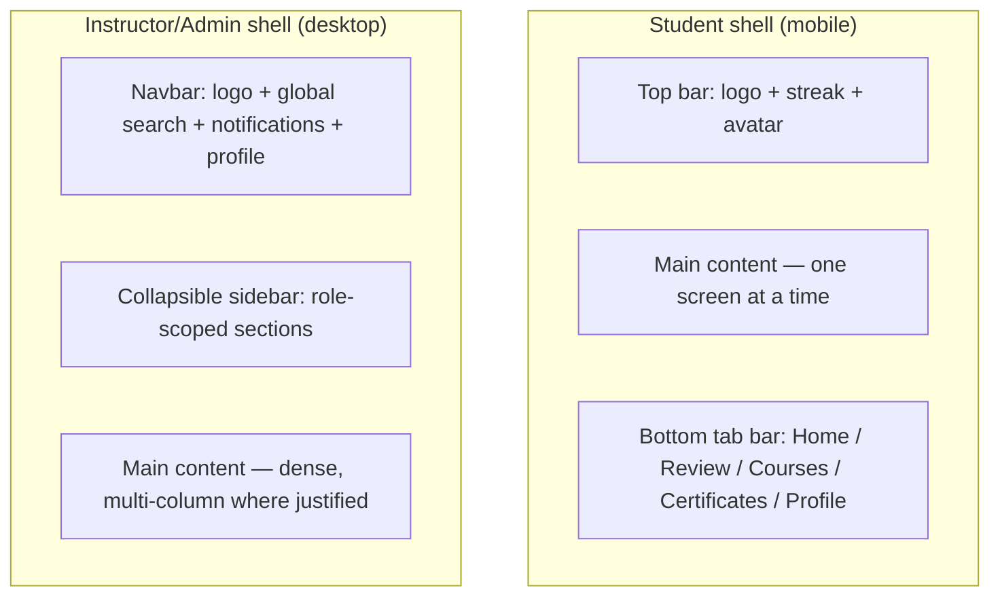

# Elrefaee English Academy — Enterprise UI/UX Design System

**Status:** Draft for review · **Date:** 2026-08-03 · **Builds on:** [00-master-blueprint.md](00-master-blueprint.md) §17 (Tailwind/shadcn direction), §11 (WCAG 2.2 AA), [02-product-requirements-document.md](02-product-requirements-document.md) §3–4 (personas, differentiation), [06-api-specification-document.md](06-api-specification-document.md) (resource shapes the UI renders)

**Companion visual reference:** this document specifies the system in writing; a rendered **Foundations & Component Showcase** accompanies it so the palette, type scale, and core component states can actually be seen and judged, not just read as hex codes — a design system's tokens can't be meaningfully approved from a table alone. Link at the end of Section 4.

**Scope-of-detail note, the same discipline applied in every prior document in this series:** 40 components and 16 full page layouts are requested. Applying identical eight-field depth to all 40 components would mean documenting `Tooltip` at the same length as `Speaking Interface` — a generic, well-understood pattern getting the same treatment as a genuinely novel, high-risk one. **13 components that are either foundational (everything else composes from them) or domain-specific and non-obvious get full treatment (Section 5); the remaining 27 get a compact but complete entry (Section 6)** — purpose, key variants/states, and the one or two rules that would actually surprise someone. Page layouts (Section 8) are specified as structured region breakdowns with Mermaid composition diagrams, not pixel-level mockups — that level of fidelity is a Phase 2 (UX) deliverable this document sets the foundation for, not this document's own job.

**No implementation code appears below** — design tokens are specified as values and rationale, not as CSS/JS.

### Table of contents
1. Design Philosophy & Principles
2. UX Principles
3. Accessibility & Responsive Rules
4. Design Tokens
5. Core & Domain Components (full spec)
6. Remaining Components (compact spec)
7. States: Empty, Loading, Error, Success
8. Page Layouts
9. Senior Design Review

---

## 1. Design Philosophy & Principles

### 1.1 What this system is for
Not a component library skin — the **visual argument for the product's core differentiation** (PRD §4.8): this is a *credible* academy, not another gamified app. Every design decision below is judged against one question: **does this read as rigorous and trustworthy, or as a game?** Gamification elements (Blueprint §8) exist and matter, but they are visually subordinate to the credentialing and instructional surfaces — never the other way around, which is the exact visual failure mode of the competitors researched in the PRD.

### 1.2 Design principles
1. **Clarity over decoration.** An ESL learner — sometimes reading their second-strongest skill in English — is the primary user. Every screen is judged on legibility and unambiguous next-action first, visual flourish second.
2. **Earned warmth.** The system is not cold/corporate, but warmth is expressed through color restraint, encouraging microcopy, and celebratory moments at genuine milestones (a certificate, a level-up) — not through constant gamified chrome.
3. **One system, three audiences.** A Student, an Instructor, and an Admin see the same visual language (same tokens, same components) at different information densities — a Student's dashboard is spacious and encouraging; an Instructor's cohort view is dense and scannable. Same DNA, different pacing, exactly like Notion's shared language across a personal doc and a dense database view.
4. **Never let gamification and credentialing visually collide.** Restated here as a design principle because it's been restated as a product/architecture rule in every prior document (Blueprint §8, SRS FR-18, SAD §3) — an XP toast and a certificate must never share a visual register (color, motion, container style) that could make one look like the other.
5. **Design in tokens, not one-off values.** No component ever hardcodes a color, spacing, or radius value outside the token set in Section 4 — this is what keeps "one system" true across web, tablet, and mobile rather than three products that happen to share a name.

### 1.3 Reference points, and how this system differs from each
- **Apple (HIG):** restraint, generous whitespace, content-first hierarchy — adopted. Apple's near-total avoidance of color in UI chrome — **not** adopted; this product needs semantic color (CEFR level, mastery status) to carry real information.
- **Material Design:** rigorous elevation/motion system — adopted (Section 4.7). Material's bold, saturated primary-color-everywhere approach — **not** adopted; this system's primary blue is used with more restraint, closer to Stripe's.
- **Fluent:** depth/acrylic effects for layering — the *idea* of depth-as-information (what's foreground vs. background) is adopted; the literal blur/acrylic aesthetic is not, since it reads as "OS chrome," not "learning platform."
- **Stripe:** typographic confidence, restrained color, data taken seriously — closely adopted, especially for Instructor/Admin surfaces.
- **Linear:** speed-signaling motion, dense-but-legible information design — adopted for Instructor/Admin dashboards specifically.
- **Notion:** one system flexing across very different density needs — adopted as Principle 3 above.
- **Duolingo:** high-energy gamification as the *entire* visual identity — explicitly **not** adopted, per Section 1.1; this is the one reference point defined more by contrast than adoption.
- **Figma:** clean, confident iconography and precise spacing rhythm — adopted for the icon/spacing system (Sections 4.8, 4.3).

---

## 2. UX Principles

1. **One primary action per screen.** Every screen has exactly one visually dominant call-to-action (matches PRD §9's "dashboard surfaces one clear next action" requirement) — secondary actions are always visually subordinate, never competing.
2. **Progress is always visible, never hidden behind navigation.** A learner should never have to click into a sub-page to find out how close they are to their next milestone.
3. **Errors explain, never just alarm.** Per the earlier internal-comms/writing guidance already established for this project (EDD's teaching philosophy of patient correction, restated visually): an error state names what went wrong and what to do next — never just a red box.
4. **Motion has a job.** Animation confirms an action succeeded, orients a user through a transition, or celebrates a genuine milestone — never decorative-only (Section 4.9).
5. **Mobile is not a shrunk desktop.** Designed mobile-first (Blueprint §11) — the mobile layout is the primary design target for the Student experience specifically (PRD persona Mateo, §3.1), with desktop as the expanded canvas, not the other way around. Instructor/Admin surfaces are designed desktop-first, tablet-adapted, mobile-functional-but-secondary — a deliberate, stated asymmetry, since grading and content review are desk-bound tasks in practice.

---

## 3. Accessibility & Responsive Rules

**WCAG 2.2 AA is the floor, not the ceiling** (Blueprint §11, SRS §3) — every rule below is additive to, not a restatement of, the full requirement list already specified there.

- **Color is never the only signal.** CEFR level, mastery status, and error/success states always pair color with an icon, label, or shape (a pill's border style, not just fill color) — required because color-only signaling fails both colorblind users and the WCAG 2.2 bar.
- **Every interactive target ≥24×24px** (WCAG 2.2 Target Size Minimum, Blueprint §11) enforced as a token-level rule: the smallest interactive component variant (`sm` button, icon-only button) is defined at exactly this floor, never smaller.
- **Focus states are a first-class visual design, not a browser default.** A visible, on-brand focus ring (Section 4.7's elevation-adjacent tokens) is designed for every interactive component — never `outline: none` without a replacement.
- **Every drag interaction has a non-drag equivalent**, per WCAG 2.2 Dragging Movements (Blueprint §11) — this is a component-level requirement stated again in Section 5's relevant components (Quiz drag-and-drop matching).
- **Dark mode, high-contrast mode, and dyslexia-friendly type are token-level toggles**, not separate designs (Section 4.2, 4.4) — one system, three accessibility-driven variants of the same tokens, never a maintained fork.
- **Reduced motion is respected by default** — every animation in Section 4.9 has a defined reduced-motion fallback (usually: the same state change, no transition).

**Responsive breakpoints** (Section 4.3): mobile (0–767px), tablet (768–1279px), desktop (1280–1535px), wide (1536px+) — Student-facing screens are authored mobile-first and expand; Instructor/Admin screens are authored desktop-first and degrade gracefully to tablet, with a stated minimum-viable (not optimized) mobile experience.

---

## 4. Design Tokens

### 4.1 Color palette
A deep, confident **ink blue** as primary (credibility/rigor — deliberately not Duolingo green, not a generic SaaS purple), a warm **amber-gold** accent reserved specifically for achievement/credentialing moments (certificates, level completion — a considered nod to an academic seal, used sparingly, never as a general UI color), and a **cool-tinted neutral** scale (a slight blue undertone, harmonizing with the primary rather than a flat, unconsidered gray).

| Token | Light value | Dark value | Usage |
|---|---|---|---|
| `color-primary-900` | `#0F2942` | `#DCE8F2` | Highest-emphasis text/icons |
| `color-primary-600` | `#22537F` | `#5B8FB8` | Primary buttons, links, active nav |
| `color-primary-100` | `#DCE8F2` | `#1B3552` | Selected/tinted backgrounds |
| `color-accent-500` | `#C98A2B` | `#E0A94F` | **Reserved**: certificates, XP/streak celebration moments only |
| `color-neutral-900` | `#14202B` | `#F7FAFC` | Body text (dark mode: near-white) |
| `color-neutral-500` | `#6B7C8C` | `#9AACB8` | Secondary text |
| `color-neutral-100` | `#E7EDF1` | `#22303C` | Borders, dividers |
| `color-neutral-50` | `#F7FAFC` | `#0B1620` | Page background |
| `color-surface` | `#FFFFFF` | `#14202B` | Card/panel background |
| `color-success` | `#2E7D5B` | `#4FAE84` | Correct answers, passed assessments |
| `color-warning` | `#C0692A` | `#DD8A4F` | Form warnings, at-risk indicators |
| `color-error` | `#B3382C` | `#E06A5C` | Errors, failed checkpoints |
| `color-info` | `#2C6699` | `#6FA3CC` | Informational banners |

**High-contrast mode** (Section 3): a fourth token set widening every text/background pair to a minimum 7:1 ratio (AAA-level contrast, exceeding the AA floor deliberately for this specific mode, since its entire purpose is maximum legibility) — same token *names*, different values, never a separate component fork.

### 4.2 Typography
**Display/headings:** a considered serif (`Charter`, falling back through `'Iowan Old Style', 'Sitka Text', Cambria, serif`) — chosen for academic credibility and genuine character, deliberately not the generic AI-default sans (Inter/Space Grotesk) or the generic AI-default cream-serif pairing (this system pairs the serif with a cool-neutral ground, not cream, and a system-native body face, not a matching serif body).
**Body/UI:** the operating system's native UI font stack (`-apple-system, 'Segoe UI', Roboto, ...`) — a deliberate legibility-first choice, not a default-by-omission: for an ESL-learner-facing product, maximizing reading legibility and matching the reader's own OS conventions outweighs the value of a more distinctive body face.
**Monospace:** `ui-monospace, 'SF Mono', 'Cascadia Code', monospace` — IPA transcriptions, data tables, verification codes.

| Token | Size / line-height | Weight | Usage |
|---|---|---|---|
| `text-xs` | 12px / 16px | 400 | Captions, IPA labels |
| `text-sm` | 14px / 20px | 400–500 | Secondary text, form labels |
| `text-base` | 16px / **26px** | 400 | Body text — line-height deliberately wider than a typical 24px, a specific accommodation for ESL reading legibility |
| `text-lg` | 18px / 28px | 400 | Lead paragraphs |
| `text-xl`–`text-2xl` | 20–24px | 600 | H4/H3 |
| `text-3xl`–`text-4xl` | 30–38px | 600–700 | H2/H1 |
| `text-5xl` | 48px / 56px | 700 | Display (landing hero only) |

### 4.3 Spacing & grid
4px base unit: `space-1`(4) `space-2`(8) `space-3`(12) `space-4`(16) `space-5`(20) `space-6`(24) `space-8`(32) `space-10`(40) `space-12`(48) `space-16`(64) `space-20`(80) `space-24`(96) — numeric naming matching the Tailwind convention already chosen at the implementation-stack level (Blueprint §17), so design tokens and build tokens stay vocabulary-aligned.
**Grid:** mobile 4-col (16px gutter), tablet 8-col (24px gutter), desktop/wide 12-col (24px gutter), max content width 1280px on wide screens (content never stretches edge-to-edge on a large monitor — a deliberate readability constraint).

### 4.4 Border radius
Deliberately **not** "rounded-lg everywhere" (the generic AI-default this system explicitly avoids, per Principle 5): `radius-sm`(4px) — inputs, tags, data-table cells; `radius-md`(8px) — buttons, standard cards; `radius-lg`(12px) — modals, elevated cards, the Speaking/Writing practice surfaces; `radius-full`(9999px) — avatars, badges, pills only. Admin/Instructor data-dense tables use `radius-sm` or square corners — a serious, data-first surface reads as serious partly through *not* rounding everything.

### 4.5 Shadows & elevation
Five levels, each tied to a specific semantic use, not a generic "card shadow":
| Level | Use | Approx. shadow |
|---|---|---|
| 0 | Flat surfaces (page background, table rows) | none — border only |
| 1 | Resting cards (lesson cards, vocabulary cards) | subtle, 1px blur-heavy |
| 2 | Raised/hover state | slightly larger, more offset |
| 3 | Dropdowns, popovers | pronounced, directional |
| 4 | Modals, dialogs | strongest, with a scrim behind |

Dark mode does not simply invert these — shadows read poorly on dark surfaces, so elevation in dark mode is communicated primarily through **surface color steps** (each level a slightly lighter neutral than the one behind it) with a much-reduced shadow, matching how Material and Apple's own dark-mode systems both handle this.

### 4.6 Motion & animation
`duration-fast`(120ms) — micro-interactions (button press, checkbox toggle); `duration-base`(200ms) — standard transitions (tab switch, accordion); `duration-slow`(320ms) — modal/page-level transitions. Easing: `ease-out` (entrances), `ease-in` (exits). **Celebratory moments** (certificate issued, level completed, streak milestone) get one deliberate, orchestrated motion sequence each — not a generic confetti library applied everywhere — matching Principle 4 ("motion has a job") and reserved specifically for genuine milestones so it doesn't cheapen through overuse. `prefers-reduced-motion` disables all non-essential transitions platform-wide, a single token-level switch, not a per-component afterthought.

### 4.7 Iconography
One icon family, consistent stroke weight (2px at 24px grid), rounded caps matching `radius-md`'s character — icons never mix outline and filled styles within the same screen except to distinguish an active/inactive state (filled = active/selected, outline = inactive), a single consistent rule rather than an ad hoc per-icon choice.

### 4.8 Illustrations
Used sparingly and specifically for **empty states and onboarding** (Section 7) — never as generic decorative filler on functional screens (a data-dense Instructor dashboard never has an illustration competing with the data). Style: simple geometric line-work in the primary/accent palette, never a mismatched generic stock-illustration style, and never a style that reads as "for children" given the primary adult-learner audience (Blueprint §1) — a real risk to flag given how much EdTech illustration defaults skew juvenile.

**→ See the companion Foundations & Component Showcase for these tokens rendered visually.**

---

## 5. Core & Domain Components — Full Specification

### 5.1 Button
- **Purpose:** the primary action-affordance across the system.
- **Variants:** `primary` (filled, primary-600), `secondary` (outlined), `tertiary`/ghost (text-only), `destructive` (error color, confirmation-gated), `icon-only` (min 24×24 target).
- **States:** default, hover, active/pressed, focus (visible ring), disabled, loading (inline spinner replaces label, button width unchanged to prevent layout shift).
- **Behavior:** exactly one `primary` button visible per screen/section (UX Principle 1) — a screen with two competing primary buttons is a design-review failure, not a style choice.
- **Accessibility:** ≥24×24px target; loading state retains an accessible label (`aria-busy`, not just a visual spinner); disabled buttons are still focusable with an explanation available (never silently inert with no reason given).
- **Responsive:** full-width on mobile for primary actions in a form/flow context; auto-width elsewhere.
- **Interaction rules:** `duration-fast` for press feedback; destructive actions require a confirmation step (Dialog, §5.4), never a single-click irreversible action.
- **Usage guidelines:** never more than one `primary` + one `secondary` in the same button group.

### 5.2 Input (text, number, textarea)
- **Purpose:** primary data-entry control.
- **Variants:** text, email, password (with visibility toggle), number, textarea (auto-growing for writing submissions).
- **States:** default, focus, filled, error (with inline message below, not just a red border), disabled, read-only.
- **Behavior:** validation feedback appears on blur for single fields, on submit for forms — never on every keystroke (which reads as hostile, especially for ESL learners still forming a response).
- **Accessibility:** every input has a visible, persistent label (never placeholder-as-label, which disappears exactly when it's most needed); error messages are programmatically associated (`aria-describedby`) so screen readers announce them.
- **Responsive:** full-width within its container at every breakpoint.
- **Interaction rules:** error state never appears mid-typing on the first attempt at a field — gives the learner room to finish forming an answer.
- **Usage guidelines:** the writing-submission textarea (§8) uses a distinct, larger variant — see §6's Writing Editor entry.

### 5.3 Card
- **Purpose:** the primary content-grouping container — lesson cards, vocabulary cards, dashboard widgets all inherit this base.
- **Variants:** `standard` (elevation 1), `interactive` (elevation 1→2 on hover, implies clickability), `flat` (elevation 0, used inside already-elevated containers to avoid stacked-shadow visual noise).
- **States:** default, hover (interactive only), selected (primary-100 background + primary-600 border), locked/disabled (reduced opacity + lock icon — used for not-yet-unlocked lessons).
- **Behavior:** an `interactive` card's entire surface is the click target, not just its title text.
- **Accessibility:** an `interactive` card is a real `button`/`link` semantically, never a `div` with an onClick — keyboard and screen-reader operable by construction.
- **Responsive:** cards reflow from a multi-column grid (desktop) to a single column (mobile) — never horizontally scrollable as the primary mobile pattern (a common but poor mobile pattern for primary content).
- **Usage guidelines:** `radius-md`, elevation 1 by default (§4.5/§4.4).

### 5.4 Dialog / Modal
- **Purpose:** focused, blocking interaction for a single task (confirmation, a short form) — not a dumping ground for complex flows.
- **Variants:** `confirmation` (short, 1–2 actions), `form` (contains an Input/form group), `celebratory` (certificate-earned, level-up — visually distinct treatment, accent-adjacent, with the one-time motion sequence from §4.6).
- **States:** entering, open, exiting.
- **Behavior:** traps focus while open; `Escape` closes non-destructive dialogs; a destructive `confirmation` dialog requires an explicit affirmative action, never closable by an accidental click-outside alone.
- **Accessibility:** `role="dialog"`, `aria-modal="true"`, focus returns to the triggering element on close — a complete, non-negotiable keyboard-trap-and-release cycle.
- **Responsive:** full-screen on mobile (never a small centered box a thumb has to fight with), centered floating panel on tablet/desktop.
- **Usage guidelines:** never nest a Dialog inside a Dialog — if a flow needs that, it needs a dedicated page instead.

### 5.5 Toast (notification)
- **Purpose:** transient, non-blocking confirmation or alert.
- **Variants:** `success`, `info`, `warning`, `error`; a distinct `xp-gain` micro-variant (small, corner-anchored, brief) — visually **must never** resemble the `celebratory` Dialog variant above (Principle 4's restated rule, made concrete at the component level).
- **States:** entering, visible, exiting (auto-dismiss after a duration proportional to message length, always dismissible manually).
- **Accessibility:** `aria-live="polite"` (or `assertive` for errors) so screen-reader users receive the same information sighted users do, without it interrupting their current focus unnecessarily.
- **Responsive:** stacks bottom-center on mobile, bottom-right on desktop.

### 5.6 Tabs
- **Purpose:** switching between sibling views within the same context (e.g., a Lesson's Overview/Vocabulary/Grammar tabs).
- **States:** active, inactive, hover, focus, disabled (e.g., a "Speaking" tab disabled until prerequisite content is complete).
- **Behavior:** content beneath switches without a full page transition; the active indicator animates (`duration-fast`) between tab positions rather than snapping.
- **Accessibility:** full arrow-key navigation between tabs (`role="tablist"`), not just click/tap.
- **Responsive:** horizontally scrollable with a visible overflow affordance on mobile if more than 4 tabs — never silently clipped.

### 5.7 Navigation (Sidebar + Navbar)
- **Purpose:** primary wayfinding, role-scoped (SRS §4).
- **Variants:** Student (simplified: Home, Courses, Review, Certificates, Profile), Instructor (adds Cohorts, Grading, Analytics), Admin/Studio (adds CMS, Users, Settings) — one navigation *component*, different configured item sets per role, never four separately-built navigation components.
- **Behavior:** current section always visually indicated (filled icon + primary-600 label, per §4.7's active/inactive rule); collapsible on tablet/desktop to an icon-only rail; becomes a bottom tab bar on mobile for Student role specifically (thumb-reachable, matching UX Principle 5's mobile-first stance for that audience) and a slide-in drawer for Instructor/Admin mobile (secondary-priority surface).
- **Accessibility:** landmark roles (`nav`), current-page indicated via `aria-current`.

### 5.8 Audio Recorder
- **Purpose:** the shared recording primitive underlying Pronunciation practice, Speaking assessments, and Conversation Partner turns (SRS FR-10/FR-14).
- **Variants:** `single-take` (pronunciation drill — record, review, re-record freely), `timed` (speaking assessment — visible countdown, one submission).
- **States:** idle (permission not yet granted / ready), requesting-permission, recording (visible waveform + elapsed time), reviewing (playback + re-record + submit), uploading, scored.
- **Behavior:** a large, unmistakable record affordance (never a small icon button for the primary action of this component); visible real-time waveform feedback during recording so a learner can tell the mic is actually capturing audio — a genuine trust signal for a component whose entire job depends on that confidence.
- **Accessibility:** microphone-permission failure has a clear, actionable error state (§7.3), not a silent dead component; **the one explicitly flagged, still-open accessibility gap from the SRS (§16 review) applies directly here** — a learner who cannot produce spoken audio needs an alternative path, which this component's design does not yet resolve and should not pretend to.
- **Responsive:** full-width, thumb-reachable record button on mobile — this is a primarily mobile-used component given the Student persona (PRD §3.1).
- **Security notes (carried from SRS §7):** recording is never auto-submitted; the learner always confirms in the `reviewing` state first.

### 5.9 Speaking Interface
- **Purpose:** the composed screen-level pattern combining a prompt, the Audio Recorder, and feedback display (Blueprint §10).
- **Variants:** `practice` (Phase 1 — comparison-based feedback, unlimited re-attempts, encouraging tone throughout even on a low score) vs. `assessment` (Phase 2/certification context — timed, one attempt, more formal visual register, closer to the Instruction/Admin density level than the playful Student default).
- **Behavior:** the target phrase/prompt is always visible during recording (never hidden, which would test memory rather than pronunciation); feedback renders per-phoneme/word where Phase 2 scoring is available, a simpler holistic comparison in Phase 1 — the UI is designed to degrade gracefully between the two without looking broken in the Phase 1 state.
- **Accessibility:** the IPA transcription of the target phrase is always shown alongside the phrase itself (monospace token, §4.2) — direct reinforcement of the EDD's explicit-IPA-from-Pre-A1 methodology (EDD §8).

### 5.10 Writing Editor
- **Purpose:** the writing-submission composition surface (SRS FR-13).
- **Behavior:** a large, distraction-minimal textarea (no surrounding chrome competing for attention); a live word/character count; category-tagged AI feedback (EDD §12's five buckets: content/organization/grammar/vocabulary/mechanics) renders as inline, color-coded annotations the learner can toggle by category, not one undifferentiated wall of comments.
- **States:** drafting, submitted (read-only), AI-feedback-pending, feedback-available, instructor-reviewed (a visually distinct badge from AI-only feedback — the learner should always be able to tell whether a human has looked at their work yet, per SRS FR-13's hard rule that AI scores are suggestions until an instructor signs off).
- **Accessibility:** feedback annotations are navigable via keyboard (not hover-only tooltips as the sole access method).
- **Responsive:** full-screen editing mode on mobile (minimizes chrome further than desktop, since screen real estate for writing is already scarce there).

### 5.11 Vocabulary Card / Flashcard
- **Purpose:** the review-queue primitive (EDD §15/§16 — retrieval-based by default).
- **Behavior:** **front-first, retrieval-forced** — the definition/translation is never visible until the learner has attempted recall (a tap/swipe reveals it), directly implementing the Active Recall methodology (EDD §16) at the component level, not just a content-authoring guideline; after reveal, four recall-quality buttons (`again`/`hard`/`good`/`easy`) feed the FSRS scheduler (DDD §3.5) — never a simple right/wrong binary, which would lose the scheduling signal the algorithm needs.
- **Variants:** vocabulary (headword + IPA + example), grammar-chunk (a short pattern + example sentence).
- **States:** front (question), back (revealed answer + recall buttons), transitioning.
- **Accessibility:** the reveal action is a real button, not a hover-only or swipe-only gesture — swipe is a supported *shortcut*, never the only path (matching WCAG 2.2's dragging-alternative principle, §3).
- **Responsive:** full-width single-card mobile view (the primary usage context, matching PRD's review-queue-on-the-go persona pattern); grid-of-cards view available on desktop for browsing (not reviewing) the vocabulary notebook.

### 5.12 Quiz Components
- **Purpose:** the exercise/checkpoint rendering surface (SRS FR-07/FR-08), covering multiple item types with one consistent shell.
- **Variants:** multiple-choice, fill-in-the-blank (typed, with the fuzzy-match tolerance from SRS FR-07 applied silently — the learner never sees "close enough" logic, just a correct/incorrect result), drag-and-drop matching, audio-response.
- **Behavior:** immediate formative feedback after each item in practice contexts (green/red + explanation, never just a checkmark with no reasoning) vs. deferred, batch feedback at the end for timed assessment contexts — a stated, deliberate difference in behavior between the two contexts, not an oversight.
- **Accessibility:** every drag-and-drop matching item ships with a fully keyboard-operable select-then-place alternative, by construction — restated here as a component-level non-negotiable (Blueprint §11, WCAG 2.2 Dragging Movements), not left to per-exercise discretion.
- **Responsive:** drag-and-drop reflows to a tap-to-select-tap-to-place pattern on touch devices, which doubles as the accessibility alternative above rather than being a second implementation.

### 5.13 Dashboard Widgets
- **Purpose:** the composable unit of every role's dashboard (SRS FR-03) — a progress ring, a due-review count, a cohort-at-risk list, an academy KPI tile all share one widget shell.
- **Variants:** `stat` (a single number + trend, e.g., current streak), `list` (e.g., at-risk students), `progress` (ring or bar, e.g., level completion), `action` (a widget whose entire purpose is one CTA, e.g., "Continue Lesson 4").
- **Behavior:** every widget states its data's freshness where relevant (e.g., "as of this morning" on an Instructor analytics widget reading from the nightly-aggregated CQRS read model, SAD §19) — a small but important honesty signal given that these are precomputed, not live, values.
- **Accessibility:** a `stat` widget's number is never color-alone-encoded for meaning (§3) — a declining trend pairs a down-arrow icon and label with any red, never red alone.
- **Responsive:** a responsive grid (masonry-like reflow) — widgets never require horizontal scrolling to discover on any breakpoint.

---

## 6. Remaining Components — Compact Specification

| Component | Purpose | Key variants/states | The one rule most likely to be missed |
|---|---|---|---|
| Dropdown/Select | Single choice from a list | native-feel, searchable (for long lists e.g. country) | Never used for fewer than ~5 options — Radio (below) is more scannable below that threshold |
| Checkbox | Multi-select / boolean toggle | checked, indeterminate, disabled | Indeterminate state exists and is used for "select all" parent controls, not skipped |
| Radio button | Single choice, all options visible at once | selected, disabled | Always used (not Dropdown) when ≤5 options and comparison between them matters |
| Table | Structured, dense data (Admin/Instructor) | sortable columns, row-selection, sticky header | `radius-sm`/square corners (§4.4) — a data table is never the place for playful rounding |
| List | Simple sequential content (notifications, notes) | default, with-avatar, with-action | Divider-based, not card-based, when items are homogeneous and dense — avoids "everything is a card" fatigue |
| Accordion | Progressive disclosure of grouped content (FAQ, lesson block outline) | expanded, collapsed | Only one section open at a time in dense contexts (Instructor), multiple allowed in exploratory contexts (Student FAQ) |
| Tooltip | Supplementary info on hover/focus | default, with-icon-trigger | Never the *only* place critical information lives — always supplementary, per §3's non-hover-only rule |
| Progress bar | Linear completion indicator | determinate, indeterminate | Determinate by default — an indeterminate bar is used only for genuinely unknown-duration waits (e.g., AI Gateway calls, §5's loading-state guidance) |
| Avatar | User representation | photo, initials-fallback, role-badge overlay | Initials fallback always legible against `color-primary-100` background — never relies on the photo existing |
| Badge | Small status indicator (role, level) | filled, outline | Distinct from Tag (below) — Badge communicates *status*, never user-removable |
| Tag | User- or system-applied label (vocabulary tier, content type) | removable, static | The removable variant always has a visible, ≥24px close target — not a tiny 'x' |
| Breadcrumb | Hierarchical location within Curriculum Studio/Admin | — | Present only in genuinely deep hierarchies (CMS); never added to the flat Student navigation just for consistency's sake |
| Navbar | Top-level app chrome (logo, global search, profile menu) | — | Houses global Search (below) and notification bell — nothing else competes for this row's attention |
| Footer | Marketing/landing page only | — | Never appears inside the authenticated app shell — inside the product, the Navigation (§5.7) is the only wayfinding surface |
| Pagination | Navigating large lists (Admin) | cursor-based (default, §4.1 API doc), numbered (small admin lists) | Matches the API's own pagination model (API Spec §1.4) exactly — never a UI pattern the API can't actually back |
| Search | Cross-content lookup (API Spec §6.16) | global (navbar), scoped (within a page) | Results are always visibly scoped to what the searcher is allowed to see — a Draft-content leak here is treated as severely as the API-layer rule it fronts |
| Filters | Narrowing a list/table | chip-based (removable, stacks with Tag styling), panel (Admin dense views) | Every applied filter is visible as a removable chip — never a hidden "3 filters applied" summary the user has to open a panel to inspect |
| Charts | Analytics visualization (SRS §11) | line (trend over time), bar (comparison), donut (composition) | Semantic color (§4.1) only — chart series colors are drawn from a distinct, colorblind-safe categorical palette, never reusing `color-error`/`color-success` for non-semantic series |
| Forms | Composed input groups | single-column (always) | Never multi-column on any breakpoint — single-column forms measurably reduce completion errors, especially valuable given the ESL-reading-load context |
| Calendar | Homework due dates, cohort scheduling (Instructor) | month, week, agenda-list | Agenda-list is the default on mobile — a full month grid is desktop-appropriate density only |
| Media Player | Lesson audio/video playback | with-transcript-toggle | Transcript toggle always present (Blueprint §11's accessibility requirement) even when the default UI hides it pending attempt (EDD §10's pedagogical resolution — restated at the component level) |
| Lesson Components | The block-rendering shell for a lesson's structural blocks (EDD §5) | warm-up, presentation, practice, task, wrap-up block shells | Each block type has a *distinct* visual treatment (not just a heading change) so a learner always has ambient awareness of where they are in the canonical lesson structure |

---

## 7. States: Empty, Loading, Error, Success

- **Empty states:** always paired with a specific next action, never a bare "nothing here" — e.g., a new learner's empty progress dashboard shows the placement-test CTA (SRS FR-03), not a blank chart. A light, simple illustration (§4.8) is appropriate here specifically — this is the one context where decorative art earns its place, because it softens what would otherwise read as a broken or unfinished screen.
- **Loading states:** skeleton screens (matching the eventual content's actual layout) for anything expected to resolve in under ~2s; an explicit progress/status message for anything longer (an AI Gateway call, §5.16's timeout guidance from the API spec) — never a bare spinner with no context past ~3 seconds, which reads as "is this broken?"
- **Error states:** name the problem and the fix in plain language (UX Principle 3) — "We couldn't save your answer — check your connection and try again" not "Error 500." Network/offline errors specifically surface the "pending sync" state from SRS FR-05's mutation-queue tolerance, not a dead end.
- **Success states:** proportional to the achievement — a completed exercise gets a small, quiet confirmation; a certificate gets the full celebratory treatment (§5.4/§4.6) — success feedback intensity is itself a design token category, not ad hoc per screen.

---

## 8. Page Layouts

Structured region breakdowns + composition diagrams. Pixel-precise mockups are a Phase 2 (UX) deliverable this document grounds, not this document's own scope (stated in the header note).

| Page | Layout regions | Key components | Primary goal |
|---|---|---|---|
| **Landing** | Hero (headline + one CTA), differentiation section (mirrors PRD §4.8's table, visually), pricing/CTA footer | Footer (§6, marketing-only), Card grid | Convert a visitor to signup — one CTA repeated, never competing CTAs |
| **Authentication** | Centered single-column form, no navigation chrome | Input, Button, error inline | Minimize friction and distraction during login/signup |
| **Student Dashboard** | Top: streak/XP strip (small, quiet). Center: one dominant "continue" action widget. Below: due-review count, recent progress | Dashboard Widgets, Progress bar | Get the learner into their next lesson/review in one tap |
| **Teacher Dashboard** | Cohort-at-risk list (top, most important), pending-grading queue, class analytics summary | Dashboard Widgets (list variant), Table | Surface who needs attention *before* routine stats |
| **Admin Dashboard** | Content-publishing queue, academy KPI tiles, user-management shortcuts | Table, Dashboard Widgets (stat variant) | Governance-first, not vanity-metrics-first |
| **Course Page** | Level header (CEFR badge, progress ring), unit list (locked/unlocked/complete states) | Card (interactive), Badge, Progress bar | Orient the learner in the full level, then funnel to "next unit" |
| **Lesson Page** | Sequential block flow (§6's Lesson Components), persistent minimal progress indicator | Lesson Components, Tabs (if the lesson has sub-sections) | One block at a time, no overwhelming full-lesson wall of content |
| **Vocabulary (notebook)** | Filterable grid/list toggle, due-today count banner | Vocabulary Card, Filters, Tag | Browse *and* review from the same entry point without confusing the two modes |
| **Speaking Practice** | Full-focus single-task layout, minimal chrome | Speaking Interface, Audio Recorder | Remove every distraction from the recording moment |
| **Writing Practice** | Prompt (collapsible once drafting starts) + editor + feedback panel (toggleable, not forced open) | Writing Editor | Give the editor maximum space once the learner is actively writing |
| **Quizzes** | One item per screen (mobile) / paged multi-item (desktop), persistent item-progress indicator | Quiz Components, Progress bar | Reduce cognitive load per screen, especially on mobile |
| **Assessments** | Timed-context visual register (more formal, §5.9), explicit remaining-time and remaining-items indicators | Quiz Components (assessment variant), Progress bar | Signal "this counts" without inducing panic — calm authority, not alarm |
| **Certificates** | Full celebratory moment on issuance (§4.6/§5.4), then a calm, shareable, verification-linked display | Dialog (celebratory), Card, Badge | Feel earned and credible — the visual opposite of a game badge |
| **Analytics** | Chart-forward, filterable by cohort/time range (Instructor/Admin) | Charts, Filters, Table | Answer "who/what needs attention" at a glance, detail on demand |
| **Settings** | Grouped sections (Notifications, Accessibility, Billing, Data & Privacy) | Forms (single-column), Toggle | Every accessibility preference from §3 has a visible, findable control here — never buried |
| **Profile** | Public-facing summary (display name, level, certificates earned) vs. private account section, clearly separated | Avatar, Badge, Card | Distinguish "what others might see" from "my private account," visually and structurally |

---

## 9. Senior Design Review

Reviewed as if audited by senior designers from Apple, Google, Microsoft, and Figma. Each finding states what was found and where the fix now lives.

1. **(Apple-lens: restraint) The accent gold risked becoming a general "highlight" color used wherever something needed to pop**, which would dilute exactly the certificate/achievement significance it's meant to carry. Fixed: §4.1 states its use is **reserved**, not just suggested, and §5.5's Toast spec explicitly prohibits the XP-gain toast from borrowing the celebratory Dialog's register — the same discipline applied twice, at the token level and the component level.
2. **(Material-lens: elevation consistency) The initial draft risked defining shadows as one flat value reused everywhere ("just add a card shadow"), which is exactly the un-considered-default failure mode Material's own system is built to avoid.** Fixed: §4.5's five-level elevation system ties each level to a specific semantic use, and explicitly states dark mode uses surface-color-stepping instead of shadow-inversion — a real, non-obvious distinction many systems get wrong.
3. **(Fluent-lens: information hierarchy under density) The Instructor/Teacher dashboard risked inheriting the Student dashboard's spacious, single-action layout, which would bury the at-risk-student signal Instructors most need first (PRD US-I1).** Fixed: §8's Teacher Dashboard entry explicitly orders the at-risk list *above* summary stats — density and priority order stated as a deliberate difference from the Student layout, not a shared template applied uniformly.
4. **(Figma-lens: system integrity) Icon style risked mixing outline and filled icons ad hoc per designer preference across screens**, which is the single most common way a "design system" quietly stops being one. Fixed: §4.7 states one explicit, closed rule (filled = active/selected state only) rather than leaving it to per-instance judgment.
5. **(Google/Material-lens: motion discipline) Celebratory motion risked becoming a reusable "confetti component" applied to every minor success**, cheapening exactly the milestones it should mark as significant. Fixed: §4.6 and §7 both state celebratory treatment is reserved for genuine milestones, with routine success getting deliberately quieter feedback — motion intensity treated as a token-governed hierarchy, not a binary on/off.
6. **(Cross-cutting: accessibility) The Audio Recorder and Speaking Interface (§5.8/§5.9) are the components with the least-resolved accessibility story in this entire document — a learner who cannot produce spoken audio has no stated alternative path.** Not resolved here, and stated as such rather than papered over: this is the same open gap the SRS's own engineering review flagged (SRS §16) as needing a UX-phase decision, not an engineering-only fix — restated here at the design-system level because it is, in fact, this document's job to propose that alternative, and it currently does not. **Flagged as the single most important open item for the next design phase**, not quietly left for someone else to notice later.

**Net assessment:** enterprise-grade and internally consistent with the Blueprint, EDD, PRD, SRS, SAD, DDD, and API Specification — cross-checked explicitly. One genuine, unresolved accessibility gap is named rather than hidden (Finding 6). No implementation code was generated. Ready for your review.
