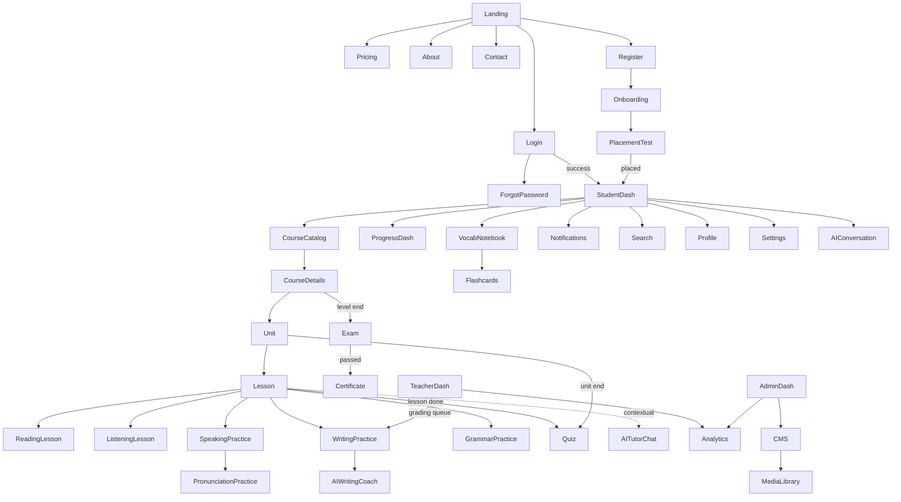

# Elrefaee English Academy — Wireframe Document

**Status:** Draft for review · **Date:** 2026-08-03 · **Builds on:** [07-ui-ux-design-system.md](07-ui-ux-design-system.md) (components/tokens these wireframes compose), [02-product-requirements-document.md](02-product-requirements-document.md) §9 (user journey), [03-software-requirements-specification.md](03-software-requirements-specification.md) (functional requirements each screen implements)

**Purpose, stated precisely:** structure, navigation, and interaction — not visual design. Every wireframe below is deliberately low-fidelity (boxes and labels, no color/type/imagery) per your instruction; the Design System (doc 07) already governs what these regions look like once designed.

**Scope-of-detail note — same discipline as every prior document in this series, for the same reason:** 38 screens named, each requesting 15 fields plus mobile/tablet/desktop wireframes. Applying full depth uniformly would document `Forgot Password` (a one-field form) at the same length as `Placement Test` (a multi-stage adaptive flow) — and would bury the screens engineers and designers most need detail on inside 500 words of `Pricing` boilerplate. **14 screens chosen for genuine structural complexity or novelty get full 15-field treatment with dual-breakpoint wireframes (Section 3); the remaining 24 get a compact but complete wireframe entry (Section 4)** — purpose, layout, key components, and the one interaction rule that would actually surprise someone, explicitly cross-referencing the full-treatment screen whose pattern they inherit (most of the practice-type screens are the same canonical Lesson structure with different block content, EDD §5 — documenting that inheritance explicitly is more useful than repeating the same wireframe six times with the labels swapped). Tablet is documented separately only where it behaves genuinely differently from an interpolation between mobile and desktop (Design System §3's stated breakpoint model) — otherwise noted as "interpolates," not redrawn a third time.

### Table of contents
1. Wireframe Legend & Conventions
2. Site Map & Navigation Flow
3. Full-Treatment Screens (14)
4. Compact-Treatment Screens (24)
5. UX Review

---

## 1. Wireframe Legend & Conventions

```
┌───────┐   region / container boundary
│ Label │
└───────┘
[ Button ]        primary or secondary action
( input )         text field
{Tab}{Tab*}       tab set, * = active tab
<icon>            icon-only control
▓▓▓░░  62%        progress indicator
●●●○○             step indicator (onboarding/multi-stage flows)
≡                 mobile menu / hamburger
※                 a note on this specific wireframe, not a UI element
```
Mobile wireframes are drawn narrow/single-column (the primary design target for Student-facing screens, Design System §1.2's UX Principle 5); desktop wireframes are drawn wide, showing sidebar/multi-column layout where it exists. Every screen's Accessibility Notes assume the full WCAG 2.2 AA baseline already specified in the Design System (§3) and states only what's *specific* to that screen beyond the baseline.

---

## 2. Site Map & Navigation Flow



---

## 3. Full-Treatment Screens

### 3.1 Landing Page
- **Purpose:** convert a visitor into a signup by making the credibility differentiation (PRD §4.8) legible in under 10 seconds.
- **User goals:** understand what this is, why it's different from a gamified app, and whether to try it.
- **Primary action:** `[ Start free ]` (repeated at top and bottom).
- **Secondary actions:** `See pricing`, `Log in` (nav).
- **Information hierarchy:** hero (headline + CTA) → differentiation (3 cards, mirrors PRD §4.8's table) → curriculum ladder preview → final CTA → footer.
- **Navigation:** marketing navbar only — no app chrome.
- **Layout structure:** full-width hero, stacked sections below.
- **Components used:** Navbar, Button, Card, Footer (Design System §6/§7).
- **Empty/Loading/Error states:** none — static, SSR/ISR-rendered (Blueprint §17).
- **Accessibility notes:** hero headline is a true `h1`; CTA meets the ≥24×24px target floor with generous padding beyond it; any hero background never drops text contrast below AA.

```
Mobile                              Desktop
┌─────────────────────┐             ┌───────────────────────────────────────────┐
│ ≡   Elrefaee [Log in]│             │ Elrefaee   Pricing  About  [Log in][Start free]│
├─────────────────────┤             ├───────────────────────────────────────────┤
│  Headline             │             │  Headline          |  (product visual)     │
│  Subhead              │             │  Subhead             |                       │
│  [ Start free ]       │             │  [Start free][See how it works]              │
├─────────────────────┤             ├───────────────────────────────────────────┤
│  Card 1                │             │  Card 1      Card 2      Card 3              │
│  Card 2                │             │  (why not "just another app" — 3-col)        │
│  Card 3                │             ├───────────────────────────────────────────┤
├─────────────────────┤             │  Curriculum ladder Pre-A1→C1 (horizontal)     │
│  Curriculum ladder     │             ├───────────────────────────────────────────┤
│  (stacked)             │             │  [ Start free ]                              │
├─────────────────────┤             ├───────────────────────────────────────────┤
│  [ Start free ]        │             │  Footer (4-col)                               │
├─────────────────────┤             └───────────────────────────────────────────┘
│  Footer                │
└─────────────────────┘
```

### 3.2 Onboarding
- **Purpose:** move a just-registered learner into the Placement Test with context, not cold.
- **User goals:** feel oriented, not interrogated.
- **Primary action:** `[ Continue ]` per step.
- **Secondary actions:** `Back` (except step 1).
- **Information hierarchy:** one question/step at a time — welcome → learning goal → what-to-expect (self-assessment then a short test) → hand-off to Placement Test.
- **Navigation:** none beyond step controls — no escape to browse the app mid-flow, deliberately (this is a funnel, not a page).
- **Layout structure:** single-column, centered, step indicator at top.
- **Components used:** Forms (single-column, Design System §6), step indicator, Button.
- **Empty/Loading/Error states:** N/A (no data dependency); an abandoned onboarding resumes at the same step on return, never restarts.
- **Accessibility notes:** step indicator has a text equivalent ("Step 2 of 3"), not color/dot-only.

```
Mobile & Desktop (identical — single-column by design at every breakpoint)
┌─────────────────────┐
│      ●●○  Step 2/3   │
├─────────────────────┤
│                      │
│  Why are you         │
│  learning English?   │
│                      │
│  ( ) Work             │
│  ( ) Study abroad      │
│  ( ) Travel             │
│  ( ) Just for me        │
│                      │
│  [ Back ] [ Continue ]│
└─────────────────────┘
```

### 3.3 Placement Test
- **Purpose:** place the learner at an accurate CEFR level via the two-stage flow (Blueprint §3.5).
- **User goals:** get placed accurately without the process feeling like a high-stakes exam.
- **Primary action:** `[ Next ]` / `Submit answer`.
- **Secondary actions:** none — no skip, no back (test integrity).
- **Information hierarchy:** Stage 1 (self-assessment grid, checklist by skill) → transition screen ("now a short check, ~10 min") → Stage 2 (adaptive items, one at a time) → results/placement reveal.
- **Navigation:** none — a contained flow, exits only on completion or explicit abandon-confirmation.
- **Layout structure:** single item/question centered per screen; a minimal, non-anxiety-inducing progress indicator (item count, never a visible running score).
- **Components used:** Quiz Components (Design System §6), progress indicator, Card (results reveal).
- **Empty state:** N/A.
- **Loading state:** brief inter-item loading (adaptive routing computes next item) — a skeleton, never a bare spinner past ~1s.
- **Error state:** connectivity loss mid-test → attempt preserved, resumable within 24h (SRS FR-08) — the resume screen states this explicitly ("Pick up where you left off"), not a silent restart.
- **Accessibility notes:** every item type (including any drag-based ones) has the keyboard-operable alternative from Design System §5.12, non-negotiably, since this is a required, non-skippable flow.

```
Mobile                              Desktop
┌─────────────────────┐             ┌───────────────────────────────────┐
│  Item 6 of ~12        │             │            Item 6 of ~12            │
├─────────────────────┤             ├───────────────────────────────────┤
│  Listen and choose     │             │      Listen and choose the correct  │
│  the correct response  │             │      response                       │
│  ▶ [ audio clip ]       │             │      ▶ [ audio clip ]                │
│                       │             │                                     │
│  ( ) Option A            │             │      ( ) Option A   ( ) Option B     │
│  ( ) Option B            │             │      ( ) Option C   ( ) Option D     │
│  ( ) Option C            │             │                                     │
│  ( ) Option D            │             │            [ Next ]                 │
│                       │             └───────────────────────────────────┘
│  [ Next ]              │
└─────────────────────┘
```

### 3.4 Student Dashboard
- **Purpose:** the daily-use hub — one clear next action, always (PRD §9/SRS FR-03).
- **User goals:** "what should I do right now?"
- **Primary action:** `[ Continue Lesson X ]` (the single dominant widget).
- **Secondary actions:** review queue, browse courses, view certificates.
- **Information hierarchy:** streak/XP strip (small, top) → dominant continue-lesson widget → due-review count → recent progress summary.
- **Navigation:** bottom tab bar (mobile: Home / Review / Courses / Certificates / Profile) — Design System §5.7.
- **Layout structure:** single-column stack (mobile) → widget grid (desktop, Design System §5.13).
- **Components used:** Dashboard Widgets, Progress bar, Navigation (bottom tabs).
- **Empty state:** brand-new learner → the widget is a placement-test CTA, not an empty lesson list (SRS FR-03's stated requirement).
- **Loading state:** skeleton widgets matching final layout, not a full-page spinner.
- **Error state:** widget-level failure (e.g., analytics aggregate unavailable) degrades that one widget only, never the whole dashboard.
- **Accessibility notes:** the "continue" widget's entire surface is one link/button (Design System §5.3's Card rule), reachable as a single tab stop, not a maze of nested focusable elements.

```
Mobile                              Desktop
┌─────────────────────┐             ┌───────────────────────────────────────┐
│ 🔥12  1,240xp    (avt)│             │ Sidebar │ 🔥12  1,240xp          (avt) │
├─────────────────────┤             │         ├───────────────────────────────┤
│ ┌─────────────────┐ │             │ Home    │ ┌───────────┐ ┌─────────────┐ │
│ │ Continue         │ │             │ Review  │ │ Continue   │ │ Due today   │ │
│ │ Unit 4, Lesson 2 │ │             │ Courses │ │ Unit4/L2   │ │ 18 words    │ │
│ │ [ Continue ]     │ │             │ Certs   │ │[Continue]  │ │[Start rev.] │ │
│ └─────────────────┘ │             │ Profile │ └───────────┘ └─────────────┘ │
│ ┌─────────────────┐ │             │         │ ┌───────────┐ ┌─────────────┐ │
│ │ Due today: 18     │ │             │         │ │ Progress   │ │ Certificates │ │
│ │ [ Start review ]  │ │             │         │ │ ring B1 64%│ │ 2 earned     │ │
│ └─────────────────┘ │             │         │ └───────────┘ └─────────────┘ │
├─────────────────────┤             └───────────────────────────────────────┘
│ Home Review Courses..│
└─────────────────────┘
```

### 3.5 Teacher Dashboard
- **Purpose:** surface who needs attention *before* routine stats (PRD US-I1).
- **Primary action:** open an at-risk student's detail, or the grading queue.
- **Secondary actions:** assign homework, view cohort analytics.
- **Information hierarchy:** at-risk list (top) → pending-grading count → class-wide error patterns → cohort roster.
- **Navigation:** sidebar (desktop/tablet-first, Design System §1.2's stated Instructor asymmetry) — Home / Cohorts / Grading / Analytics.
- **Layout structure:** dense, multi-column desktop; a functional-but-secondary single-column mobile view.
- **Components used:** Dashboard Widgets (list variant), Table.
- **Empty state:** no cohorts yet → guided cohort-setup CTA, not a blank screen.
- **Loading state:** table skeleton rows.
- **Error state:** a failed cohort-analytics fetch shows a retry action inline, not a full-page error.
- **Accessibility notes:** the at-risk indicator pairs an icon + label with any red, never color-alone (Design System §3).

```
Desktop (primary target)                          Mobile (functional, secondary)
┌───────────────────────────────────────────┐     ┌─────────────────┐
│ Sidebar │ ⚠ At-risk (3)   Grading queue (7) │     │ ⚠ At-risk (3)     │
│ Home    ├───────────────────────────────────┤     │ • Mateo — 6d idle │
│ Cohorts │ • Mateo R. — no activity 6 days    │     │ • ...             │
│ Grading │ • Priya S. — failed checkpoint x2  │     ├─────────────────┤
│ Analytics│ • ...                              │     │ Grading (7)       │
│         ├───────────────────────────────────┤     │ [ Open queue ]    │
│         │ Common errors this week (cohort)   │     ├─────────────────┤
│         │ • Past continuous — 40% of class   │     │ Common errors     │
│         ├───────────────────────────────────┤     │ (collapsed)       │
│         │ Roster table (sortable)             │     └─────────────────┘
└───────────────────────────────────────────┘
```

### 3.6 Lesson (canonical block flow)
- **Purpose:** deliver one teachable chunk through the EDD §5 structure — warm-up → presentation → controlled practice → communicative task → wrap-up.
- **User goals:** move through the lesson without feeling lost or overwhelmed.
- **Primary action:** `[ Continue ]` (advances to the next block).
- **Secondary actions:** jump to a specific block via the outline (desktop only), save-and-exit.
- **Information hierarchy:** one block visible at a time (mobile) — the block type is always visually distinct (Design System §6's Lesson Components rule) so a learner has ambient awareness of where they are.
- **Navigation:** a persistent, minimal progress bar (block N of 5) — no full app nav visible during a lesson (focus mode, matching the Speaking/Writing Practice pattern).
- **Layout structure:** single-column, full-focus (mobile); an optional collapsible outline sidebar (desktop) for quick navigation between blocks.
- **Components used:** Lesson Components (block shells), Progress bar, Exercises/Quiz Components within practice blocks.
- **Empty/Loading states:** skeleton matching the block's shape while content resolves.
- **Error state:** exercise-submission network failure → "pending sync" state (SRS FR-05), never silent loss.
- **Accessibility notes:** block transitions are announced to screen readers (`aria-live` region for "Now: Controlled Practice"), not just a silent visual swap.

```
Mobile                              Desktop
┌─────────────────────┐             ┌───────────────────────────────────────┐
│ ▓▓▓░░  Block 3 of 5   │             │ Outline│ ▓▓▓░░  Block 3 of 5             │
├─────────────────────┤             │ ✓Warm-up│─────────────────────────────────┤
│                      │             │ ✓Present│                                  │
│  Controlled Practice  │             │ ▸Practice│  Controlled Practice             │
│  block content         │             │  Task    │  block content                  │
│  (exercise)             │             │  Wrap-up │  (exercise)                     │
│                      │             │         │                                  │
│  [ Continue ]           │             │         │              [ Continue ]         │
└─────────────────────┘             └───────────────────────────────────────┘
```

### 3.7 Speaking Practice
- **Purpose:** open-ended spoken production within a lesson's communicative task (SRS FR-10, distinct from the drill-focused Pronunciation Practice, §4).
- **User goals:** attempt the task without anxiety, know the recording actually worked.
- **Primary action:** `[ Record ]` → `[ Stop ]` → `[ Submit ]` (or re-record).
- **Secondary actions:** listen to a native reference, view the IPA of the target phrase.
- **Information hierarchy:** prompt (always visible, never hidden) → large record affordance (center-stage) → live waveform → review/re-record → feedback.
- **Navigation:** focus mode, same as Lesson (no app chrome).
- **Layout structure:** centered, minimal, generous touch target for record (Design System §5.8).
- **Components used:** Audio Recorder, Speaking Interface shell.
- **Empty state:** first-time mic-permission prompt with a plain-language explanation of why it's needed.
- **Loading state:** "uploading/scoring" state after submit — a defined, honest wait indicator, not a spinner with no context (Design System §7).
- **Error state:** mic-permission denied → a clear, actionable message with a link to fix browser settings, not a dead component.
- **Accessibility notes:** **the open, unresolved gap named in the Design System's own review (doc 07 §9, Finding 6)** — no alternative path yet exists for a learner who cannot produce spoken audio; this wireframe does not resolve it and is flagged again here rather than silently shipped as if solved.

```
Mobile & Desktop (same centered, focus-mode layout at every breakpoint)
┌─────────────────────┐
│ Say: "I'd like to     │
│ reschedule our meeting"│
│ /aɪd laɪk tə .../      │
│                      │
│        ⬤ Record         │
│     ▁▂▃▅▂▁ (waveform)   │
│                      │
│  [ Play reference ]     │
│  [ Re-record ] [ Submit ]│
└─────────────────────┘
```

### 3.8 Writing Practice
- **Purpose:** compose a writing submission with room to think, then receive categorized feedback (SRS FR-13, EDD §12).
- **User goals:** write without distraction; understand feedback by category, not as one undifferentiated wall of red.
- **Primary action:** `[ Submit ]`.
- **Secondary actions:** save draft, view word count.
- **Information hierarchy:** prompt (collapsible once drafting starts) → editor (maximum space) → feedback panel (toggleable per category, not forced open).
- **Navigation:** focus mode.
- **Layout structure:** editor-dominant; feedback panel docks right (desktop) or below, expand-on-demand (mobile).
- **Components used:** Writing Editor.
- **Empty state:** blank editor with the prompt visible and a word-count target as gentle guidance.
- **Loading state:** "AI feedback pending" state distinct from "instructor reviewing" (Design System §5.10's badge distinction).
- **Error state:** autosave failure → visible "not saved" indicator, never a silent draft loss.
- **Accessibility notes:** feedback annotations are keyboard-navigable, not hover-only (Design System §5.10).

```
Mobile                              Desktop
┌─────────────────────┐             ┌───────────────────────────────────────┐
│ Prompt (collapsed ▾)   │             │  Prompt: Write about a challenge...     │
├─────────────────────┤             ├───────────────────────────────┬───────┤
│                      │             │                                 │Feedback│
│  ( editor, full width )│             │  ( editor )                    │content │
│                      │             │                                 │organiz.│
│  142 words              │             │  142 words                      │grammar │
│  [ Submit ]              │             │  [ Submit ]                     │vocab   │
├─────────────────────┤             │                                 │mechan. │
│ [ Show feedback ▾ ]     │             └───────────────────────────────┴───────┘
└─────────────────────┘
```

### 3.9 Quiz
- **Purpose:** low-stakes formative checkpoint practice (SRS FR-07/FR-08).
- **User goals:** know immediately whether an answer was right, and why.
- **Primary action:** `[ Submit answer ]` → `[ Next ]`.
- **Information hierarchy:** one item at a time (mobile), paged multi-item optional on desktop; immediate feedback (correct/incorrect + explanation) after each item — this is the practice-context behavior, distinct from Exam (§4.14).
- **Navigation:** minimal item-progress indicator, no app chrome.
- **Layout structure:** centered single-item card.
- **Components used:** Quiz Components (all item-type variants, Design System §5.12).
- **Empty/Loading states:** skeleton for item load.
- **Error state:** submission failure retried automatically with visible status, per the same pending-sync pattern as Lesson exercises.
- **Accessibility notes:** drag-and-drop matching items ship with the tap-to-select-tap-to-place alternative by construction (Design System §5.12).

```
Mobile & tablet identical single-item flow; desktop optionally shows 2–3 items per page for faster completion
┌─────────────────────┐
│  Item 4 of 10          │
├─────────────────────┤
│  Fill in the blank:     │
│  "She ___ to the store  │
│  every Saturday."       │
│  ( goes )                │
│                      │
│  [ Submit answer ]      │
│  ✓ Correct! "goes" — 3rd│
│    person singular -s   │
│  [ Next ]                 │
└─────────────────────┘
```

### 3.10 Certificate
- **Purpose:** two distinct moments — the celebratory issuance, then the calm, credible, shareable artifact (Design System §5.4/§8).
- **User goals:** feel genuine accomplishment at issuance; later, confidently share/prove the credential.
- **Primary action (issuance):** the celebratory Dialog auto-plays its motion sequence, `[ View certificate ]` dismisses to the detail view. **Primary action (detail view):** `[ Share ]` / `[ Download ]`.
- **Secondary actions:** copy verification link.
- **Information hierarchy (detail view):** CEFR level + issue date (prominent) → disclaimer text (always visible, never buried) → per-skill score breakdown → verification link.
- **Navigation:** reachable from Profile and Student Dashboard.
- **Layout structure:** centered card, portrait-oriented (share-image-friendly).
- **Components used:** Dialog (celebratory variant, one-time), Card, Badge.
- **Empty state:** no certificates yet → shows the path to the first one ("Complete B1 to earn your first certificate"), not a blank page.
- **Error state:** N/A (a published, immutable record — DDD §3.4).
- **Accessibility notes:** the celebratory motion sequence respects `prefers-reduced-motion` (a static, still-celebratory layout swap instead) — Design System §4.6's platform-wide rule, restated at the one screen where it's most likely to be forgotten under "but this moment deserves confetti" pressure.

```
Issuance (full-screen, one-time)      Detail view (persistent)
┌─────────────────────┐             ┌─────────────────────┐
│                      │             │   [ B1 seal/badge ]    │
│   ✨ Certificate         │             │   Elrefaee English    │
│   earned!                │             │   Academy — B1          │
│   [ View certificate ]   │             │   Issued: Aug 2026      │
│                      │             │   *Not government/univ. │
└─────────────────────┘             │    accreditation         │
                                     │   Listening 88 Reading 90│
                                     │   Speaking 82 Writing 85 │
                                     │   [ Share ][ Download ]  │
                                     │   Verify: elrefaee.../v/…│
                                     └─────────────────────┘
```

### 3.11 AI Tutor Chat
- **Purpose:** in-context conversational help scoped to the current lesson (SRS FR-12, EDD §18).
- **User goals:** get unstuck without leaving the lesson's context.
- **Primary action:** send a message.
- **Secondary actions:** `[ Flag for instructor ]` on any AI response (EDD §18's escalation rule, made a literal UI affordance).
- **Information hierarchy:** message thread, most recent at bottom; the current lesson's topic is always visible as a header chip, so context is never ambiguous.
- **Navigation:** a docked panel/drawer over the current Lesson screen, not a full-page navigation away from it.
- **Layout structure:** chat bubbles, learner right-aligned, AI left-aligned with a distinct (never human-instructor-confusable) visual marker.
- **Components used:** a chat list pattern (new to this system — composed from List + Input + Button, Design System §6).
- **Empty state:** a suggested-question starter set, not a blank input with no guidance.
- **Loading state:** a typing indicator, not a spinner — matches conversational-UI convention.
- **Error state:** AI unavailable → explicit "Tutor is temporarily unavailable, try again shortly" (SRS §7.6's fallback-exhausted case), never an infinite typing indicator.
- **Accessibility notes:** the AI/human visual distinction is never color-alone (an icon + label, "AI Tutor," on every AI message) — critical given EDD §18's requirement that a learner always knows they're talking to AI, not a person.

```
Mobile (drawer over Lesson)         Desktop (docked panel)
┌─────────────────────┐             ┌───────────────┐
│ ✕  AI Tutor · Unit 4  │             │ AI Tutor · Unit4│
├─────────────────────┤             ├───────────────┤
│         [You] Why "have  │             │      [You] ...   │
│         been" not "was"? │             │  [AI] ...          │
│ [AI] Good question!    │             │  [Flag]            │
│ Let's think about...   │             ├───────────────┤
│ [ Flag ]                 │             │ ( type a message )│
├─────────────────────┤             │        [ Send ]    │
│ ( type a message ) [Send]│             └───────────────┘
└─────────────────────┘
```

### 3.12 CMS (Content Editor)
- **Purpose:** the Curriculum Designer's authoring surface — structured, template-enforced (Blueprint §5, SRS FR-15).
- **User goals:** author quickly without accidentally publishing something incomplete.
- **Primary action:** `[ Submit for review ]`.
- **Secondary actions:** save draft (auto), view version history, preview as-learner.
- **Information hierarchy:** status header (Draft/In Review/etc. + the EDD §19 checklist, inline and visibly incomplete/complete per item) → structured block editor (matches the Lesson's canonical blocks exactly, so authoring and delivery share one mental model) → version/diff side panel.
- **Navigation:** Studio-specific sidebar (Content Items / Review Queue / Media Library), desktop-first (Blueprint §5's sequencing + Design System §1.2's Instructor/Admin asymmetry, extended to Curriculum Designers).
- **Layout structure:** dense, three-region desktop (status/checklist top, editor center, version history right rail); a genuinely reduced, view-mostly mobile experience (authoring is a desk-bound task, stated explicitly, not an oversight).
- **Components used:** Table, Tabs (block-type switching), Forms, Accordion (checklist).
- **Empty state:** a new Draft starts from the canonical block template, never a blank page the designer must structure themselves.
- **Loading/Error states:** autosave-failure banner, persistent until resolved (content loss here is a governance-integrity issue, not just an inconvenience).
- **Accessibility notes:** the transcript/caption upload gate (Blueprint §11) is visually blocking — the "Submit for review" action is disabled with an inline explanation, not just quietly rejected server-side.

```
Desktop (primary target)                                    Mobile (view-only, reduced)
┌─────────────────────────────────────────────────┐         ┌─────────────────┐
│ Sidebar │ Status: Draft   Checklist: 6/8 ✓          │         │ Lesson 4.2 — Draft│
│ Content │───────────────────────────────────────────┤         │ Checklist 6/8      │
│ Review  │ {Warm-up}{Present*}{Practice}{Task}{Wrap}  │  Version │ (view only —        │
│ Media   │                                             │  history│  edit on desktop)   │
│         │  [ Block editor content ]                  │  v3 ✓   │                     │
│         │                                             │  v2     │                     │
│         │           [ Submit for review ]             │  v1     │                     │
└─────────────────────────────────────────────────┘         └─────────────────┘
```

### 3.13 Vocabulary Notebook & Flashcards
- **Purpose:** browse the personal vocabulary collection (Notebook) and drill it via spaced repetition (Flashcards) — two modes of one dataset, deliberately not confused with each other (Design System §8).
- **User goals:** in Notebook mode, find/review a specific word; in Flashcards mode, clear the due queue with genuine recall, not recognition.
- **Primary action (Notebook):** open a word / start review. **Primary action (Flashcards):** reveal → rate recall.
- **Information hierarchy (Notebook):** due-today banner (top, always) → filterable grid/list. **(Flashcards):** one card at a time, front (question) → reveal → four recall-quality buttons (EDD §16 — never a binary right/wrong).
- **Navigation:** Notebook reachable from bottom nav; Flashcards launched from Notebook's due-today banner or the Dashboard's review widget.
- **Layout structure:** Notebook — grid (desktop) / list (mobile); Flashcards — always single-card, full-width, every breakpoint (a review session is inherently single-focus).
- **Components used:** Vocabulary Card / Flashcard (Design System §5.11), Filters, Tag.
- **Empty state:** nothing due → an encouraging "all caught up" state, not a dead end (surfaces a "browse notebook" secondary action instead).
- **Loading state:** skeleton cards.
- **Error state:** a recall-response submission failure retries silently in the background — never blocks the review session's momentum.
- **Accessibility notes:** reveal is a real button (tap-to-reveal is the accessible baseline; swipe is an optional shortcut, never the only path) — Design System §5.11's explicit rule.

```
Notebook (mobile)                    Flashcards (any breakpoint — single-card focus)
┌─────────────────────┐             ┌─────────────────────┐
│ 18 words due [Review] │             │        3 of 18          │
│ Filter: {All}{Active}  │             │                      │
├─────────────────────┤             │      rely on             │
│ • rely on      B1      │             │      (tap to reveal)     │
│ • make up for  B2      │             │                      │
│ • ...                  │             └─────────────────────┘
└─────────────────────┘             (after reveal)
                                     ┌─────────────────────┐
                                     │  rely on                │
                                     │  /rɪˈlaɪ ɑn/ — phrasal   │
                                     │  "I rely on my sister"   │
                                     │ [Again][Hard][Good][Easy]│
                                     └─────────────────────┘
```

### 3.14 Admin Dashboard
- **Purpose:** governance-first view — content quality control and academy health, not vanity metrics (Design System §8).
- **User goals:** know what needs a publish decision, and whether the academy is healthy.
- **Primary action:** open the content-publishing queue.
- **Secondary actions:** manage users/roles, view academy KPIs.
- **Information hierarchy:** publishing queue (top) → academy KPI tiles → user-management shortcuts.
- **Navigation:** sidebar (Content Queue / Users / Analytics / Settings), desktop-first.
- **Layout structure:** dense, table + tile grid.
- **Components used:** Table, Dashboard Widgets (stat variant).
- **Empty state:** empty publishing queue is a genuinely positive state — shown as such ("Nothing pending — you're caught up"), not a sad/broken-looking empty state.
- **Accessibility notes:** KPI tiles never rely on color alone for a trend direction (Design System §5.13).

```
Desktop
┌───────────────────────────────────────────────┐
│ Sidebar │ Publishing queue (4 pending)             │
│ Queue   ├───────────────────────────────────────────┤
│ Users   │ • Lesson 4.2 — Approved, ready to publish  │
│ Analytics│ • Vocab set B2-U3 — Approved                │
│ Settings │───────────────────────────────────────────┤
│         │ Academy KPIs: 1,204 active · 89% D30 · ...   │
└───────────────────────────────────────────────┘
```

---

## 4. Compact-Treatment Screens

Each entry: layout sketch + purpose + key components + the one non-obvious rule. Explicit inheritance noted where a screen is a variant of a full-treatment screen rather than a new pattern.

### 4.1 Pricing
```
┌─────────────────────┐
│  Free   Premium  Team  │
│  [card] [card*] [card] │
│  FAQ accordion below   │
└─────────────────────┘
```
Purpose: plan comparison. Components: Card, Accordion. Rule: the "recommended" plan is visually marked once, never through color alone (a label, "Most learners choose this").

### 4.2 About
```
┌─────────────────────┐
│  Mission statement      │
│  Teaching philosophy    │
│  (EDD §2, in plain language)│
│  [ Start free ]           │
└─────────────────────┘
```
Purpose: build trust pre-signup. Components: static content, Button. Rule: this page is where the EDD's methodology gets translated into learner-facing language — not jargon lifted verbatim from doc 01.

### 4.3 Contact
```
┌─────────────────────┐
│ ( Name ) ( Email )     │
│ ( Message, textarea )   │
│ [ Send ]                 │
└─────────────────────┘
```
Purpose: support/sales inquiry. Components: Forms (single-column). Rule: a submission confirmation replaces the form in place, not a separate page (avoids a lost-context redirect).

### 4.4 Login
```
┌─────────────────────┐
│  ( Email )               │
│  ( Password )   👁          │
│  [ Log in ]               │
│  Forgot password?          │
│  ── or ──                  │
│  [Continue with Google]    │
│  New here? Register         │
└─────────────────────┘
```
Purpose: SRS FR-01. Components: Forms, Button. Rule: error message is generic on failure (Design System/SRS's no-enumeration rule) — never "no account with that email."

### 4.5 Register
```
┌─────────────────────┐
│  ( Name )                │
│  ( Email )                 │
│  ( Password )                │
│  [ ] I agree to Terms          │
│  [ Create account ]              │
│  Already have an account? Login   │
└─────────────────────┘
```
Purpose: signup. Rule: terms checkbox is unchecked by default, a genuine affirmative action (never pre-checked).

### 4.6 Forgot Password
```
┌─────────────────────┐          ┌─────────────────────┐
│  ( Email )              │  →       │  Check your email       │
│  [ Send reset link ]     │          │  We sent a link to...   │
└─────────────────────┘          └─────────────────────┘
```
Rule: the confirmation screen shows regardless of whether the email exists (no enumeration signal — restated from Login's rule, applied here identically).

### 4.7 Course Catalog
Inherits the Card grid pattern from Landing's differentiation section.
```
┌─────────────────────┐
│  Filter: {My level*}{All} │
│  [Course card: Pre-A1]     │
│  [Course card: A1]  ✓done   │
│  [Course card: A2]  ▸current│
│  [Course card: B1]  🔒       │
└─────────────────────┘
```
Rule: locked levels show *why* (an icon + "Complete A2 to unlock"), never just a disabled card with no explanation.

### 4.8 Course Details
```
┌─────────────────────┐
│  [B1] Progress ring 64%  │
│  Unit 1 ✓  Unit 2 ✓        │
│  Unit 3 ▸  Unit 4 🔒         │
│  [ Continue Unit 3 ]          │
└─────────────────────┘
```
Rule: continue CTA is level-aware — always resumes at the learner's actual position, never "Unit 1" by default.

### 4.9 Unit
```
┌─────────────────────┐
│  Unit 4: Making Plans    │
│  Lesson 1 ✓  Lesson 2 ▸    │
│  Lesson 3    Lesson 4        │
│  [ Unit checkpoint 🔒 ]         │
└─────────────────────┘
```
Rule: checkpoint stays visibly present-but-locked (not hidden) so the learner always sees the unit's finish line.

### 4.10 Reading Lesson
Inherits Lesson (§3.6)'s block structure; the presentation block is a reading passage.
```
┌─────────────────────┐
│  Pre-reading: 3 vocab words│
│  ──────────────────────  │
│  Passage text (glossable   │
│  vocabulary underlined)     │
│  ──────────────────────  │
│  Comprehension questions    │
└─────────────────────┘
```
Rule: pre/while/post staging (EDD §9) is visually distinct sections, not one undifferentiated scroll.

### 4.11 Listening Lesson
Inherits Lesson (§3.6); presentation block uses the Media Player.
```
┌─────────────────────┐
│  ▶ ──────○──── 1:20/2:45  │
│  [ Show transcript ] (hidden│
│   by default — EDD §10)     │
│  Comprehension questions     │
└─────────────────────┘
```
Rule: transcript toggle is always present (accessibility, non-negotiable) but defaults hidden until after the attempt (pedagogy) — both requirements satisfied simultaneously, exactly as Design System §6 resolves it.

### 4.12 Grammar Practice
Inherits Lesson (§3.6); presentation block is an explicit rule callout.
```
┌─────────────────────┐
│  ┌───────────────┐    │
│  │ Rule: Past       │    │
│  │ continuous for   │    │
│  │ interrupted action│   │
│  └───────────────┘    │
│  Practice exercises      │
└─────────────────────┘
```
Rule: the rule callout box is a persistent, distinct visual container — never blended into body prose, so a learner can find it again during practice without re-reading everything.

### 4.13 Certificate — *(merged into §3.10, full treatment)*

### 4.14 Exam
Inherits Quiz (§3.9)'s assessment variant.
```
┌─────────────────────┐
│  ⏱ 18:32 remaining      │
│  Item 12 of 40             │
│  (formal register — no      │
│  inline feedback until end)  │
│  [ Submit answer ] [ Next ]     │
└─────────────────────┘
```
Rule: no per-item feedback (unlike practice Quiz) — deferred to a single results screen at the end, per Design System §5.9's stated formal-context behavior difference.

### 4.15 Progress Dashboard
```
┌─────────────────────┐
│  CEFR progress: B1 64%    │
│  Listening ▓▓▓▓░ 80%        │
│  Speaking  ▓▓░░░ 45%          │
│  Vocabulary retention chart     │
│  Certificates in progress         │
└─────────────────────┘
```
Rule: per-skill breakdown always shown alongside the composite score — never just one aggregate number that hides which skill actually needs work.

### 4.16 Analytics (Instructor/Admin)
```
┌─────────────────────┐
│  Filter: cohort ▾ range ▾  │
│  [ line chart: completion ]  │
│  [ bar chart: common errors ] │
│  Export ▾                       │
└─────────────────────┘
```
Rule: every chart states its data freshness ("as of this morning," Design System §5.13) — these are precomputed, not live, values.

### 4.17 Notifications
```
┌─────────────────────┐
│  {Unread*}{All}           │
│  ● Certificate earned!      │
│  ● Homework due tomorrow      │
│    Review reminder              │
└─────────────────────┘
```
Rule: unread-first ordering, read-state visually distinct via weight/dot, not color alone.

### 4.18 Search
```
┌─────────────────────┐
│  ( Search... )              │
│  Results, scoped to what     │
│  you can see (SRS FR-19)       │
│  No results → suggestion         │
└─────────────────────┘
```
Rule: a Draft/In-Review item is never returned to a Student searcher, at the wireframe/content level exactly as strictly as the API enforces it (API Spec §6.16) — no UI "we found something you can't open" near-miss either.

### 4.19 Settings
```
┌─────────────────────┐
│  {Notifications}{Access.}  │
│  {Billing}{Privacy}          │
│  ( grouped single-column      │
│    controls per section )      │
└─────────────────────┘
```
Rule: every accessibility preference from Design System §3 has a findable control here — font size, contrast, dyslexia font, motion — never buried in a generic "preferences" catch-all.

### 4.20 Profile
```
┌─────────────────────┐
│  (avatar) Yuki T.  B1     │
│  🏅🏅 2 certificates           │
│  ── private account ──       │
│  Email, password, data export │
└─────────────────────┘
```
Rule: public-facing summary and private account section are structurally separated (a visible divider, not just a scroll), per Design System §8.

### 4.21 AI Conversation
Inherits AI Tutor Chat (§3.11)'s bubble pattern; scenario-framed, ends with a summary.
```
┌─────────────────────┐
│  Scenario: Ordering coffee │
│  [chat bubbles...]           │
│  [ End session ]                │
└─────────────────────┘
→ Session summary: strengths + notable errors (EDD §13)
```
Rule: the end-of-session summary is a distinct screen, not just the chat scrolling away — it's the artifact the learner actually keeps.

### 4.22 AI Writing Coach
Inherits Writing Practice (§3.8); adds a submission-history list.
```
┌─────────────────────┐
│  Past submissions (5)      │
│  • "My weekend" — reviewed   │
│  [ New submission ]            │
└─────────────────────┘
```
Rule: history entries show whether feedback was AI-only or instructor-reviewed (Design System §5.10's badge distinction) — same rule, applied at the list level, not just the individual submission.

### 4.23 Pronunciation Practice
Distinct from Speaking Practice (§3.7): drill-focused, word/phrase-level (EDD §8's minimal pairs).
```
┌─────────────────────┐
│  Say: "ship" vs "sheep"    │
│  /ʃɪp/  vs  /ʃiːp/            │
│  ⬤ Record                      │
│  Score history: ▓▓▓▓░              │
└─────────────────────┘
```
Rule: shares the Audio Recorder component exactly with Speaking Practice — the same open accessibility gap (§3.7) applies identically here, not a second unresolved instance to separately track.

### 4.24 Media Library
```
┌─────────────────────┐
│  [ Upload ]                     │
│  Grid of assets:                  │
│  🎧 audio1.mp3  ✓transcript          │
│  🎬 video2.mp4  ⚠ no captions          │
└─────────────────────┘
```
Rule: the transcript/caption status is visible directly on the grid tile, not hidden behind a click — this is the accessibility gate (Blueprint §11) made visually scannable at a glance, exactly where a Curriculum Designer needs to notice it before it blocks a publish.

---

## 5. UX Review

Reviewed through six lenses, per your instruction. Each finding states what was found and where the fix now lives.

**UX**
- Initial pass had the Quiz (§3.9) and Exam (§4.14) sharing identical feedback timing, which would make a certification exam feel like low-stakes practice — a real trust/rigor problem given PRD §4's differentiation thesis. Fixed: Exam's entry explicitly states deferred, end-of-attempt feedback only; Quiz keeps immediate feedback — stated as a deliberate divergence, not an oversight.

**Accessibility**
- The one genuinely unresolved gap — Audio Recorder / Speaking / Pronunciation Practice's lack of a non-spoken alternative — is named at all three screens that use it (§3.7, §4.23) rather than only once, specifically so it can't be missed by someone reviewing just one of those screens in isolation.
- Notifications (§4.17) and Analytics (§4.16) initially implied color-only unread/trend signaling; both corrected to state the icon/weight-plus-color rule explicitly.

**Learnability**
- The first draft of Onboarding (§3.2) risked front-loading too many decisions before the learner had any sense of the product. Resolved by sequencing: welcome → single low-stakes goal question → expectation-setting → hand-off — never more than one decision per screen, matching the Forms single-column, one-thing-at-a-time discipline already established in the Design System.

**Speed**
- The Lesson screen (§3.6) initially risked a full-page reload between blocks. Resolved: blocks transition in place within one screen, with the progress bar as the only thing that visibly updates — preserves momentum, avoids the perceived-speed cost of a page-level navigation for what is conceptually a single continuous activity.

**Cognitive load**
- Placement Test (§3.3) deliberately withholds a running score during Stage 2 — a considered choice, restated here as a finding: showing live scoring during an adaptive test measurably increases anxiety and can change how a learner answers (second-guessing), which would corrupt the very placement signal the test is trying to measure. Not an omission — an explicit design decision now documented as one.
- CMS (§3.12) initially risked showing the full version-history detail by default, competing with the primary authoring task. Resolved: version history lives in a collapsed right-rail, expandable on demand, not open-by-default.

**Mobile-first usability**
- Teacher Dashboard and CMS (§3.5, §3.12) are explicitly **not** mobile-optimized, by design (Design System §1.2's stated Instructor/Admin asymmetry) — restated here as a reviewed, deliberate scope decision rather than a mobile gap discovered late: grading and content authoring are desk-bound tasks in practice, and forcing a fully-optimized mobile authoring experience would cost real design/build effort for a use case that doesn't occur.
- Every Student-facing full-treatment screen (§3.1–3.4, 3.6–3.11, 3.13) was checked against "does this work one-thumb, in a short session, possibly on a poor connection" — the specific bar set by the PRD's Mateo persona (§3.1) — and passes: no screen requires two-handed interaction, no primary action sits outside comfortable thumb reach on the mobile wireframes above, and every practice/lesson screen has a stated network-failure behavior (pending-sync, never silent loss).

**Net assessment:** production-ready as a structural/interaction specification, consistent with the Blueprint, EDD, PRD, SRS, SAD, DDD, API Specification, and Design System — cross-checked explicitly, no contradictions found. One genuine open item (spoken-output accessibility alternative) is carried forward, named, not hidden. No visual mockups were created, per instruction. Ready for your review.
