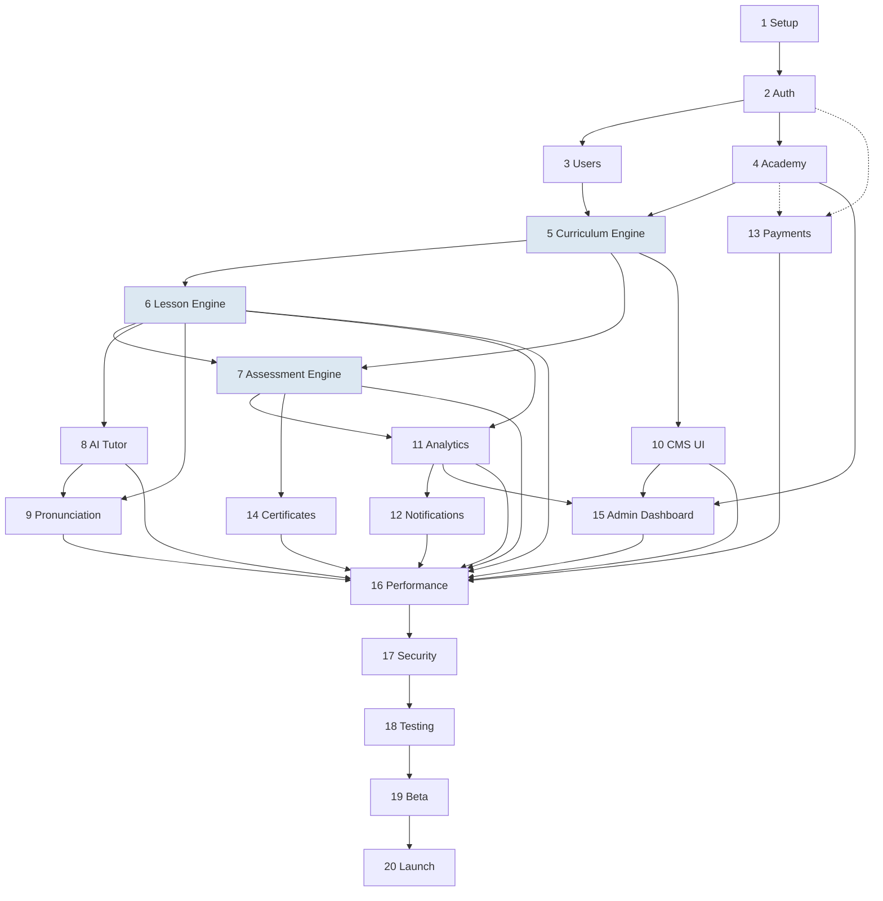

# Elrefaee English Academy — Development Roadmap

**Status:** Draft for review · **Date:** 2026-08-03 · **Builds on:** the full document series (00–09) — this is where nine documents' worth of specification gets sequenced into buildable increments. Nothing here invents new scope; every phase below implements a specific, already-approved section of the Blueprint, EDD, PRD, SRS, SAD, DDD, API Spec, Design System, or Wireframes.

**Planning assumptions, stated up front — duration estimates are meaningless without them:** a core engineering team of **6 at kickoff** (1 Tech Lead, 2 Backend, 2 Frontend, 1 DevOps/QA hybrid), growing to **9–10 by Phase 8** (adding 1 AI Engineer, 1 dedicated QA Engineer) and to **11 by Phase 17** (adding a Security specialist, contract or FTE). A **separate Curriculum team** (1 Curriculum Designer, 1 Content Reviewer — Blueprint §13 roles) works in parallel starting at Phase 5, producing the pilot content Phase 6 needs to test against — this is a **cross-functional dependency, not an engineering deliverable**, and it's the single most likely source of schedule slip in this entire plan (PRD §11 already flagged the content-review bottleneck; this roadmap inherits that risk rather than pretending engineering velocity alone determines the timeline).

### Table of contents
1. Milestones
2. Phase-by-Phase Plan (20 phases)
3. Dependency Graph & Critical Path
4. Estimated Complexity & Duration Summary
5. Risk Analysis
6. Team Responsibilities
7. Rollback Strategy
8. Versioning Strategy
9. Release Strategy
10. Technical Debt Management
11. Documentation Requirements

---

## 1. Milestones

| Milestone | End of phase | Definition of done |
|---|---|---|
| **M1 — Platform Foundation** | Phase 4 | A user can register, authenticate, and be scoped to an academy with working RBAC+RLS. No learning content yet. |
| **M2 — Learners Can Learn** | Phase 7 | A learner can be placed, complete real lessons, and pass a mastery-gated checkpoint — the core loop works end-to-end, even with thin content. |
| **M3 — AI-Augmented** | Phase 9 | AI Tutor and Phase-1 Pronunciation are live; the AI Gateway pattern is proven with a real provider in production. |
| **M4 — Content Team Self-Sufficient** | Phase 10 | Curriculum Designers author and publish content through the Studio with zero developer involvement — SRS FR-15's requirement, actually met. |
| **M5 — Full Product Surface** | Phase 15 | Every role (Student, Instructor, Reviewer, Designer, Academy Admin, Super Admin) has a working, complete dashboard. |
| **M6 — Production-Hardened** | Phase 18 | Performance, security, and test coverage all meet the NFR targets set in SRS §3/§14, verified, not assumed. |
| **M7 — Beta-Validated** | Phase 19 | Real learners and one real instructor cohort have used the product; feedback is incorporated; no launch-blocking issue remains open. |
| **M8 — General Availability** | Phase 20 | Public launch, on-call live, rollback plan rehearsed. |

---

## 2. Phase-by-Phase Plan

### Phase 1 — Project Setup
- **Objectives:** stand up the buildable foundation every later phase depends on.
- **Features:** none learner-facing.
- **Deliverables:** repo scaffold (Next.js App Router + TypeScript, Blueprint §17); Clean Architecture folder structure (`modules/{context}/{domain,application,infrastructure,interface}`, SAD §6.1); Supabase projects for dev/staging/prod (SAD §13.1); Drizzle migration tooling wired to empty schema-per-context Postgres (DDD §1); CI/CD (GitHub Actions: lint/typecheck/test/build gate, Vercel preview deploys, SRS §13.2); Sentry + basic logging wired.
- **DB work:** create the 11 empty schemas (DDD §1); migration pipeline proven with a trivial first migration.
- **Backend work:** the composition-root/DI wiring skeleton (SAD §6.1); one placeholder module (`identity`) to prove the four-layer pattern end-to-end.
- **Frontend work:** design tokens (doc 07/09) wired as CSS custom properties; base layout shell; light/dark theme switching proven.
- **AI work:** none.
- **API work:** `/api/v1` routing skeleton, shared error envelope (API Spec §1.14) implemented as the one thing every future endpoint reuses.
- **Security work:** secrets management wired (Vercel/Supabase env vars, SRS §12.4); dependency scanning enabled in CI from day one, not bolted on later.
- **Testing requirements:** the CI pipeline itself is the deliverable being tested — a trivial passing test proves the gate works.
- **Exit criteria:** a commit reaches a live preview URL through the full pipeline with zero manual steps.
- **Estimated duration:** 2 weeks.
- **Risks:** under-scoping the folder structure now is expensive to fix once 10 modules exist — this phase gets deliberately more architectural care than its short duration might suggest.
- **Dependencies:** none (first phase).

### Phase 2 — Authentication
- **Objectives:** real identity, real sessions, real RBAC — the two-layer enforcement pattern proven once, here, before any other module relies on it.
- **Features:** register, login (email/password, magic link, OAuth), MFA for elevated roles, logout, session refresh.
- **Deliverables:** `identity` module fully implemented per SAD §8; login/register/forgot-password screens (hi-fi spec §5.2).
- **DB work:** `identity.user_profiles`, `roles`, `permissions`, `role_permissions`, `user_roles` (with the two partial unique indexes, DDD §3.1's corrected constraint), `refresh_token_registry`.
- **Backend work:** `AuthService`, `RoleResolver` (SAD §8); Supabase Auth integration.
- **Frontend work:** Login/Register/Forgot Password screens (wireframe §4.4–4.6, hi-fi §5.2).
- **AI work:** none.
- **API work:** `/auth/*` per API Spec §6.1, including the full login/refresh deep-dive spec (§7.1–7.2).
- **Security work:** MFA enforcement for Instructor+ roles; rate limiting on `/auth/login` (API Spec §7.1); RLS policies for every `identity` table — the first real proof of the "RLS before merge" CI rule (SRS §12.2).
- **Testing requirements:** integration tests proving RLS actually blocks cross-user access at the database level, not just that the API declines to ask (SRS §14.2).
- **Exit criteria:** a user can complete the full auth flow including MFA and session refresh; an attempted cross-user data read is blocked by RLS even with a hypothetically-buggy API layer (tested directly against the DB).
- **Estimated duration:** 2 weeks.
- **Risks:** MFA UX friction if not carefully tested — a real risk to Instructor onboarding specifically.
- **Dependencies:** Phase 1.

### Phase 3 — User Management
- **Objectives:** the profile/settings layer every other module reads from.
- **Features:** profile view/edit, accessibility/notification preferences, GDPR export/delete.
- **Deliverables:** Profile and Settings screens (hi-fi spec §6).
- **DB work:** profile fields already in `user_profiles`; anonymization mechanism (DDD §6.2) implemented and tested now, before there's real user data to worry about later.
- **Backend work:** `/users/*` service layer.
- **API work:** `/users/*` per API Spec §6.2.
- **Security work:** the anonymization-not-hard-delete GDPR mechanism (DDD §3.11's referential-integrity rationale) — implemented and verified with a real test user now, since this is far cheaper to get right before certificates/audit logs reference real user data.
- **Testing requirements:** a full GDPR-deletion-request test proving certificates/audit references survive anonymization intact.
- **Exit criteria:** a test user can request data export and deletion, and the deletion correctly anonymizes without breaking referential integrity.
- **Estimated duration:** 1 week.
- **Risks:** low — well-specified, low-novelty phase.
- **Dependencies:** Phase 2.

### Phase 4 — Academy Management
- **Objectives:** the tenant-scoping seam every future multi-academy/B2B feature relies on (Blueprint §18) — built now, used minimally now.
- **Features:** academy seeding, academy-scoped RLS proven across schemas.
- **Deliverables:** `academy.academies` table; "English Academy" seeded; a minimal Super-Admin-only academy list endpoint — **no academy-creation UI** (Blueprint §18's explicit "architect for it, don't build it yet").
- **DB work:** `academies` table; `academy_id` foreign keys verified present on every tenant-scoped table added in later phases (a standing checklist item from here forward, not just this phase's own work).
- **API work:** `/academies` (list only) per API Spec §6.18.
- **Security work:** RLS policies scoped by `academy_id` proven with a second, throwaway test academy — confirming isolation actually works before it matters.
- **Exit criteria:** two academies' data is provably isolated via RLS, even though the UI only ever shows one.
- **Estimated duration:** 1 week.
- **Risks:** low.
- **Dependencies:** Phase 2, 3.

### Phase 5 — Curriculum Engine
- **Objectives:** the Content Governance lifecycle (Blueprint §4) — the single most structurally important module in the system, built as an engine first, before any authoring UI exists.
- **Features:** the full Draft→Published lifecycle FSM, versioning, optimistic locking, review workflow — accessible via API/seed scripts, not yet a polished UI (that's Phase 10).
- **Deliverables:** `curriculum` module (SAD §16) fully implemented; a minimal internal seed/authoring path so the Curriculum team can start producing pilot content immediately, even before Phase 10's Studio exists.
- **DB work:** `content_items`, `content_versions`, `content_reviews`, `courses`, `units`, `lessons`, `vocabulary_entries`, `media_assets` (DDD §3.3).
- **Backend work:** `ContentGovernanceService`, `CurriculumQueryService` (SAD §16); the optimistic-locking mechanism (DDD §9) implemented and tested with real concurrent-edit scenarios.
- **API work:** `/cms/content-items/*` full lifecycle endpoints (API Spec §6.15/§7.3).
- **Security work:** the media accessibility gate (transcript/captions required before Approved, Blueprint §11) enforced as a real, tested blocking rule, not a UI suggestion.
- **Testing requirements:** a concurrent-edit test proving the optimistic-lock conflict path actually rejects a stale write.
- **Exit criteria:** a Draft can move through the full lifecycle to Published via API calls, versioned and audited correctly; the Curriculum team has started authoring the pilot unit through this engine (even manually) by the end of this phase.
- **Estimated duration:** 4 weeks — the largest early phase, deliberately given real time given how much later work depends on getting this right.
- **Risks:** **the highest-risk phase for scope creep** — it's tempting to start building CMS UI polish here instead of staying disciplined about "engine first, UI in Phase 10" (Blueprint §5's explicit sequencing call, restated as a schedule risk here).
- **Dependencies:** Phase 4 (academy scoping).

### Phase 6 — Lesson Engine
- **Objectives:** the core learning loop — the phase where the product first does the thing it exists to do.
- **Features:** course/unit/lesson delivery, the canonical block flow (EDD §5), exercises with retrieval-based scoring and fuzzy matching, spaced-repetition scheduling, vocabulary notebook/flashcards.
- **Deliverables:** `learning` module; Course Catalog/Details/Unit/Lesson View/Vocabulary/Flashcards screens (wireframe §3.6/§3.13, hi-fi §5.5/§5.8).
- **DB work:** `enrollments`, `progress_records`, `vocabulary_review_state`, `bookmarks`, `learner_notes`, `learning_events` (DDD §3.5).
- **Backend work:** `ProgressService`, `ReviewSchedulerService` (the FSRS domain service, built as pure/testable per SAD §18); `RecommendationService` v1 (rules-based).
- **AI work:** none yet (AI Tutor is Phase 8) — the lesson engine is fully functional without AI, a deliberate proof that the core product doesn't depend on AI infrastructure being ready.
- **API work:** `/courses`, `/units`, `/lessons`, `/exercises`, `/vocabulary`, `/review/*` (API Spec §6.3/§6.4/§6.7).
- **Testing requirements:** the FSRS scheduler gets real unit-test rigor (SRS §14.1's specific coverage target) since it's pure and testable by construction.
- **Exit criteria:** a placed learner can complete a real lesson (using the Curriculum team's pilot content from Phase 5) end-to-end, with correct progress tracking and vocabulary queued for review.
- **Estimated duration:** 5 weeks — the largest single phase.
- **Risks:** **directly blocked on pilot content existing** (Phase 5's cross-functional dependency) — engineering can build the engine on synthetic test content, but true end-to-end validation needs the Curriculum team's real output, which may not be ready on the same clock as the code.
- **Dependencies:** Phase 5; Curriculum team's pilot-unit progress (external to engineering).

### Phase 7 — Assessment Engine
- **Objectives:** placement and mastery-gating — the Assessment context, cleanly separate from the Lesson Engine (SAD §17).
- **Features:** self-assessment grid + a simple fixed diagnostic (not full adaptive routing — deferred per SRS §19), unit/level checkpoint quizzes, mastery gating.
- **Deliverables:** `assessment` module; Placement Test, Quiz, Exam screens (wireframe §3.3/§3.9, hi-fi §5.10).
- **DB work:** `item_bank`, `rubrics`, `test_blueprints`, `attempts`, `responses`, `results` (DDD §3.4).
- **Backend work:** `AssessmentService`; the scoring-strategy registry (auto-graded types only at this phase — AI-assisted writing/speaking scoring lands in Phases 8/9).
- **API work:** `/placement/*`, `/assessment-attempts/*` (API Spec §6.5/§7's assessment deep-dives).
- **Security work:** `assessment_results` immutability enforced at the RLS level (DDD §3.4) and tested by attempting (and failing) to update a result directly.
- **Testing requirements:** randomized item-assembly logic tested against blueprint constraints (SRS §9.5).
- **Exit criteria:** a learner can be placed, take a unit checkpoint, and be correctly gated from advancing on failure.
- **Estimated duration:** 4 weeks.
- **Risks:** the temptation to build full adaptive/IRT routing now instead of the deliberately simpler MVP version (Blueprint §6/§19's explicit deferral) — a scope-discipline risk, not a technical one.
- **Dependencies:** Phase 5, 6.

### Phase 8 — AI Tutor
- **Objectives:** stand up the AI Gateway pattern for real, with its first production module and provider.
- **Features:** in-context conversational help scoped to the current lesson (EDD §18's full behavior spec).
- **Deliverables:** `ai` module — the Gateway, one provider adapter, prompt-template store, moderation layer, fallback strategy (SAD §7); AI Tutor Chat drawer/panel (wireframe §3.11, hi-fi §5.9).
- **AI work:** this phase **is** the AI work — the Gateway's dispatch/adapter/moderation/logging pattern is built once here and reused by every later AI module (Phases 9+, and any future one) without re-architecting.
- **DB work:** `prompt_templates`, `provider_configs`, `interactions` (DDD §3.8, with the metadata-only-retention correction already specified).
- **API work:** `/ai/tutor/messages` (API Spec §6.9/§8.2's fallback sequence diagram).
- **Security work:** the offline golden-set evaluation suite (SRS §7.9/§14.7) built as this phase's release gate — the first time AI-specific QA tooling exists.
- **Testing requirements:** the eval suite is the primary gate, per SRS §14.7's stated exception to deterministic acceptance criteria — explicitly not tested the same way as Phases 1–7's features.
- **Exit criteria:** a learner can ask the AI Tutor a question in a real lesson and receive a scaffolded, safety-moderated response; a simulated provider outage correctly triggers the fallback/unavailable path.
- **Estimated duration:** 3 weeks.
- **Risks:** **the first phase with a genuine external-vendor dependency** — provider API changes, cost surprises, or safety-review findings can all slip this phase in ways earlier, fully-internal phases couldn't.
- **Dependencies:** Phase 6 (docks into Lesson View); Phase 1's infra.

### Phase 9 — Pronunciation Engine
- **Objectives:** Phase-1 pronunciation practice (Blueprint §10) — browser-native, zero marginal cost, launch-ready; Phase-2 (paid, phoneme-level) is explicitly **out of this roadmap's scope**, deferred to post-revenue.
- **Features:** record/playback, basic recognition-based feedback, IPA display alongside every target phrase.
- **Deliverables:** `PronunciationEngine` adapter (Web Speech API implementation) registered in the same AI Gateway pattern Phase 8 established; Speaking Practice, Pronunciation Practice screens (wireframe §3.7/§4.23, hi-fi §5.6).
- **DB work:** `pronunciation_attempts` (media metadata + score).
- **AI work:** the *pattern* is reused from Phase 8, not rebuilt — the concrete evidence that the adapter architecture works as designed.
- **API work:** `/pronunciation/attempts` (API Spec §6.8).
- **Security work:** the still-open accessibility gap (no path for a learner who cannot produce spoken audio, flagged in SRS §16, doc 07 §9, doc 08 §3.7) is **explicitly not resolved in this phase** — restated here as a known, carried-forward gap rather than silently absent from the roadmap.
- **Exit criteria:** a learner can record, receive comparison-based feedback, and re-attempt freely in a practice context.
- **Estimated duration:** 2 weeks — shorter than Phase 8 specifically because the Gateway pattern already exists.
- **Risks:** browser microphone-permission UX varies enough across devices/browsers to be a real, if contained, QA risk.
- **Dependencies:** Phase 6 (Speaking Practice UI), Phase 8 (Gateway pattern).

### Phase 10 — CMS
- **Objectives:** the full Curriculum Studio (Blueprint §5's complete vision) — the phase that finally makes SRS FR-15 ("no developer required") true.
- **Features:** structured block editor matching Phase 5's engine exactly, vocabulary bulk editor, review queue UI with inline diff + EDD §19 checklist, media upload with the transcript gate, scheduled publishing, version history + one-click restore.
- **Deliverables:** the CMS screen (wireframe §3.12, hi-fi §5.12); Media Library screen (wireframe §4.24, hi-fi §6).
- **Frontend work:** this is a frontend-heavy phase — the block editor is the single most complex UI component built in this roadmap.
- **API work:** already built in Phase 5 — this phase is almost entirely a consumer of that API, a good proof that the engine/UI separation (Blueprint §5's sequencing rationale) paid off.
- **Testing requirements:** the concurrent-edit conflict UI (optimistic-lock rejection + diff view, SRS FR-15) tested with real simulated concurrent editors.
- **Exit criteria:** a Curriculum Designer can author, submit, get reviewed, and see published — entirely through the UI, zero direct database/API access needed.
- **Estimated duration:** 4 weeks.
- **Risks:** if Phase 5's engine had any unaddressed edge case, it surfaces here first, under UI pressure — budget slack for engine bug-fixing discovered mid-phase.
- **Dependencies:** Phase 5.

### Phase 11 — Analytics
- **Objectives:** the Learning Analytics system (SAD §19), including standing up the Queue System (background jobs) for the first time.
- **Features:** event ingestion (already emitting since Phase 6, now actually consumed), nightly aggregation, Student/Teacher/Admin dashboards.
- **Deliverables:** `analytics` module; Progress Dashboard, Analytics screens (wireframe §4.15/§4.16).
- **Backend work:** the background-job runner (Trigger.dev/Inngest, decided here per Blueprint §19's deferred choice) stood up for the first time — this phase is also where the Queue System (SAD §14) becomes real infrastructure, not just a documented plan.
- **DB work:** precomputed aggregate tables — the CQRS read side (SAD §19) built from day one of this phase, not retrofitted later.
- **API work:** `/progress/*`, `/analytics/*` (API Spec §6.10/§6.14).
- **Testing requirements:** a sparse-data (new-learner) dashboard state tested explicitly, not just the happy path.
- **Exit criteria:** a learner sees their real progress trend; an Instructor sees real cohort-level error patterns, both from precomputed data, never a live aggregation query.
- **Estimated duration:** 3 weeks.
- **Risks:** first real use of the background-job infrastructure — job-failure/dead-letter handling needs real testing, not just a design-doc description.
- **Dependencies:** Phase 6 (event source), Phase 7 (assessment events).

### Phase 12 — Notifications
- **Objectives:** re-engagement and time-sensitive alerts (SRS FR-17), the event-bus's clearest example of a module coupled to nothing but events (SAD §3).
- **Features:** streak/review-due reminders, homework-due alerts, certificate-earned notifications.
- **Deliverables:** `notifications` module; Notifications screen (wireframe §4.17).
- **Backend work:** `NotificationDispatcher`, Resend integration.
- **API work:** `/notifications/*` (API Spec §6.12).
- **Testing requirements:** a preference-disabled category correctly suppresses delivery while still logging internally (SRS FR-17).
- **Exit criteria:** a real triggering event (e.g., a certificate issued) reliably produces both an in-app and email notification, respecting preferences.
- **Estimated duration:** 2 weeks.
- **Risks:** low — well-isolated module.
- **Dependencies:** Phase 11 (shares the Queue System infrastructure Phase 11 stood up).

### Phase 13 — Payments
- **Objectives:** the `billing` module and the `BillingProvider` abstraction (Blueprint §17) — built to be technically ready early, deliberately activated for real transactions only once there's something worth paying for.
- **Features:** subscription checkout, plan entitlements, webhook-driven state sync.
- **Deliverables:** Stripe integration; Settings/Billing screen.
- **DB work:** `plans`, `subscriptions`, `billing_events` (DDD §3.10).
- **Security work:** webhook idempotency (`stripe_event_id` uniqueness, DDD §3.10) tested against Stripe's own retry behavior directly, not simulated.
- **API work:** `/billing/*`, including the webhook receiver deep-dive (API Spec §7's billing example).
- **Exit criteria:** a real (test-mode) subscription can be purchased, and a webhook replay does not double-process.
- **Estimated duration:** 2 weeks.
- **Risks:** low technical risk, real **product-sequencing risk** — shipping paywalls before Phase 6–7 have proven the core loop works would be a business mistake independent of engineering readiness.
- **Dependencies:** Phase 2, 4 — technically ready this early; placed at 13 for product-sequencing reasons, not technical ones (stated explicitly since a reader might otherwise assume a technical blocker that doesn't exist).

### Phase 14 — Certificates
- **Objectives:** the credentialing artifact (Blueprint §8) — the product's core differentiator, made real.
- **Features:** automatic issuance on passing a level's certification exam, public verification, disclaimer display.
- **Deliverables:** `certificates` table wired to `assessment.results`; Certificate screen (wireframe §3.10, hi-fi §5.11).
- **API work:** `/certificates/*` including the public, unauthenticated verification endpoint (API Spec §7.4).
- **Security work:** the verification endpoint's IP-based rate limiting (API Spec §7.4 — it has no auth gate to lean on) tested against a simulated enumeration attempt.
- **Legal/cross-functional dependency:** disclaimer language requires a real legal-review sign-off before this phase can ship to real users — **named explicitly as a non-engineering blocker**, the certificate equivalent of Phase 6's content-team dependency.
- **Exit criteria:** a learner who passes a certification exam receives a certificate with working, rate-limited public verification.
- **Estimated duration:** 1.5 weeks (engineering) — legal review runs in parallel and may extend the phase's real-world end date independent of code readiness.
- **Risks:** legal sign-off timing is outside engineering's control.
- **Dependencies:** Phase 7.

### Phase 15 — Admin Dashboard
- **Objectives:** complete the product surface for Academy Admin and Super Admin roles.
- **Features:** publishing queue, academy-wide KPIs, user/role management.
- **Deliverables:** Admin Dashboard screen (wireframe §3.14).
- **API work:** `/analytics/academy`, `/analytics/platform`, `/admin/*` (API Spec §6.14/§6.18's authorization matrix, §3).
- **Exit criteria:** an Academy Admin can publish content, manage users, and see real academy KPIs entirely through the UI.
- **Estimated duration:** 2 weeks.
- **Risks:** low — mostly composing already-built pieces (Phase 10's queue, Phase 11's analytics) into one admin-scoped view.
- **Dependencies:** Phase 4, 10, 11.

### Phase 16 — Performance Optimization
- **Objectives:** move ahead of Blueprint §16's ~10k-user scaling triggers deliberately, rather than reactively.
- **Features:** none new — this phase makes existing features fast.
- **Deliverables:** Redis (Upstash) caching layer (SAD §12) introduced now; database index audit against real usage patterns from Phases 6–15; frontend bundle-size audit; CDN cache-header tuning.
- **Testing requirements:** load testing against the SRS §3 p95 targets, at a scale approximating the early post-launch stage, not just synthetic single-user testing.
- **Exit criteria:** p95 latency targets met under realistic simulated load.
- **Estimated duration:** 2 weeks.
- **Risks:** premature-optimization risk if this phase tries to solve problems Blueprint §16 explicitly says to defer (e.g., partitioning, sharding) — scope discipline restated as a risk, matching the pattern from Phase 5/7.
- **Dependencies:** Phases 1–15 functionally complete (needs the full surface to profile against).

### Phase 17 — Security Hardening
- **Objectives:** a full, dedicated security pass — not the first time security is considered (every phase above has its own security work item), but the first time it's the *primary* objective.
- **Features:** none new.
- **Deliverables:** full OWASP Top 10 audit (SRS §12.6) re-verified against the actual built system; external penetration test; secrets-rotation policy operationalized (quarterly cadence, SAD §12.4) with a first real rotation performed; RLS policy audit across every table built across Phases 1–15.
- **Exit criteria:** the penetration test's findings are triaged and launch-blocking ones resolved.
- **Estimated duration:** 2 weeks internal + external pen-test turnaround (schedule buffer, not team-controlled).
- **Risks:** pen-test findings are unknown until they're found — this phase's duration has the widest uncertainty band in the roadmap.
- **Dependencies:** Phases 1–15.

### Phase 18 — Testing
- **Objectives:** the comprehensive, cross-cutting testing push — **not** "when testing starts" (every phase already carries its own testing requirements; treating testing as a single deferred phase would be the exact planning mistake this roadmap is structured to avoid).
- **Features:** none new.
- **Deliverables:** full E2E suite across the critical journeys (SRS §14.3); full WCAG 2.2 AA audit against the **live W3C spec** (the exact verification SRS §19/doc 07 §9 flagged as still-needed since the accessibility rules were drafted from general knowledge); cross-browser/device pass.
- **Exit criteria:** the ≥80% coverage target on learning-loop/scoring logic (SRS §3) is met and verified, not estimated; zero critical accessibility violations.
- **Estimated duration:** 3 weeks.
- **Risks:** the accessibility audit may surface a finding expensive enough to require a scope decision (ship with a known issue and a remediation date, or slip the timeline) — flagged now so it isn't a surprise if it happens.
- **Dependencies:** Phases 1–17.

### Phase 19 — Beta Release
- **Objectives:** real learners, real signal, before irreversible public commitment.
- **Features:** none new — a real-world validation phase.
- **Deliverables:** a defined beta cohort (a small group of real adult ESL learners plus one real instructor-led cohort); feedback instrumentation; a bug-bash; finalized ToS/Privacy Policy pages.
- **Exit criteria:** no launch-blocking issue remains open; monitoring/alerting has been validated under real (if limited) load and traffic patterns, not just synthetic load-test traffic.
- **Estimated duration:** 4 weeks — deliberately the longest late-stage phase, since real user feedback needs real time to surface, not just a fixed engineering estimate.
- **Risks:** beta feedback could surface a genuine product-level issue (not just a bug) that requires more than a patch — the roadmap's built-in buffer for exactly that possibility.
- **Dependencies:** Phase 18.

### Phase 20 — Production Launch
- **Objectives:** general availability.
- **Features:** none new.
- **Deliverables:** marketing site finalized; on-call rotation live; incident-response runbook active; final rollback rehearsal (Section 7) performed one last time before go-live.
- **Exit criteria:** the product is publicly available, monitored, and the team has a proven, rehearsed rollback path if something goes wrong in the first 72 hours.
- **Estimated duration:** 1 week for the launch event itself; ongoing operational commitment beyond.
- **Risks:** the standard first-72-hours launch risk profile — mitigated, not eliminated, by everything in Phases 16–19.
- **Dependencies:** Phase 19.

---

## 3. Dependency Graph & Critical Path

**Critical path** (the sequence that cannot compress regardless of team size): **1 → 2 → 5 → 6 → 7 → 14 → 16 → 17 → 18 → 19 → 20**. Phases 8, 9, 10, 11, 12, 13, 15 all have slack — they can run in parallel with each other and with parts of the critical path, given the team-growth plan in this document's opening assumption. The single most valuable scheduling insight this graph provides: **Phase 5 (Curriculum Engine) is the pivot point** — three major tracks (Lesson Engine, Assessment Engine, CMS UI) all wait on it, so any slip there cascades further than a slip almost anywhere else in the plan.

---

## 4. Estimated Complexity & Duration Summary

| Phase | Complexity | Duration | Primary risk driver |
|---|---|---|---|
| 1 Setup | Low | 2wk | Under-scoped foundations |
| 2 Auth | Medium | 2wk | MFA UX friction |
| 3 Users | Low | 1wk | — |
| 4 Academy | Low | 1wk | — |
| 5 Curriculum Engine | **Very High** | 4wk | Scope creep into UI |
| 6 Lesson Engine | **Very High** | 5wk | Content-team dependency |
| 7 Assessment Engine | High | 4wk | Adaptive-testing scope creep |
| 8 AI Tutor | High | 3wk | External vendor dependency |
| 9 Pronunciation | Medium | 2wk | Browser/device variance |
| 10 CMS | High | 4wk | Latent Phase-5 bugs surfacing |
| 11 Analytics | Medium | 3wk | First real background-job infra |
| 12 Notifications | Low | 2wk | — |
| 13 Payments | Medium | 2wk | Product-timing, not technical |
| 14 Certificates | Medium | 1.5wk | Legal sign-off timing |
| 15 Admin Dashboard | Low | 2wk | — |
| 16 Performance | Medium | 2wk | Premature-optimization scope creep |
| 17 Security | High | 2wk+buffer | Pen-test findings unknown in advance |
| 18 Testing | Medium | 3wk | Accessibility-audit findings |
| 19 Beta | Medium | 4wk | Real-user feedback surfacing product issues |
| 20 Launch | Low | 1wk | Standard launch-window risk |

**Total estimated wall-clock time to Production Launch: ~32–34 weeks (≈8 months)** given the stated team assumptions and realistic parallelization — an aggressive but achievable MVP-scope (Pre-A1→B1, per PRD §12) timeline, not a full-ladder timeline.

---

## 5. Risk Analysis

| Risk | Category | Likelihood | Impact | Mitigation |
|---|---|---|---|---|
| Content-production bottleneck blocks Phase 6/7 validation | Schedule/Content | High | High | Curriculum team starts in parallel at Phase 5, not after; engineering validates against synthetic content in the meantime so code progress isn't literally blocked, only *real* validation is |
| AI provider API changes or cost surprises mid-Phase-8 | Technical/Vendor | Medium | Medium | The AI Gateway's adapter pattern (SAD §7.2) is specifically what limits blast radius — a provider issue is an adapter fix, not a rewrite |
| Legal sign-off on certificate disclaimer language slips Phase 14 | Cross-functional | Medium | Medium | Start legal review in parallel with Phase 7/8, not after Phase 14 begins |
| Pen-test (Phase 17) surfaces a launch-blocking finding | Security/Schedule | Medium | High | Phase 17's duration explicitly carries a schedule buffer for exactly this |
| Accessibility audit (Phase 18) finds a WCAG 2.2 AA gap requiring rework, not just a fix | Compliance/Schedule | Medium | Medium | The live-spec verification was flagged as outstanding since the SRS — Phase 18 is where that debt is finally paid, deliberately, not a surprise |
| Scope creep into Phase-5/7's deliberately-deferred complexity (full CMS UI early, full adaptive testing) | Schedule/Discipline | Medium | High | Named explicitly in each phase's own risk field — a standing team discipline, not a one-time warning |
| Small-team bandwidth makes "parallel" phases (8,9,10,11,12,13,15) less parallel in practice than the dependency graph implies | Schedule | High | Medium | The team-growth plan (opening assumption) exists specifically to fund this parallelization by Phase 8 — if hiring slips, the critical-path phases should be protected first, parallel-track phases absorb the delay |
| Beta (Phase 19) surfaces a genuine product-level issue, not just bugs | Product | Medium | High | Phase 19's 4-week duration is deliberately the longest late-stage phase, built as buffer for exactly this |

---

## 6. Team Responsibilities

| Role | Primary phases | Responsibility |
|---|---|---|
| Tech Lead | All | Architecture integrity across all 20 phases; the one role with visibility into every module's boundary (SAD §4's dependency-graph enforcement is this role's standing responsibility) |
| Backend Engineers (×2, growing) | 2,3,4,5,6,7,11,12,13,14 | Domain/Application/Infrastructure layers per module |
| Frontend Engineers (×2, growing) | 2,3,6,7,9,10,11,12,13,14,15 | Interface layer, Design System component implementation |
| AI Engineer (from Phase 8) | 8,9 | AI Gateway, adapters, prompt/eval infrastructure |
| DevOps/QA hybrid → dedicated QA (from Phase 8) | All, intensifying 16–19 | CI/CD, infra, and (once dedicated) the full testing strategy (SRS §14) |
| Security specialist (from Phase 17) | 17 | OWASP audit, pen-test coordination, RLS policy audit |
| Curriculum Designer + Content Reviewer | 5 onward, parallel track | Pilot content production and ongoing review — external to the engineering roadmap but a hard dependency of it |
| Product/Founder (approval gate) | Every phase | The phase-gated review-and-approval role this entire document series has operated under — carried into implementation the same way |

---

## 7. Rollback Strategy

Per-release, not just per-incident: every deploy is Vercel's atomic-deploy model (SAD §23) — a bad deploy is a revert to the immediately-prior successful build, not a forward-fix scramble. Database migrations follow the expand-contract pattern (SRS §13.5) specifically so a code rollback never leaves the database in a state the reverted code can't handle. Feature flags (introduced from Phase 8 onward, where AI features specifically benefit from a kill switch independent of a full deploy rollback) allow disabling a specific risky feature without rolling back unrelated concurrent work. The AI Gateway's canary-rollout mechanism (SAD §7.2) is itself a standing rollback tool for provider/prompt changes specifically, reusable for every AI module added after Phase 8.

---

## 8. Versioning Strategy

**API:** URL-versioned (`/api/v1`), a version supported ≥6 months past its successor (API Spec §1.17/§1.18) — unchanged from the already-approved API Specification, restated here as the implementation-phase commitment.
**Application releases:** semantic versioning (`MAJOR.MINOR.PATCH`) for the deployed app itself, independent of the API version — a MINOR bump per phase's feature landing, PATCH for hotfixes, MAJOR reserved for the eventual `/api/v2`-driving change.
**Content:** the DDD's `content_versions` append-only model (DDD §3.3/§8) — already fully specified, unrelated to and never conflated with either of the above.

---

## 9. Release Strategy

Environment promotion: local → staging → production (SAD §13.1), unchanged. **Release cadence:** continuous deployment to staging on every merge to `main`; production promotion is a deliberate, explicit action (not automatic), gated by the same phase-approval discipline this document series has used throughout — a real production release is never a surprise. Feature flags (Section 7) support gradual/canary rollout for any feature judged risky enough to warrant it, starting with every AI module.

---

## 10. Technical Debt Management

A standing debt registry (not a vague intention) tracks every deliberate MVP-scope shortcut named across this document series, each with its own future trigger — not "someday," a **condition**:
| Known debt | Deliberately deferred at | Revisit trigger |
|---|---|---|
| Simplified placement (fixed diagnostic, not full adaptive/IRT) | Phase 7 | Enough real attempt-volume data exists to calibrate IRT (Blueprint §6) |
| Pronunciation Phase 2 (paid, phoneme-level) not built | Phase 9 | Post-revenue (Blueprint §10) |
| Full CMS UI polish beyond MVP | Phase 10 | Curriculum team reports the MVP Studio is a genuine throughput bottleneck |
| Redis/partitioning/read-replicas | Phase 16 | Blueprint §16's concrete user-count triggers (~10k, ~100k) are reached |
| Multi-academy product surface | Not in this roadmap | English Academy is proven (Blueprint §18) |
| Kids/teens track | Not in this roadmap | Adult product is proven (Blueprint §1) |
| Accessible alternative for non-spoken production | Phase 9 | **Unscheduled — flagged as needing a UX-phase decision before it can even be scoped**, carried forward from SRS §16 through doc 07 §9 and doc 08 §3.7 into this roadmap unresolved, deliberately not hidden by omission |

Every sprint (once sprints exist, from Phase 2 onward) reserves a stated capacity allowance for debt-registry items whose trigger has fired — debt isn't addressed "when there's time," it's addressed when its named condition is met, scheduled like any other work.

---

## 11. Documentation Requirements

Per phase, before a phase is considered done: **API documentation** auto-derived from the OpenAPI contract (API Spec §1's mapping convention — never hand-maintained separately, which drifts); **architecture decision records (ADRs)** for any deviation from this document series's already-approved decisions (a real deviation should be rare and always recorded, not silent); **runbooks** for any new operational surface (the background-job system from Phase 11, the AI Gateway's fallback/canary mechanics from Phase 8, the restore procedure from DDD §13 — rehearsed, not just written); **onboarding documentation** kept current enough that a new engineer joining at the Phase-8 team-growth point can find the Clean Architecture layering rules, the module-dependency graph, and this roadmap itself without asking — the entire nine-document series preceding this one *is* that onboarding documentation, and keeping it current as implementation reveals new detail is itself a standing requirement, not a one-time deliverable.

---

**Net assessment:** a realistic, dependency-aware, ~8-month path to launch for the stated team and MVP scope, with every deliberate shortcut named and its revisit condition stated rather than left implicit. No implementation code was written. Ready for your review — awaiting approval before implementation planning begins.
